# Chain-of-Thought (CoT) Prompting

> **Roadmap:** Prompt Engineering → Topic 3 of 10
> **Status:** ✅ Completed

---

## Core Idea

Make the model **think out loud** before giving an answer. Instead of jumping straight to a result, it walks through reasoning steps — dramatically improving accuracy on complex tasks.

> CoT works because generating intermediate reasoning tokens forces the model to allocate more "compute" to the problem. The reasoning steps literally improve the final answer.

---

---

## 3 Ways to Use CoT

### 1. Zero-shot CoT — just add "think step by step"

```python
from groq import Groq

client = Groq(api_key="your-groq-api-key")

response = client.chat.completions.create(
    model="llama-3.3-70b-versatile",
    max_tokens=300,
    messages=[
        {
            "role": "system",
            "content": "You are a helpful assistant."
        },
        {
            "role": "user",
            "content": """If 5 shirts cost $40, how much do 8 shirts cost?

Think step by step."""
        }
    ]
)

print(response.choices[0].message.content)
# Step 1: Find the cost of 1 shirt → $40 ÷ 5 = $8
# Step 2: Multiply by 8 → $8 × 8 = $64
# The answer is $64.
```

---

### 2. Few-shot CoT — show examples with reasoning

```python
from groq import Groq

client = Groq(api_key="your-groq-api-key")

response = client.chat.completions.create(
    model="llama-3.3-70b-versatile",
    max_tokens=400,
    messages=[
        {
            "role": "system",
            "content": "You are a math tutor. Always show your reasoning before the final answer."
        },
        # --- Few-shot CoT example ---
        {
            "role": "user",
            "content": "A train travels 60 km/h for 2.5 hours. How far does it travel?"
        },
        {
            "role": "assistant",
            "content": """Step 1: Distance = Speed × Time
Step 2: Distance = 60 × 2.5 = 150 km
Answer: 150 km"""
        },
        # --- Actual query ---
        {
            "role": "user",
            "content": "If 5 shirts cost $40, how much do 8 shirts cost?"
        }
    ]
)

print(response.choices[0].message.content)
```

---

### 3. Structured CoT — separate reasoning from final answer

Best for production. Parse reasoning and answer separately.

```python
from groq import Groq
import re

client = Groq(api_key="your-groq-api-key")

response = client.chat.completions.create(
    model="llama-3.3-70b-versatile",
    max_tokens=500,
    messages=[
        {
            "role": "system",
            "content": """You are a helpful assistant.
Always respond in this exact format:

<reasoning>
Your step-by-step thinking here
</reasoning>

<answer>
Final answer only here
</answer>"""
        },
        {
            "role": "user",
            "content": "A store sells apples for $1.20 each. I buy 7 and pay with a $10 bill. How much change do I get?"
        }
    ]
)

raw = response.choices[0].message.content

# Parse reasoning and answer separately
reasoning = re.search(r"<reasoning>(.*?)</reasoning>", raw, re.DOTALL)
answer    = re.search(r"<answer>(.*?)</answer>",    raw, re.DOTALL)

print("Reasoning:", reasoning.group(1).strip())
print("Answer:",    answer.group(1).strip())
```

---

## When to Use CoT

| Task type | Use CoT? |
|---|---|
| Math / calculations | Yes — always |
| Multi-step logic | Yes |
| Code debugging | Yes |
| Simple classification | No — overkill |
| One-word answers | No |

---

## Summary of 3 CoT Methods

| Method | How | Best for |
|---|---|---|
| Zero-shot CoT | Add "think step by step" | Quick wins, any task |
| Few-shot CoT | Show reasoned examples | Consistent reasoning style |
| Structured CoT | XML tags + regex parsing | Production apps |

---

## Next Topic

➡️ **Role & Persona Prompting**
