# Role & Persona Prompting

> **Roadmap:** Prompt Engineering → Topic 4 of 10
> **Status:** ✅ Completed

---

## What is it and why does it matter?

When you give the LLM a role or persona in the system prompt, you're telling it **who to be** before it answers. This changes how it picks words, how deep it goes, what it assumes you already know, and what tone it uses.

Think of it like this: if you ask a doctor, a teacher, and an engineer the same question — "how does memory work?" — you'll get three completely different answers. Same knowledge base, different presentation. That's exactly what persona prompting does.

---



---

## What makes a GOOD persona?

A weak persona is vague. A strong persona has 3 things:

1. **Who they are** — job title, years of experience, specialty
2. **Who they're talking to** — the audience (beginner? expert? non-technical?)
3. **How they behave** — tone, style, what to avoid

```python
# ❌ Weak — too vague, gives the model no real direction
"You are a helpful assistant."

# ✅ Strong — specific role + audience + behavior
"""You are a senior Python engineer with 10 years of experience.
You are explaining concepts to a junior developer who knows basic Python
but has never worked on production systems.
Be direct, use simple words, and always include a short code example."""
```

---

## Practical Example — same question, two personas

```python
from groq import Groq
client = Groq(api_key="your-groq-api-key")

question = "What is a database index and why should I use one?"

# --- Persona 1: Teacher for beginners ---
response_beginner = client.chat.completions.create(
    model="llama-3.3-70b-versatile",
    max_tokens=300,
    messages=[
        {
            "role": "system",
            "content": """You are a patient coding teacher explaining to a complete beginner.
Use simple analogies from everyday life. Avoid jargon.
Keep answers short and friendly."""
        },
        {"role": "user", "content": question}
    ]
)

# --- Persona 2: Senior engineer for a technical team ---
response_senior = client.chat.completions.create(
    model="llama-3.3-70b-versatile",
    max_tokens=300,
    messages=[
        {
            "role": "system",
            "content": """You are a senior database engineer reviewing code for a production team.
Be precise and technical. Mention trade-offs and when NOT to use indexes.
Assume the reader knows SQL."""
        },
        {"role": "user", "content": question}
    ]
)

print("=== BEGINNER ===")
print(response_beginner.choices[0].message.content)

print("\n=== SENIOR ENGINEER ===")
print(response_senior.choices[0].message.content)
```

The model is identical in both calls — only the system prompt changes. But the outputs will feel like they came from two completely different people.

---

## Building a reusable persona system

In real apps you'll switch personas depending on what the user needs. Here's a clean pattern:

```python
from groq import Groq
client = Groq(api_key="your-groq-api-key")

# Store all personas in one place — easy to add, edit, swap
PERSONAS = {
    "tutor": """You are a friendly coding tutor for beginners.
Use simple language, real-life analogies, and short examples.
Never assume prior knowledge.""",

    "reviewer": """You are a strict senior code reviewer.
Point out bugs, bad practices, and security issues.
Be direct. No sugarcoating.""",

    "rubber_duck": """You are a rubber duck debugger.
Ask the user questions to help them think through their own problem.
Never give the answer directly — guide them to find it themselves."""
}

def ask(persona_name: str, user_message: str) -> str:
    response = client.chat.completions.create(
        model="llama-3.3-70b-versatile",
        max_tokens=400,
        messages=[
            {"role": "system", "content": PERSONAS[persona_name]},
            {"role": "user",   "content": user_message}
        ]
    )
    return response.choices[0].message.content

# Usage — just swap the persona name
print(ask("tutor",       "What is recursion?"))
print(ask("reviewer",    "def get_user(id): return db.query(f'SELECT * FROM users WHERE id={id}')"))
print(ask("rubber_duck", "My loop runs forever but I don't know why"))
```

---

## Persona ingredients — weak vs strong

| Ingredient | Weak example | Strong example |
|---|---|---|
| Role | "assistant" | "senior data engineer" |
| Audience | *(missing)* | "talking to a non-technical CEO" |
| Tone | *(missing)* | "concise, no jargon, use bullet points" |
| Constraints | *(missing)* | "never suggest paid tools" |
| Goal | "help" | "help them understand, not just give answers" |

---

## Key Insight

> The persona doesn't change *what the model knows* — it changes *how it chooses to present* that knowledge.

Same expert. Different audience. Totally different output. This is why persona prompting is one of the highest-leverage things you can do — it costs zero extra tokens to set a good system prompt, but it completely shapes every response that follows.

---

## Next Topic

➡️ **System Prompts & Instructions**
