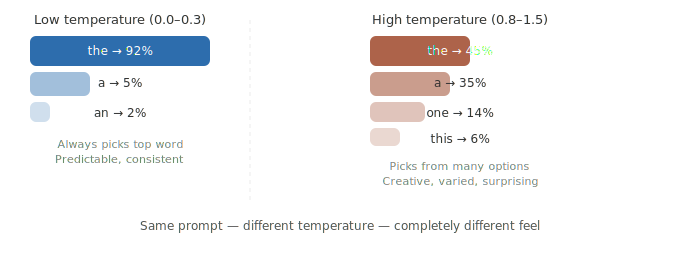

# Temperature & Sampling Parameters

> **Roadmap:** Prompt Engineering → Topic 8 of 10
> **Status:** ✅ Completed

---

## What is it?

When you call an LLM API, you're not just sending a prompt — you're also controlling **how the model picks its next word**. The model internally generates a probability score for thousands of possible next words. These parameters decide how it chooses from that list.

---



---

## The 4 Main Parameters

### 1. Temperature
Controls how **random** the output is. Range is `0.0` to `2.0`.

- `0.0` — always picks the most likely word. Boring but reliable. Good for facts, JSON, code.
- `0.7` — the sweet spot. Balanced between creative and consistent. Good for most tasks.
- `1.5+` — very unpredictable. Sometimes brilliant, often weird. Good for brainstorming.

### 2. max_tokens
Controls **how long** the response can be. The model stops when it hits this limit even mid-sentence. Always set this in production — never leave it unlimited or you'll get surprise API bills.

### 3. top_p (nucleus sampling)
An alternative to temperature. Instead of scaling all probabilities, it cuts off the list at a cumulative probability threshold. `top_p=0.9` means "only consider words that together make up 90% of the probability." Usually you set either temperature **or** top_p — not both.

### 4. stop sequences
A list of strings that tell the model to **stop generating** the moment it produces them. Very useful for structured outputs where you know exactly where the response should end.

---

## Full Example — all parameters together

```python
from groq import Groq
client = Groq(api_key="your-groq-api-key")

response = client.chat.completions.create(
    model="llama-3.3-70b-versatile",

    max_tokens=300,         # stop after 300 tokens max
    temperature=0.7,        # 0.0 = robotic, 1.0 = creative, 1.5+ = chaotic
    top_p=0.9,              # only sample from top 90% probability mass
    stop=["###", "END"],    # stop generating when model outputs these strings

    messages=[
        {"role": "system", "content": "You are a helpful assistant."},
        {"role": "user",   "content": "Write a short product description for wireless headphones."}
    ]
)

print(response.choices[0].message.content)
```

---

## Seeing Temperature in Action — same prompt, 3 values

```python
from groq import Groq
client = Groq(api_key="your-groq-api-key")

prompt = "Give me a one-sentence tagline for a coffee shop."

for temp in [0.0, 0.7, 1.5]:
    response = client.chat.completions.create(
        model="llama-3.3-70b-versatile",
        max_tokens=60,
        temperature=temp,
        messages=[
            {"role": "system", "content": "You write creative marketing copy."},
            {"role": "user",   "content": prompt}
        ]
    )
    print(f"temp={temp}: {response.choices[0].message.content.strip()}")

# temp=0.0: "Your perfect cup, every morning."
# temp=0.7: "Where every sip tells a story."
# temp=1.5: "Caffeinate your chaos, one bold brew at a time."
```

---

## Using Stop Sequences for Structured Output

```python
from groq import Groq
client = Groq(api_key="your-groq-api-key")

response = client.chat.completions.create(
    model="llama-3.3-70b-versatile",
    max_tokens=200,
    temperature=0.2,        # low temp — consistent structured output
    stop=["---END---"],     # model stops the moment it writes this
    messages=[
        {
            "role": "system",
            "content": """Extract the product name and price from the text.
Format:
Product: <name>
Price: <price>
---END---"""
        },
        {
            "role": "user",
            "content": "The Sony WH-1000XM5 headphones are on sale for ₹24,990."
        }
    ]
)

print(response.choices[0].message.content)
# Product: Sony WH-1000XM5
# Price: ₹24,990
```

---

## Quick Reference — What to Set for Each Task

| Task | Temperature | top_p | Notes |
|---|---|---|---|
| JSON / structured output | 0.0 – 0.2 | — | Needs consistency above all |
| Q&A / factual answers | 0.2 – 0.4 | — | Accurate, not too stiff |
| Chatbot / assistant | 0.6 – 0.8 | 0.9 | Natural but reliable |
| Creative writing | 0.9 – 1.2 | 0.95 | Varied and expressive |
| Brainstorming | 1.2 – 1.5 | — | Maximum variety |

---

## Key Insight

> Temperature is the single most impactful parameter after the prompt itself. If outputs are too boring and repetitive, turn it up. If they're too random and unreliable, turn it down. Most production apps live between `0.2` and `0.8`.

---

➡️ **Next: ReAct Prompting**
