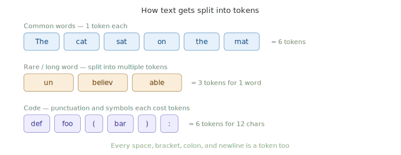

# Tokens & Token Counting

> **Roadmap:** Context & Memory → Topic 2 of 8
> **Status:** ✅ Completed

---

## What is a token?

A token is the **basic unit the model reads and writes**. It's not a word, not a character — it's a chunk of text that the model's tokenizer treats as one unit.

- Common words = 1 token each
- Rare or long words = split into multiple tokens
- Spaces, punctuation, brackets, newlines = all cost tokens too



---

## Why tokens matter in practice

- **Cost** — most APIs charge per token. Sending large documents on every request adds up fast.
- **Speed** — more tokens in = slower response. Important for real-time apps.
- **Limits** — exceed the context window and your call fails or silently drops content.
- **Output control** — `max_tokens` limits response length. Set too low and model cuts off mid-sentence.

---

## Counting tokens before sending — tiktoken

```python
import tiktoken

# cl100k_base is the tokenizer used by most modern LLMs
encoder = tiktoken.get_encoding("cl100k_base")

def count_tokens(text: str) -> int:
    return len(encoder.encode(text))

texts = [
    "The cat sat on the mat",
    "unbelievable",
    "def foo(bar):",
    "Hello! How are you doing today?",
]

for text in texts:
    print(f"{count_tokens(text):3d} tokens | {text}")

#   6 tokens | The cat sat on the mat
#   3 tokens | unbelievable
#   6 tokens | def foo(bar):
#   8 tokens | Hello! How are you doing today?
```

**Install:** `pip install tiktoken`

---

## Counting tokens for a full conversation

```python
import tiktoken

encoder = tiktoken.get_encoding("cl100k_base")

def count_conversation_tokens(messages: list) -> int:
    """
    Count total tokens for a full messages list.
    Each message has ~4 tokens overhead for role formatting.
    """
    total = 0
    for message in messages:
        total += 4  # overhead per message
        total += len(encoder.encode(message["content"]))
    total += 2  # reply priming tokens
    return total


messages = [
    {"role": "system",    "content": "You are a helpful coding assistant."},
    {"role": "user",      "content": "What is a Python decorator?"},
    {"role": "assistant", "content": "A decorator wraps another function to extend its behaviour."},
    {"role": "user",      "content": "Can you show me a simple example?"},
]

total = count_conversation_tokens(messages)
print(f"Total tokens:          {total}")
print(f"Remaining in 128k:     {128_000 - total:,}")
```

---

## Token-aware chat function

```python
from groq import Groq
import tiktoken

client  = Groq(api_key="your-groq-api-key")
encoder = tiktoken.get_encoding("cl100k_base")

MAX_TOKENS      = 128_000
WARN_AT         = 100_000
RESPONSE_BUDGET = 1_000

def count_tokens(messages: list) -> int:
    total = 0
    for m in messages:
        total += 4
        total += len(encoder.encode(m["content"]))
    return total + 2

def token_aware_chat(conversation: list, system: str) -> str:
    all_messages = [{"role": "system", "content": system}] + conversation
    token_count  = count_tokens(all_messages)

    print(f"Sending {token_count:,} tokens (limit: {MAX_TOKENS:,})")

    if token_count + RESPONSE_BUDGET > MAX_TOKENS:
        return "❌ Context window full. Please start a new conversation."

    if token_count > WARN_AT:
        print("⚠️  Getting close to context limit.")

    response = client.chat.completions.create(
        model="llama-3.3-70b-versatile",
        max_tokens=RESPONSE_BUDGET,
        messages=all_messages
    )
    return response.choices[0].message.content


system       = "You are a helpful assistant."
conversation = []

user_input = "Explain the difference between a list and a tuple in Python."
conversation.append({"role": "user", "content": user_input})

reply = token_aware_chat(conversation, system)
conversation.append({"role": "assistant", "content": reply})
print(f"\nReply: {reply}")
```

---

## Token costs — rough ballpark

| Model | Input (per 1M tokens) | Output (per 1M tokens) |
|---|---|---|
| `llama-3.3-70b` via Groq | Free (rate limited) | Free |
| `gpt-4o` | ~$2.50 | ~$10.00 |
| `claude-sonnet-4-6` | ~$3.00 | ~$15.00 |
| `gpt-4o-mini` | ~$0.15 | ~$0.60 |

---

## Key Insight

> Tokens are the currency of LLMs — they determine cost, speed, and limits all at once. Get into the habit of counting tokens before you send anything, especially when handling user-uploaded documents or long conversations.

---

➡️ **Next: Conversation History Management**