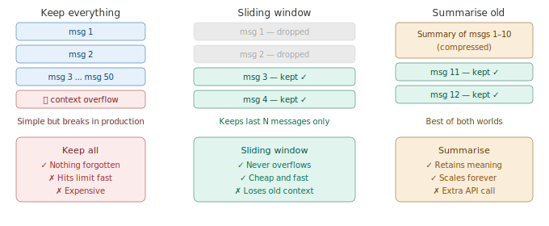

# Conversation History Management

> **Roadmap:** Context & Memory → Topic 3 of 8
> **Status:** ✅ Completed

---

## What is it?

As a conversation grows, you need a strategy for **what to keep, what to drop, and what to compress**. Most beginners just append every message forever — that works for 5 messages but breaks at 50.



---

## Strategy 1 — Keep everything (naive)

Simple to write but will eventually crash. Fine for demos only.

```python
from groq import Groq
client = Groq(api_key="your-groq-api-key")

conversation = []  # grows forever — will hit limit eventually

def chat(user_input: str) -> str:
    conversation.append({"role": "user", "content": user_input})

    response = client.chat.completions.create(
        model="llama-3.3-70b-versatile",
        max_tokens=500,
        messages=[
            {"role": "system", "content": "You are a helpful assistant."},
            *conversation
        ]
    )

    reply = response.choices[0].message.content
    conversation.append({"role": "assistant", "content": reply})
    return reply
```

---

## Strategy 2 — Sliding window (keep last N messages)

Keeps only the most recent N messages. Simple, reliable, cheap. Good for most chatbots.

```python
from groq import Groq
client = Groq(api_key="your-groq-api-key")

SYSTEM   = "You are a helpful assistant."
MAX_MSGS = 10  # keep only the last 10 messages (5 exchanges)

conversation = []

def chat_sliding(user_input: str) -> str:
    conversation.append({"role": "user", "content": user_input})

    # Always trim to last MAX_MSGS before sending
    trimmed = conversation[-MAX_MSGS:]

    response = client.chat.completions.create(
        model="llama-3.3-70b-versatile",
        max_tokens=500,
        messages=[
            {"role": "system", "content": SYSTEM},
            *trimmed
        ]
    )

    reply = response.choices[0].message.content
    conversation.append({"role": "assistant", "content": reply})
    return reply
```

---

## Strategy 3 — Summarise old messages (best for long sessions)

When the conversation gets long, compress the old part into a summary. The model retains the *meaning* of old messages without the token cost.

```python
from groq import Groq
client = Groq(api_key="your-groq-api-key")

SYSTEM       = "You are a helpful assistant."
KEEP_RECENT  = 6   # keep last 6 messages in full
SUMMARISE_AT = 10  # start summarising when history exceeds this

conversation = []
summary      = ""  # running summary of compressed messages

def summarise_messages(messages: list) -> str:
    history_text = "\n".join(
        f"{m['role'].upper()}: {m['content']}" for m in messages
    )
    response = client.chat.completions.create(
        model="llama-3.3-70b-versatile",
        max_tokens=300,
        temperature=0.3,
        messages=[
            {
                "role": "system",
                "content": "Summarise the conversation below into 3-5 bullet points. Keep all important facts, decisions, and context."
            },
            {"role": "user", "content": f"Summarise:\n\n{history_text}"}
        ]
    )
    return response.choices[0].message.content


def chat_with_summary(user_input: str) -> str:
    global summary

    conversation.append({"role": "user", "content": user_input})

    # Compress when history gets too long
    if len(conversation) > SUMMARISE_AT:
        old_messages    = conversation[:-KEEP_RECENT]
        recent_messages = conversation[-KEEP_RECENT:]

        new_summary = summarise_messages(old_messages)
        summary     = f"{summary}\n\nAdditional context:\n{new_summary}" if summary else new_summary

        conversation.clear()
        conversation.extend(recent_messages)

    # Inject summary into system prompt if it exists
    system_with_summary = SYSTEM
    if summary:
        system_with_summary += f"\n\nSummary of earlier conversation:\n{summary}"

    response = client.chat.completions.create(
        model="llama-3.3-70b-versatile",
        max_tokens=500,
        messages=[
            {"role": "system", "content": system_with_summary},
            *conversation
        ]
    )

    reply = response.choices[0].message.content
    conversation.append({"role": "assistant", "content": reply})
    return reply
```

---

## Which strategy to use when

| Situation | Strategy |
|---|---|
| Short demo or prototype | Keep everything |
| General chatbot, moderate sessions | Sliding window |
| Long sessions, support bots, tutors | Summarise old messages |
| Nothing can be forgotten | Summarise + external DB storage |

---

## Key Insight

> Always keep the system prompt and the most recent messages — those are sacred. What you do with the middle is the art of conversation management.

Start with sliding window. Add summarisation once sessions get long. That covers 95% of real-world chatbot needs.

---

➡️ **Next: Short-term vs Long-term Memory**