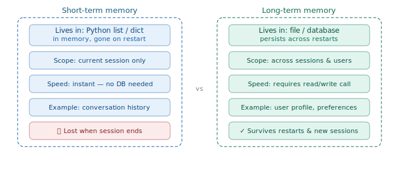

# Short-term vs Long-term Memory

> **Roadmap:** Context & Memory → Topic 4 of 8
> **Status:** ✅ Completed

---

## What is the difference?

**Short-term memory** lives in a Python list in RAM — it exists while your program runs and disappears the moment it stops.

**Long-term memory** is saved to a file or database so it survives between sessions. When the user comes back tomorrow, the model still knows who they are.

Think of it like human memory. Short-term is what you're actively thinking about right now. Long-term is what you still remember tomorrow morning.



---

## Short-term memory — what you already know

Short-term memory is just the conversation list you pass on every API call. Already covered in the previous topic — this is a quick reminder.

```python
# This IS short-term memory — a list in RAM
conversation = [
    {"role": "user",      "content": "My name is Arjun"},
    {"role": "assistant", "content": "Nice to meet you Arjun!"},
]
# When your program stops → conversation is gone forever
```

---

## Long-term memory — Level 1: JSON file

Simplest approach. Good for single-user apps or prototypes.

```python
import json, os
from groq import Groq

client      = Groq(api_key="your-groq-api-key")
MEMORY_FILE = "user_memory.json"

def load_memory() -> dict:
    if os.path.exists(MEMORY_FILE):
        with open(MEMORY_FILE, "r") as f:
            return json.load(f)
    return {"user_facts": []}

def save_memory(memory: dict) -> None:
    with open(MEMORY_FILE, "w") as f:
        json.dump(memory, f, indent=2)

def extract_and_save_facts(user_message: str, memory: dict) -> dict:
    """Ask the model if anything is worth remembering. Save it if so."""
    response = client.chat.completions.create(
        model="llama-3.3-70b-versatile",
        max_tokens=150,
        temperature=0.1,
        messages=[
            {
                "role": "system",
                "content": """Extract any personal facts worth remembering.
Reply with JSON only:
{"fact": "the fact", "type": "name|preference|goal|other"}
If nothing worth remembering: {"fact": null}"""
            },
            {"role": "user", "content": user_message}
        ]
    )
    try:
        result = json.loads(response.choices[0].message.content)
        if result.get("fact"):
            memory["user_facts"].append(result)
            save_memory(memory)
            print(f"💾 Saved: {result['fact']}")
    except json.JSONDecodeError:
        pass
    return memory


def chat_with_long_term_memory(user_input: str, conversation: list) -> str:
    memory = load_memory()
    memory = extract_and_save_facts(user_input, memory)

    memory_text = ""
    if memory["user_facts"]:
        facts       = "\n".join(f"- {f['fact']}" for f in memory["user_facts"])
        memory_text = f"\n\nThings you know about this user:\n{facts}"

    system = f"You are a helpful personal assistant.{memory_text}"
    conversation.append({"role": "user", "content": user_input})

    response = client.chat.completions.create(
        model="llama-3.3-70b-versatile",
        max_tokens=400,
        messages=[
            {"role": "system", "content": system},
            *conversation[-10:]
        ]
    )

    reply = response.choices[0].message.content
    conversation.append({"role": "assistant", "content": reply})
    return reply


# Session 1
convo = []
chat_with_long_term_memory("Hi! My name is Arjun.", convo)
chat_with_long_term_memory("I'm learning AI engineering.", convo)

# Session 2 — new convo list, but memory file still exists
convo2 = []
print(chat_with_long_term_memory("Hey! Do you remember me?", convo2))
# → "Yes, you're Arjun, learning AI engineering..."
```

---

## Long-term memory — Level 2: SQLite (multi-user)

When you have multiple users, use SQLite — a simple local database, no server needed.

```python
import sqlite3, json
from groq import Groq

client = Groq(api_key="your-groq-api-key")

def init_db():
    conn = sqlite3.connect("memory.db")
    conn.execute("""
        CREATE TABLE IF NOT EXISTS user_memory (
            user_id TEXT PRIMARY KEY,
            facts   TEXT DEFAULT '[]',
            updated TIMESTAMP DEFAULT CURRENT_TIMESTAMP
        )
    """)
    conn.commit()
    conn.close()

def load_user_memory(user_id: str) -> list:
    conn = sqlite3.connect("memory.db")
    row  = conn.execute("SELECT facts FROM user_memory WHERE user_id=?", (user_id,)).fetchone()
    conn.close()
    return json.loads(row[0]) if row else []

def save_user_memory(user_id: str, facts: list) -> None:
    conn = sqlite3.connect("memory.db")
    conn.execute("""
        INSERT INTO user_memory (user_id, facts)
        VALUES (?, ?)
        ON CONFLICT(user_id) DO UPDATE SET facts=excluded.facts
    """, (user_id, json.dumps(facts)))
    conn.commit()
    conn.close()

def chat_multi_user(user_id: str, user_input: str, conversation: list) -> str:
    facts       = load_user_memory(user_id)
    memory_text = "\n".join(f"- {f}" for f in facts) if facts else ""
    system      = f"You are a helpful assistant.\n\nUser facts:\n{memory_text}" if memory_text else "You are a helpful assistant."

    conversation.append({"role": "user", "content": user_input})
    response = client.chat.completions.create(
        model="llama-3.3-70b-versatile",
        max_tokens=400,
        messages=[{"role": "system", "content": system}, *conversation[-10:]]
    )
    reply = response.choices[0].message.content
    conversation.append({"role": "assistant", "content": reply})
    return reply

# Each user gets their own memory
init_db()
save_user_memory("arjun_01", ["Name is Arjun", "Learning AI engineering", "Prefers Python"])
save_user_memory("priya_02", ["Name is Priya", "Data scientist", "Uses R and Python"])
```

---

## The full pattern — combining both

```python
def build_system_prompt(user_id: str) -> str:
    facts = load_user_memory(user_id)
    base  = "You are a helpful personal AI assistant."
    if facts:
        base += "\n\nWhat you know about this user:\n" + "\n".join(f"- {f}" for f in facts)
    return base

# Every new session:
# 1. Load long-term memory → inject into system prompt
# 2. Start fresh short-term conversation list
# 3. Slide the window as the conversation grows
```

---

## Which to use when

| Need | Solution |
|---|---|
| Remember things within one chat | Short-term (conversation list) |
| Remember user across sessions | Long-term (JSON or DB) |
| One user, simple app | JSON file |
| Multiple users | SQLite or PostgreSQL |
| Scale to millions | Cloud DB (Supabase, Firebase, DynamoDB) |

---

## Key Insight

> Short-term memory is the conversation. Long-term memory is the user profile. Every great AI product eventually needs both — the conversation keeps the chat coherent, and the user profile makes the product feel like it actually knows you.

---

➡️ **Next: Summarisation for Memory**