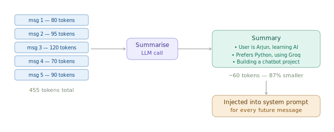

# Summarisation for Memory

> **Roadmap:** Context & Memory → Topic 5 of 8
> **Status:** ✅ Completed

---

## What is it?

Instead of keeping every word ever said, you **compress old information into a dense summary** and inject that summary into every future prompt. The model reads it like a briefing note before each conversation.

A 10-message conversation might be 1000 tokens. Its summary might be 80. You lose none of the important context but save 92% of your token budget.



---

## Type 1 — One-shot summary

Summarise the whole conversation at once when it gets long.

```python
from groq import Groq
client = Groq(api_key="your-groq-api-key")

def summarise_conversation(conversation: list) -> str:
    history = "\n".join(
        f"{m['role'].upper()}: {m['content']}"
        for m in conversation
    )

    response = client.chat.completions.create(
        model="llama-3.3-70b-versatile",
        max_tokens=300,
        temperature=0.2,
        messages=[
            {
                "role": "system",
                "content": """You are a conversation summariser.
Create a concise summary focusing on:
- Key facts about the user (name, goals, preferences)
- Decisions made
- Important context for future messages
Write as bullet points. Be dense — every word should carry information."""
            },
            {
                "role": "user",
                "content": f"Summarise this conversation:\n\n{history}"
            }
        ]
    )
    return response.choices[0].message.content


conversation = [
    {"role": "user",      "content": "Hi! I'm Arjun, studying CS. I want to build an AI tutoring app."},
    {"role": "assistant", "content": "Great! What subject will it tutor?"},
    {"role": "user",      "content": "Maths and coding. Free for students. Stack: Python + Groq."},
    {"role": "assistant", "content": "Nice. Should we start with the chat interface?"},
    {"role": "user",      "content": "Yes, and I need it to remember each student's progress."},
]

print(summarise_conversation(conversation))
# • User: Arjun, CS student
# • Goal: AI tutoring app — free for students
# • Stack: Python + Groq
# • Subjects: Maths and coding
# • Requirement: Remember student progress across sessions
```

---

## Type 2 — Rolling summary (updates as conversation grows)

Keep updating a running summary every time the conversation hits a threshold. Old messages get compressed, recent ones stay fresh.

```python
from groq import Groq
client = Groq(api_key="your-groq-api-key")

SUMMARISE_EVERY = 6   # compress after every 6 new messages
KEEP_RECENT     = 4   # always keep last 4 messages in full

class RollingMemoryChat:
    def __init__(self, system: str):
        self.system       = system
        self.conversation = []
        self.summary      = ""
        self.msg_count    = 0

    def _update_summary(self, messages_to_compress: list) -> None:
        history  = "\n".join(f"{m['role'].upper()}: {m['content']}" for m in messages_to_compress)
        existing = f"Existing summary:\n{self.summary}\n\n" if self.summary else ""

        response = client.chat.completions.create(
            model="llama-3.3-70b-versatile",
            max_tokens=250,
            temperature=0.2,
            messages=[
                {"role": "system", "content": "Update the summary with new info. Keep all important facts. Be concise."},
                {"role": "user",   "content": f"{existing}New messages:\n{history}\n\nWrite updated bullet-point summary."}
            ]
        )
        self.summary = response.choices[0].message.content
        print(f"📝 Summary updated")

    def chat(self, user_input: str) -> str:
        self.conversation.append({"role": "user", "content": user_input})
        self.msg_count += 1

        # Every N messages, compress the older ones
        if self.msg_count % SUMMARISE_EVERY == 0:
            to_compress = self.conversation[:-KEEP_RECENT]
            if to_compress:
                self._update_summary(to_compress)
                self.conversation = self.conversation[-KEEP_RECENT:]

        # Inject summary into system prompt
        full_system = self.system
        if self.summary:
            full_system += f"\n\nConversation summary so far:\n{self.summary}"

        response = client.chat.completions.create(
            model="llama-3.3-70b-versatile",
            max_tokens=400,
            messages=[
                {"role": "system", "content": full_system},
                *self.conversation
            ]
        )

        reply = response.choices[0].message.content
        self.conversation.append({"role": "assistant", "content": reply})
        return reply


bot = RollingMemoryChat("You are a helpful AI tutor.")
bot.chat("Hi I'm Arjun, I want to learn neural networks.")
bot.chat("Explain backpropagation simply.")
bot.chat("What is gradient descent?")
bot.chat("How does a CNN work?")
bot.chat("What is an RNN?")
bot.chat("What is a transformer?")
print(bot.chat("What was the first thing I told you?"))  # tests memory
```

---

## Type 3 — Hierarchical summary (for very long sessions)

When even the summary gets too long, compress the summary itself.

```python
def compress_summary(long_summary: str) -> str:
    response = client.chat.completions.create(
        model="llama-3.3-70b-versatile",
        max_tokens=150,
        temperature=0.1,
        messages=[
            {"role": "system", "content": "Compress this into the 5 most essential facts only. Every word must count."},
            {"role": "user",   "content": long_summary}
        ]
    )
    return response.choices[0].message.content

def maybe_compress_summary(summary: str, max_tokens: int = 500) -> str:
    """If summary exceeds token limit, compress it further."""
    if len(summary) / 4 > max_tokens:  # rough estimate: 1 token ≈ 4 chars
        print("📦 Summary too long — compressing further...")
        return compress_summary(summary)
    return summary
```

---

## When to use each type

| Type | Use when |
|---|---|
| One-shot | Session ends, or you want a clean snapshot |
| Rolling | Long ongoing sessions — tutors, assistants, support bots |
| Hierarchical | Multi-week or multi-month user sessions |

---

## Key Insight

> Summarisation preserves *meaning* while discarding *verbosity*. A 1000-token conversation becomes an 80-token summary. The model loses no important context but you save 92% of your token budget.

---

➡️ **Next: Memory Stores (In-memory, DB)**