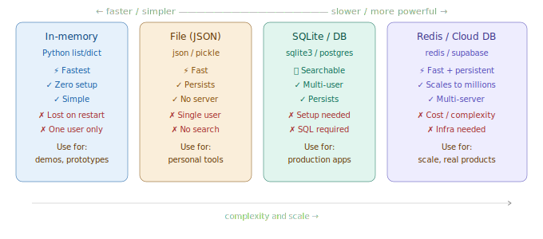

# Memory Stores (In-memory, DB)

> **Roadmap:** Context & Memory → Topic 6 of 8
> **Status:** ✅ Completed

---

## What is it?

This topic is about *where* to store conversation history, summaries, and user facts. The right storage layer depends on how fast you need to read, how much you store, and how many users you serve.



---

## Store 1 — In-memory (Python dict)

Fastest, zero setup, gone on restart. Good for prototypes.

```python
from groq import Groq
client = Groq(api_key="your-groq-api-key")

memory_store: dict[str, list] = {}

def get_conversation(user_id: str) -> list:
    if user_id not in memory_store:
        memory_store[user_id] = []
    return memory_store[user_id]

def chat(user_id: str, user_input: str) -> str:
    conversation = get_conversation(user_id)
    conversation.append({"role": "user", "content": user_input})

    response = client.chat.completions.create(
        model="llama-3.3-70b-versatile",
        max_tokens=300,
        messages=[
            {"role": "system", "content": "You are a helpful assistant."},
            *conversation[-10:]
        ]
    )

    reply = response.choices[0].message.content
    conversation.append({"role": "assistant", "content": reply})
    return reply

print(chat("arjun", "My favourite language is Python."))
print(chat("arjun", "What's my favourite language?"))  # remembers
```

---

## Store 2 — JSON file (simple persistence)

Good for personal tools or single-user apps.

```python
import json, os
from groq import Groq
client = Groq(api_key="your-groq-api-key")

STORE_DIR = "user_sessions"
os.makedirs(STORE_DIR, exist_ok=True)

def load_session(user_id: str) -> dict:
    path = f"{STORE_DIR}/{user_id}.json"
    if os.path.exists(path):
        with open(path) as f:
            return json.load(f)
    return {"conversation": [], "summary": ""}

def save_session(user_id: str, session: dict) -> None:
    with open(f"{STORE_DIR}/{user_id}.json", "w") as f:
        json.dump(session, f, indent=2)

def chat_json_store(user_id: str, user_input: str) -> str:
    session = load_session(user_id)
    session["conversation"].append({"role": "user", "content": user_input})

    system = "You are a helpful assistant."
    if session["summary"]:
        system += f"\n\nPrevious session summary:\n{session['summary']}"

    response = client.chat.completions.create(
        model="llama-3.3-70b-versatile",
        max_tokens=300,
        messages=[
            {"role": "system", "content": system},
            *session["conversation"][-10:]
        ]
    )

    reply = response.choices[0].message.content
    session["conversation"].append({"role": "assistant", "content": reply})
    save_session(user_id, session)
    return reply
```

---

## Store 3 — SQLite (multi-user production)

A real database — supports queries, multiple users, persists across restarts. No server needed.

```python
import sqlite3, json
from groq import Groq
client = Groq(api_key="your-groq-api-key")

DB_PATH = "chat_memory.db"

def init_db() -> None:
    conn = sqlite3.connect(DB_PATH)
    conn.executescript("""
        CREATE TABLE IF NOT EXISTS sessions (
            user_id    TEXT PRIMARY KEY,
            summary    TEXT DEFAULT '',
            updated_at TEXT DEFAULT CURRENT_TIMESTAMP
        );
        CREATE TABLE IF NOT EXISTS messages (
            id         INTEGER PRIMARY KEY AUTOINCREMENT,
            user_id    TEXT,
            role       TEXT,
            content    TEXT,
            created_at TEXT DEFAULT CURRENT_TIMESTAMP
        );
    """)
    conn.commit()
    conn.close()

def get_recent_messages(user_id: str, limit: int = 10) -> list:
    conn = sqlite3.connect(DB_PATH)
    rows = conn.execute(
        "SELECT role, content FROM messages WHERE user_id=? ORDER BY id DESC LIMIT ?",
        (user_id, limit)
    ).fetchall()
    conn.close()
    return [{"role": r[0], "content": r[1]} for r in reversed(rows)]

def save_message(user_id: str, role: str, content: str) -> None:
    conn = sqlite3.connect(DB_PATH)
    conn.execute("INSERT INTO messages (user_id, role, content) VALUES (?,?,?)", (user_id, role, content))
    conn.execute("INSERT INTO sessions (user_id) VALUES (?) ON CONFLICT(user_id) DO UPDATE SET updated_at=CURRENT_TIMESTAMP", (user_id,))
    conn.commit()
    conn.close()

def chat_sqlite(user_id: str, user_input: str) -> str:
    init_db()
    save_message(user_id, "user", user_input)
    messages = get_recent_messages(user_id)

    response = client.chat.completions.create(
        model="llama-3.3-70b-versatile",
        max_tokens=300,
        messages=[{"role": "system", "content": "You are a helpful assistant."}, *messages]
    )

    reply = response.choices[0].message.content
    save_message(user_id, "assistant", reply)
    return reply

init_db()
print(chat_sqlite("arjun", "I'm building a chess app in Python."))
print(chat_sqlite("arjun", "What am I building?"))   # remembers after restart
```

---

## Store 4 — Redis (fast + persistent, for scale)

In-memory database that also saves to disk. Incredibly fast, used by companies with millions of users.

```python
# pip install redis
import redis, json
from groq import Groq
client = Groq(api_key="your-groq-api-key")

r = redis.Redis(host="localhost", port=6379, decode_responses=True)

def save_to_redis(user_id: str, conversation: list, ttl: int = 86400) -> None:
    r.setex(f"chat:{user_id}", ttl, json.dumps(conversation))

def load_from_redis(user_id: str) -> list:
    data = r.get(f"chat:{user_id}")
    return json.loads(data) if data else []

def chat_redis(user_id: str, user_input: str) -> str:
    conversation = load_from_redis(user_id)
    conversation.append({"role": "user", "content": user_input})

    response = client.chat.completions.create(
        model="llama-3.3-70b-versatile",
        max_tokens=300,
        messages=[{"role": "system", "content": "You are a helpful assistant."}, *conversation[-10:]]
    )

    reply = response.choices[0].message.content
    conversation.append({"role": "assistant", "content": reply})
    save_to_redis(user_id, conversation)
    return reply
```

---

## Choosing the right store

| Store | Speed | Persists | Multi-user | When to use |
|---|---|---|---|---|
| In-memory dict | ⚡⚡⚡ | No | Shared RAM | Demos, prototypes |
| JSON file | ⚡⚡ | Yes | No | Personal tools |
| SQLite | ⚡⚡ | Yes | Yes | Small-medium production |
| PostgreSQL | ⚡ | Yes | Yes | Large production |
| Redis | ⚡⚡⚡ | Yes | Yes | High-speed, real-time |

---

## Key Insight

> Start with in-memory. Move to JSON when you need persistence. Move to SQLite when you have multiple users. Move to PostgreSQL or Redis when you need to scale.

Don't jump to the fancy solution before you need it — the simplest store that works is always the right choice.

---

➡️ **Next: Context Compression Techniques**