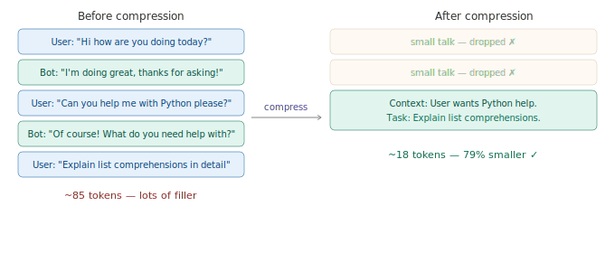

# Context Compression Techniques

> **Roadmap:** Context & Memory → Topic 7 of 8
> **Status:** ✅ Completed

---

## What is it?

Context compression is about **reducing tokens without losing the information that actually matters**. While summarisation compresses whole conversations, these techniques work at a finer level — filtering irrelevant messages, rewriting verbose content, and extracting only what counts.

Think of it like packing a suitcase. Summarisation is folding all your clothes into one pile. Compression is deciding which clothes you actually need, folding them tightly, and leaving the rest at home.



---

## Technique 1 — Drop irrelevant messages

Not every message matters. Greetings, small talk, and filler carry no useful context. Filter them out before sending.

```python
from groq import Groq
client = Groq(api_key="your-groq-api-key")

def is_relevant(message: dict) -> bool:
    """Returns True if message is worth keeping, False if it's filler."""
    response = client.chat.completions.create(
        model="llama-3.3-70b-versatile",
        max_tokens=10,
        temperature=0.0,
        messages=[
            {
                "role": "system",
                "content": """Decide if this message contains useful information worth remembering.
Reply with only: YES or NO.
Small talk, greetings, generic acknowledgements = NO.
Facts, tasks, preferences, decisions, code = YES."""
            },
            {"role": "user", "content": message["content"]}
        ]
    )
    return response.choices[0].message.content.strip().upper() == "YES"

def filter_conversation(conversation: list) -> list:
    """Keep only messages the model considers relevant."""
    filtered = [msg for msg in conversation if is_relevant(msg)]
    print(f"Kept {len(filtered)}/{len(conversation)} messages")
    return filtered


conversation = [
    {"role": "user",      "content": "Hi! How are you?"},
    {"role": "assistant", "content": "I'm doing well, thanks!"},
    {"role": "user",      "content": "My name is Arjun by the way."},
    {"role": "user",      "content": "I'm building a Python API for a food delivery app."},
    {"role": "user",      "content": "FastAPI with PostgreSQL. I need help with JWT auth."},
]

filtered = filter_conversation(conversation)
```

---

## Technique 2 — Rewrite verbose messages as dense facts

Some messages are useful but wordy. Rewrite them as compact facts instead of dropping them.

```python
from groq import Groq
client = Groq(api_key="your-groq-api-key")

def compress_message(message: dict) -> dict:
    """Rewrite a verbose message as a single dense sentence."""
    response = client.chat.completions.create(
        model="llama-3.3-70b-versatile",
        max_tokens=60,
        temperature=0.1,
        messages=[
            {"role": "system", "content": "Rewrite the message below as a single dense sentence. Remove filler. Keep only facts and intent."},
            {"role": "user",   "content": message["content"]}
        ]
    )
    return {"role": message["role"], "content": response.choices[0].message.content.strip()}

def compress_old_messages(conversation: list, keep_recent: int = 4) -> list:
    """Compress all messages except the most recent ones."""
    if len(conversation) <= keep_recent:
        return conversation

    old_messages    = conversation[:-keep_recent]
    recent_messages = conversation[-keep_recent:]
    compressed      = [compress_message(m) for m in old_messages]
    return compressed + recent_messages
```

---

## Technique 3 — Extract a structured context block

Most aggressive. Replace the entire conversation history with a compact JSON briefing of key facts.

```python
from groq import Groq
import json
client = Groq(api_key="your-groq-api-key")

def extract_context_block(conversation: list) -> str:
    history = "\n".join(f"{m['role'].upper()}: {m['content']}" for m in conversation)

    response = client.chat.completions.create(
        model="llama-3.3-70b-versatile",
        max_tokens=200,
        temperature=0.1,
        messages=[
            {
                "role": "system",
                "content": """Extract key context into a structured block. Reply with JSON only:
{
  "user_name": "if mentioned, else null",
  "user_goal": "what they're trying to accomplish",
  "tech_stack": ["technologies mentioned"],
  "current_task": "what they need help with right now",
  "decisions_made": ["any decisions or preferences stated"],
  "open_questions": ["things still unresolved"]
}"""
            },
            {"role": "user", "content": f"Extract context:\n\n{history}"}
        ]
    )
    return response.choices[0].message.content


def chat_with_context_block(context_block: str, user_input: str) -> str:
    """Use extracted context block instead of full conversation history."""
    system = f"You are a helpful coding assistant.\n\nContext from earlier:\n{context_block}"

    response = client.chat.completions.create(
        model="llama-3.3-70b-versatile",
        max_tokens=400,
        messages=[
            {"role": "system", "content": system},
            {"role": "user",   "content": user_input}
        ]
    )
    return response.choices[0].message.content


# Test it
conversation = [
    {"role": "user",      "content": "I'm Arjun, building a food delivery app with FastAPI and PostgreSQL."},
    {"role": "user",      "content": "I want JWT auth. Decided to use PyJWT to keep things simple."},
]

context_block = extract_context_block(conversation)
reply = chat_with_context_block(context_block, "Show me how to generate a JWT token with PyJWT.")
print(reply)
```

---

## When to use each technique

| Technique | Best for | Token saving |
|---|---|---|
| Drop irrelevant messages | Conversations with lots of small talk | 20–40% |
| Rewrite verbose messages | Long-winded exchanges | 40–70% |
| Extract context block | Long sessions, fresh start needed | 70–90% |
| All three combined | Production apps, long-running agents | Up to 95% |

---

## Key Insight

> Compression is not about losing information — it's about losing *noise*. A model that reads 20 clean tokens of dense context performs better than one reading 200 tokens of watered-down conversation.

---

➡️ **Next: Sliding Window Context**