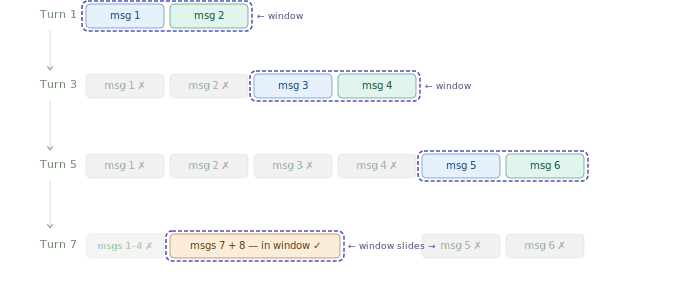

# Sliding Window Context

> **Roadmap:** Context & Memory → Topic 8 of 8
> **Status:** ✅ Completed

---

## What is it?

Instead of sending the full conversation every time, you only send the **most recent N messages**. As new messages arrive, the window slides forward — old messages fall out the back, new ones enter the front.



---

## The naive version — and why it breaks

```python
# ❌ Breaks conversation pairs
conversation = [msg1, msg2, msg3, msg4, msg5]
trimmed = conversation[-4:]   # might cut a user message that has no reply
```

If you trim mid-pair, the model sees an assistant reply with no question before it. Always trim in complete pairs.

---

## Strategy 1 — Pair-aware trimming

Always keep complete user + assistant pairs so context stays coherent.

```python
from groq import Groq
client = Groq(api_key="your-groq-api-key")

def trim_to_pairs(conversation: list, max_pairs: int = 5) -> list:
    """Keep only the last N user+assistant pairs."""
    max_messages = max_pairs * 2

    if len(conversation) <= max_messages:
        return conversation

    trimmed = conversation[-max_messages:]

    # Always start on a user message
    if trimmed[0]["role"] == "assistant":
        trimmed = trimmed[1:]

    return trimmed


conversation = [
    {"role": "user",      "content": "What is a list?"},
    {"role": "assistant", "content": "An ordered collection of items."},
    {"role": "user",      "content": "What is a dict?"},
    {"role": "assistant", "content": "Maps keys to values."},
    {"role": "user",      "content": "What is a function?"},
    {"role": "assistant", "content": "A reusable block of code."},
    {"role": "user",      "content": "What is a class?"},
    {"role": "assistant", "content": "A blueprint for objects."},
]

trimmed = trim_to_pairs(conversation, max_pairs=2)
# Returns only last 2 pairs — always starts on user message
```

---

## Strategy 2 — Token-aware window

Trim by token budget instead of message count — more accurate since messages vary in length.

```python
from groq import Groq
import tiktoken

client  = Groq(api_key="your-groq-api-key")
encoder = tiktoken.get_encoding("cl100k_base")

def count_tokens(text: str) -> int:
    return len(encoder.encode(text))

def token_aware_window(conversation: list, system: str, token_budget: int = 3000) -> list:
    """Fit as many recent messages as possible within the token budget."""
    remaining = token_budget - count_tokens(system) - 10
    selected  = []

    for message in reversed(conversation):
        msg_tokens = count_tokens(message["content"]) + 4
        if msg_tokens > remaining:
            break
        selected.insert(0, message)
        remaining -= msg_tokens

    # Start on user message
    if selected and selected[0]["role"] == "assistant":
        selected = selected[1:]

    return selected


def chat(conversation: list, user_input: str, system: str) -> str:
    conversation.append({"role": "user", "content": user_input})
    window = token_aware_window(conversation, system)

    response = client.chat.completions.create(
        model="llama-3.3-70b-versatile",
        max_tokens=500,
        messages=[{"role": "system", "content": system}, *window]
    )

    reply = response.choices[0].message.content
    conversation.append({"role": "assistant", "content": reply})
    return reply
```

---

## Strategy 3 — Hybrid window + summary anchor (best)

Keep a rolling summary of everything old, and the last N messages in full. The summary acts as an anchor — the model always knows the full story.

```python
from groq import Groq
client = Groq(api_key="your-groq-api-key")

class HybridWindowChat:
    def __init__(self, system: str, window_size: int = 6):
        self.system      = system
        self.window_size = window_size
        self.history     = []
        self.summary     = ""

    def _make_summary(self, messages: list) -> str:
        text     = "\n".join(f"{m['role'].upper()}: {m['content']}" for m in messages)
        response = client.chat.completions.create(
            model="llama-3.3-70b-versatile",
            max_tokens=150,
            temperature=0.1,
            messages=[
                {"role": "system", "content": "Summarise into 3-5 dense bullet points. Keep all facts and decisions."},
                {"role": "user",   "content": text}
            ]
        )
        return response.choices[0].message.content

    def chat(self, user_input: str) -> str:
        self.history.append({"role": "user", "content": user_input})

        # Compress overflow into summary
        if len(self.history) > self.window_size:
            overflow     = self.history[:-self.window_size]
            self.history = self.history[-self.window_size:]
            new_summary  = self._make_summary(overflow)
            self.summary = f"{self.summary}\n{new_summary}".strip() if self.summary else new_summary

        # Inject summary as anchor
        full_system = self.system
        if self.summary:
            full_system += f"\n\nEarlier conversation summary:\n{self.summary}"

        response = client.chat.completions.create(
            model="llama-3.3-70b-versatile",
            max_tokens=400,
            messages=[{"role": "system", "content": full_system}, *self.history]
        )

        reply = response.choices[0].message.content
        self.history.append({"role": "assistant", "content": reply})
        return reply


bot = HybridWindowChat("You are a helpful AI tutor.", window_size=4)
bot.chat("Hi I'm Arjun, learning AI engineering.")
bot.chat("What is a transformer?")
bot.chat("What is RAG?")
bot.chat("What is LangChain?")
bot.chat("What is a vector database?")
bot.chat("What is fine-tuning?")
print(bot.chat("What was the first thing I told you?"))   # tests memory
```

---

## Strategies comparison

| Strategy | How it works | Best for |
|---|---|---|
| Fixed message count | Keep last N messages | Simple chatbots |
| Pair-aware trimming | Keep last N pairs, start on user | Any production chatbot |
| Token-aware window | Fit max messages in token budget | Long or varied messages |
| Hybrid window + summary | Window + compressed summary anchor | Long sessions, agents |

---

## Key Insight

> A bare sliding window is fast and simple — but amnesiac. Pairing it with a rolling summary gives you the best of both worlds: the speed of a window with the long-term memory of a summary. This hybrid pattern is what most serious AI products use under the hood.

---

## 🎉 Context & Memory Complete!

All 8 topics done. Next section: **Embeddings & Vector DBs**

➡️ **Next Section: What are Embeddings?**