# 19 — What are Embeddings?

**Section 3: Embeddings & Vector DBs**

---

## What is an embedding?

An embedding is a way of converting text (or images, audio, etc.) into a list of numbers called a **vector**. The key property is that *similar meanings produce similar vectors*.

Think of it like coordinates on a map. Cities that are geographically close have similar coordinates. Embeddings do the same for meaning — words or sentences that mean similar things end up "close together" in a high-dimensional numeric space.

- "dog" and "puppy" → vectors that are very close
- "dog" and "laptop" → vectors that are far apart

The model learns this structure automatically during training, without being told what "similar" means.

---

## Why do embeddings matter?

Plain text matching (keyword search) only finds exact word matches. Embeddings enable **semantic search** — finding things that *mean* the same thing even if they use different words.

This unlocks:

- **Semantic search** — find documents that mean the same as a query
- **RAG (Retrieval-Augmented Generation)** — retrieve relevant documents, then pass to an LLM
- **Clustering** — group documents by meaning automatically
- **Similarity detection** — find near-duplicate content
- **Recommendation** — suggest items with similar meaning/content

---

## What does a vector look like?

When you embed the sentence `"The dog ran across the park"`, you get back something like:

```
[0.21, -0.84, 0.53, 0.12, -0.37, 0.90, ... ]  ← 384 or 1536 or 3072 numbers
```

Each number captures some aspect of meaning. No single number corresponds to a human concept like "animal" — it's distributed across all dimensions. The model figures out the geometry during training.

---

## Diagram



---

## Code — generating and comparing embeddings

```python
# pip install sentence-transformers numpy

from sentence_transformers import SentenceTransformer
import numpy as np

# Load a small but powerful embedding model (384 dimensions)
model = SentenceTransformer("all-MiniLM-L6-v2")

# --- 1. Embed some sentences ---
sentences = [
    "The dog ran across the park",
    "A puppy sprinted through the garden",   # semantically close
    "My laptop needs a new battery",          # unrelated
    "The CPU is overheating",                 # tech-related
]

embeddings = model.encode(sentences)
print(f"Shape: {embeddings.shape}")  # (4, 384)

# --- 2. Measure cosine similarity manually ---
def cosine_similarity(a, b):
    return np.dot(a, b) / (np.linalg.norm(a) * np.linalg.norm(b))

base = embeddings[0]  # "The dog ran..."

for i, sentence in enumerate(sentences[1:], 1):
    sim = cosine_similarity(base, embeddings[i])
    print(f"Similarity to sentence {i}: {sim:.3f}  →  '{sentence}'")

# Expected output:
# Similarity to sentence 1: 0.812  →  'A puppy sprinted...'  (HIGH - same meaning)
# Similarity to sentence 2: 0.142  →  'My laptop...'         (LOW - different topic)
# Similarity to sentence 3: 0.183  →  'The CPU...'           (LOW - different topic)
```

---

## Code — simple semantic search

This is the core pattern behind RAG.

```python
documents = [
    "Python is a popular programming language for data science",
    "Dogs make great pets for families with children",
    "Machine learning models require large datasets",
    "Cats are more independent than dogs",
    "Neural networks are inspired by the human brain",
]

query = "What animals are good for families?"

# Embed everything
doc_embeddings = model.encode(documents)
query_embedding = model.encode([query])[0]

# Score each document
scores = [cosine_similarity(query_embedding, doc_emb) 
          for doc_emb in doc_embeddings]

# Rank and print
ranked = sorted(zip(scores, documents), reverse=True)
print(f"\nQuery: '{query}'\n")
for score, doc in ranked:
    print(f"  {score:.3f}  {doc}")

# "Dogs make great pets..." ranks #1
# "Cats are more independent..." ranks #2
# ML/Python docs score low
```

---

## Code — embeddings + Groq (the RAG pattern)

Embeddings handle *retrieval*. Groq handles *generation*. Together this is RAG.

```python
from groq import Groq
from sentence_transformers import SentenceTransformer
import numpy as np

groq_client = Groq(api_key="your-groq-api-key")
embed_model = SentenceTransformer("all-MiniLM-L6-v2")

# Your knowledge base
knowledge_base = [
    "Our refund policy allows returns within 30 days of purchase.",
    "Shipping takes 3-5 business days for standard delivery.",
    "We offer free shipping on orders over $50.",
    "Customer support is available Monday to Friday, 9am-6pm EST.",
]

kb_embeddings = embed_model.encode(knowledge_base)

def rag_answer(user_question: str, top_k: int = 2) -> str:
    # Step 1: Embed the question
    q_emb = embed_model.encode([user_question])[0]

    # Step 2: Find most relevant docs by cosine similarity
    scores = [np.dot(q_emb, d) / (np.linalg.norm(q_emb) * np.linalg.norm(d))
              for d in kb_embeddings]
    top_indices = sorted(range(len(scores)), key=lambda i: scores[i], reverse=True)[:top_k]
    context = "\n".join([knowledge_base[i] for i in top_indices])

    # Step 3: Generate answer with Groq
    response = groq_client.chat.completions.create(
        model="llama-3.3-70b-versatile",
        messages=[
            {"role": "system", "content": f"Answer using this context:\n{context}"},
            {"role": "user", "content": user_question}
        ]
    )
    return response.choices[0].message.content

print(rag_answer("How long does shipping take?"))
# Groq retrieves the shipping policy and answers accurately
```

---

## Key takeaways

- An embedding is a list of numbers (vector) representing the *meaning* of text
- Similar meanings → vectors that are close together in space
- Closeness is measured with cosine similarity (covered in topic 21)
- Embeddings are the engine behind semantic search, RAG, and clustering
- In a typical system: an embedding model handles retrieval, an LLM (via Groq) handles generation
- Common embedding models: `all-MiniLM-L6-v2` (local, free), `text-embedding-3-small` (OpenAI API)

---

## Coming up next

- **Topic 20** — Embedding models in depth (OpenAI, HuggingFace options, dimensions, tradeoffs)
- **Topic 21** — Semantic similarity & cosine distance (the math behind "closeness")