# 20 — Embedding Models

**Section 3: Embeddings & Vector DBs**

---

## The landscape

There are two broad categories of embedding models:

- **API-based** — send text, receive vectors, pay per token (OpenAI, Cohere)
- **Local / HuggingFace** — run on your own machine, free, slightly lower quality

---

## Model comparison



| Model | Dims | Cost | Best for |
|---|---|---|---|
| `text-embedding-3-small` | 1536 | $0.02/1M tokens | Production RAG, good default |
| `text-embedding-3-large` | 3072 | $0.13/1M tokens | High-stakes retrieval |
| `embed-english-v3.0` | 1024 | ~$0.10/1M tokens | Cohere RAG with input types |
| `all-MiniLM-L6-v2` | 384 | Free | Dev/prototyping, fast |
| `all-mpnet-base-v2` | 768 | Free | Local, balanced quality |
| `BAAI/bge-large-en-v1.5` | 1024 | Free | Best free model (MTEB) |

**More dimensions = more expressive, but also slower, larger storage, and higher cost.** For most RAG apps, 384–768 dims is sufficient.

---

## How to choose

- Learning / prototyping → `all-MiniLM-L6-v2`
- Production RAG, moderate scale → `text-embedding-3-small`
- High-stakes retrieval, large diverse corpus → `text-embedding-3-large` or `BAAI/bge-large-en-v1.5`
- Need query vs document input type control → Cohere `embed-english-v3.0`

---

## Code — local models (sentence-transformers)

```python
# pip install sentence-transformers

from sentence_transformers import SentenceTransformer

model_small  = SentenceTransformer("all-MiniLM-L6-v2")      # 384 dims
model_medium = SentenceTransformer("all-mpnet-base-v2")      # 768 dims
model_large  = SentenceTransformer("BAAI/bge-large-en-v1.5") # 1024 dims

texts = ["The quick brown fox", "A fast auburn fox"]

print(model_small.encode(texts).shape)   # (2, 384)
print(model_medium.encode(texts).shape)  # (2, 768)
print(model_large.encode(texts).shape)   # (2, 1024)
```

---

## Code — OpenAI API embeddings

```python
# pip install openai

from openai import OpenAI

client = OpenAI(api_key="your-openai-api-key")

def embed_openai(texts: list[str], model="text-embedding-3-small") -> list[list[float]]:
    response = client.embeddings.create(input=texts, model=model)
    return [item.embedding for item in response.data]

vecs = embed_openai(["semantic search is powerful", "finding meaning in text"])
print(len(vecs[0]))   # 1536

# OpenAI supports matryoshka — truncate to save storage (still meaningful)
vecs_256 = [v[:256] for v in vecs]
```

---

## Code — Cohere with input_type

Cohere's `input_type` parameter is important for RAG. Queries and documents are embedded in compatible but distinct sub-spaces, improving retrieval accuracy.

```python
# pip install cohere

import cohere

co = cohere.Client("your-cohere-api-key")

# At index time
doc_embeddings = co.embed(
    texts=["Refunds are allowed within 30 days", "Free shipping over $50"],
    model="embed-english-v3.0",
    input_type="search_document",
).embeddings

# At query time
query_embedding = co.embed(
    texts=["Can I return my order?"],
    model="embed-english-v3.0",
    input_type="search_query",
).embeddings[0]

print(len(doc_embeddings[0]))   # 1024
```

---

## Code — Groq + embeddings (full RAG pipeline)

```python
from groq import Groq
from sentence_transformers import SentenceTransformer
import numpy as np

groq  = Groq(api_key="your-groq-api-key")
embed = SentenceTransformer("all-MiniLM-L6-v2")

docs = [
    "Python was created by Guido van Rossum in 1991.",
    "NumPy provides fast array operations for numerical computing.",
    "Pandas is used for data manipulation and analysis.",
    "PyTorch is a deep learning framework developed by Meta.",
]

# normalize_embeddings=True lets us use dot product instead of cosine
doc_vecs = embed.encode(docs, normalize_embeddings=True)

def search(query: str, top_k=2):
    q_vec = embed.encode([query], normalize_embeddings=True)[0]
    scores = doc_vecs @ q_vec      # dot product == cosine when normalised
    top = np.argsort(scores)[::-1][:top_k]
    return [docs[i] for i in top]

def ask(question: str) -> str:
    context = "\n".join(search(question))
    resp = groq.chat.completions.create(
        model="llama-3.3-70b-versatile",
        messages=[
            {"role": "system", "content": f"Answer using only this context:\n{context}"},
            {"role": "user",   "content": question},
        ]
    )
    return resp.choices[0].message.content

print(ask("Who made PyTorch?"))
# → "PyTorch was developed by Meta."
```

---

## Key tip — always normalise

When you normalise embeddings to unit length (`normalize_embeddings=True`), the dot product `a · b` equals cosine similarity. This is faster than computing cosine manually and is standard in production.

---

## Key takeaways

- More dimensions = more expressive but slower and costlier — 384 dims is fine for most tasks
- `all-MiniLM-L6-v2` is the go-to free model for development
- `text-embedding-3-small` is the go-to paid model for production
- Cohere's `input_type` distinction (query vs document) can improve RAG accuracy
- Always normalise embeddings and use dot product — same result as cosine, much faster
- The embedding model and the LLM are separate — mix and match freely

---

## Coming up next

- **Topic 21** — Semantic similarity & cosine distance (the math behind "closeness")