# Semantic Similarity & Cosine Distance

> **Roadmap:** Embeddings & Vector DBs → Topic 3 of 9
> **File:** `21_semantic_similarity_cosine.md`

---

## What is it?

Once you have two embedding vectors, you need a way to measure how similar they are. The standard method is **cosine similarity** — it measures the *angle* between two vectors in high-dimensional space, not the distance between their tips.



Two vectors pointing in nearly the same direction → small angle → high similarity score.
Two vectors pointing in very different directions → large angle → low score.

---

## The formula

```
cos(θ) = (A · B) / (|A| × |B|)
```

- `A · B` — dot product: multiply matching dimensions, sum them up
- `|A|` — magnitude (length) of vector A
- `|B|` — magnitude (length) of vector B
- Result is always between **-1.0** and **1.0**

| Score | Meaning |
|---|---|
| 1.0 | Identical direction — same meaning |
| 0.8 – 0.95 | Very similar |
| 0.4 – 0.7 | Related but different |
| 0.0 – 0.3 | Mostly unrelated |
| -1.0 | Opposite direction — opposite meaning |

In practice, with modern embedding models text rarely goes below 0.0. Scores below 0.3 already mean "unrelated."

---

## Why angle and not distance?

Euclidean distance (straight line between two points) is affected by vector *magnitude*. A short vector and a long vector pointing the same direction would look distant. Cosine similarity ignores length and only cares about direction — which is what we want when comparing meaning.

> **Key insight:** Cosine similarity measures *direction*, not length. Two vectors can be at very different scales but still score 1.0 if they point the same way. This is why normalising embeddings to unit length lets you replace the cosine formula with a simple dot product — same result, much faster.

---

## Code — cosine similarity from scratch

```python
import numpy as np
from sentence_transformers import SentenceTransformer

model = SentenceTransformer("all-MiniLM-L6-v2")

def cosine_similarity(a: np.ndarray, b: np.ndarray) -> float:
    return np.dot(a, b) / (np.linalg.norm(a) * np.linalg.norm(b))

sentences = [
    "The dog ran across the park",      # base
    "A puppy sprinted through the garden",  # very similar
    "I love machine learning",              # unrelated
    "Dogs are terrible pets",               # opposite sentiment
]

embeddings = model.encode(sentences)
base = embeddings[0]

for i, s in enumerate(sentences[1:], 1):
    score = cosine_similarity(base, embeddings[i])
    print(f"{score:.3f}  →  {s}")

# 0.812  →  A puppy sprinted through the garden
# 0.142  →  I love machine learning
# 0.431  →  Dogs are terrible pets   (same topic, different sentiment)
```

---

## Code — faster with normalisation + dot product

When embeddings are normalised to unit length, `dot(a, b) == cosine(a, b)`. This is the standard production approach.

```python
# Normalise once at index time
doc_vecs = model.encode(sentences, normalize_embeddings=True)

# At query time — just a dot product (much faster at scale)
query_vec = model.encode(["puppy playing outside"], normalize_embeddings=True)[0]
scores = doc_vecs @ query_vec   # matrix × vector = all scores at once

ranked = sorted(zip(scores, sentences), reverse=True)
for score, text in ranked:
    print(f"{score:.3f}  {text}")
```

---

## Code — semantic search with a threshold

In production you usually don't just want the top result — you want results *above a minimum quality bar*. Use a threshold to filter.

```python
def semantic_search(
    query: str,
    documents: list[str],
    model,
    threshold: float = 0.5,
    top_k: int = 3
) -> list[tuple[float, str]]:
    doc_vecs   = model.encode(documents, normalize_embeddings=True)
    query_vec  = model.encode([query], normalize_embeddings=True)[0]
    scores     = doc_vecs @ query_vec

    results = [
        (float(score), doc)
        for score, doc in zip(scores, documents)
        if score >= threshold
    ]
    results.sort(reverse=True)
    return results[:top_k]

docs = [
    "Refunds are accepted within 30 days of purchase.",
    "Free shipping on orders over $50.",
    "Customer support is open Monday to Friday.",
    "Our return policy requires the original receipt.",
    "Python is a great language for data science.",
]

hits = semantic_search("Can I return something I bought?", docs, model, threshold=0.45)
for score, text in hits:
    print(f"{score:.3f}  {text}")

# 0.721  Refunds are accepted within 30 days of purchase.
# 0.614  Our return policy requires the original receipt.
```

---

## Code — full pipeline with Groq

```python
from groq import Groq
from sentence_transformers import SentenceTransformer
import numpy as np

groq  = Groq(api_key="your-groq-api-key")
model = SentenceTransformer("all-MiniLM-L6-v2")

knowledge_base = [
    "Refunds are accepted within 30 days of purchase.",
    "Free shipping on orders over $50.",
    "Customer support is open Monday to Friday, 9am–6pm.",
    "Our return policy requires the original receipt.",
]

kb_vecs = model.encode(knowledge_base, normalize_embeddings=True)

def ask(question: str, threshold: float = 0.45) -> str:
    q_vec  = model.encode([question], normalize_embeddings=True)[0]
    scores = kb_vecs @ q_vec

    # Only use docs above the threshold
    context_docs = [
        doc for score, doc in zip(scores, knowledge_base)
        if score >= threshold
    ]

    if not context_docs:
        context = "No relevant information found."
    else:
        context = "\n".join(context_docs)

    resp = groq.chat.completions.create(
        model="llama-3.3-70b-versatile",
        messages=[
            {"role": "system", "content": f"Answer using this context:\n{context}"},
            {"role": "user",   "content": question},
        ]
    )
    return resp.choices[0].message.content

print(ask("What's your return policy?"))
print(ask("Do you offer free delivery?"))
```

---

## Other distance metrics (brief)

| Metric | Formula | When to use |
|---|---|---|
| Cosine similarity | `dot(a,b) / (|a||b|)` | Standard for text — direction only |
| Dot product | `dot(a,b)` | Same as cosine when normalised — fastest |
| Euclidean distance | `sqrt(sum((a-b)²))` | When magnitude matters (images, audio) |
| Manhattan distance | `sum(|a-b|)` | Rarely used for text |

For text and RAG, always default to cosine / normalised dot product.

---

➡️ **Next: Vector DB Concepts (HNSW, IVF)**