# Vector DB Concepts (HNSW, IVF)

> **Roadmap:** Embeddings & Vector DBs → Topic 4 of 9
> **File:** `22_vector_db_concepts.md`

---

## What is it?

When you have millions of documents stored as vectors, comparing your query against every single one (brute-force / exact search) is too slow. Vector databases use **Approximate Nearest Neighbour (ANN)** algorithms to trade a tiny bit of accuracy for massive speed gains.

Two algorithms dominate: **HNSW** and **IVF**.



---

## HNSW — Hierarchical Navigable Small World

Think of it like a road network. The top layer has a few nodes connected by long-range links (motorways). You enter at the top, hop quickly to the rough neighbourhood of your target, then drop to lower layers with more nodes and shorter links, refining as you go.

- **Build time:** slow (building the graph takes work)
- **Query time:** very fast
- **Memory:** high — the graph lives in RAM
- **Best for:** datasets up to ~10M vectors where you can afford the RAM
- **Used by:** ChromaDB, Weaviate, Qdrant

---

## IVF — Inverted File Index

Think of it like a library organised by genre. A clustering step (k-means) divides all vectors into `nlist` groups. At query time, you find the closest centroid(s) and only search within those clusters — skipping the rest entirely.

The key parameter is `nprobe` — how many clusters to check. Higher = more accurate, slower.

- **Build time:** moderate (just clustering)
- **Query time:** fast, tunable with nprobe
- **Memory:** lower — can work with disk-based storage
- **Best for:** very large datasets (10M–1B+ vectors)
- **Used by:** FAISS, Pinecone

---

## How to choose

| | HNSW | IVF |
|---|---|---|
| Speed | Very fast | Fast, tunable |
| Accuracy | Very high | Tunable via nprobe |
| Memory | High (graph in RAM) | Lower |
| Best scale | Up to ~10M | 10M–1B+ |
| Used by | Chroma, Weaviate | Faiss, Pinecone |

In practice you rarely pick manually — Pinecone and ChromaDB use HNSW by default. The concepts matter so you understand what `nprobe`, `efSearch`, and `M` actually do when you tune them.

---

## Code — exact vs HNSW vs IVF with FAISS

```python
# pip install faiss-cpu numpy sentence-transformers

import faiss
import numpy as np
from sentence_transformers import SentenceTransformer

model = SentenceTransformer("all-MiniLM-L6-v2")

docs = [
    "The Eiffel Tower is in Paris.",
    "Python is a programming language.",
    "Dogs are loyal companions.",
    "The Louvre is a famous museum.",
    "Machine learning uses statistics.",
    "Cats are independent animals.",
    "France is known for its cuisine.",
    "Neural networks are inspired by the brain.",
]

vecs = model.encode(docs, normalize_embeddings=True).astype("float32")
dim  = vecs.shape[1]   # 384
```

```python
# --- Exact search (brute force) — baseline ---
index_flat = faiss.IndexFlatIP(dim)   # IP = inner product = cosine when normalised
index_flat.add(vecs)

query = model.encode(["Famous landmarks in France"], normalize_embeddings=True).astype("float32")
scores, indices = index_flat.search(query, k=3)

for score, idx in zip(scores[0], indices[0]):
    print(f"{score:.3f}  {docs[idx]}")
```

```python
# --- HNSW index ---
# M = connections per node (higher = better recall, more memory)
# efConstruction = build quality (higher = better index, slower build)
# efSearch = query accuracy (raise if missing good results)

index_hnsw = faiss.IndexHNSWFlat(dim, 32)   # M=32
index_hnsw.hnsw.efConstruction = 200
index_hnsw.hnsw.efSearch = 64
index_hnsw.add(vecs)

scores, indices = index_hnsw.search(query, k=3)
for score, idx in zip(scores[0], indices[0]):
    print(f"{score:.3f}  {docs[idx]}")
```

```python
# --- IVF index ---
# nlist = number of clusters (rule of thumb: sqrt(n_docs))
# nprobe = clusters checked per query

nlist     = 4   # normally int(sqrt(len(docs)))
quantiser = faiss.IndexFlatIP(dim)
index_ivf = faiss.IndexIVFFlat(quantiser, dim, nlist, faiss.METRIC_INNER_PRODUCT)

index_ivf.train(vecs)   # IVF requires a training step
index_ivf.add(vecs)

index_ivf.nprobe = 2
scores, indices = index_ivf.search(query, k=3)
for score, idx in zip(scores[0], indices[0]):
    print(f"{score:.3f}  {docs[idx]}")
```

```python
# --- Groq + FAISS HNSW RAG pipeline ---
from groq import Groq

groq    = Groq(api_key="your-groq-api-key")
kb_vecs = model.encode(docs, normalize_embeddings=True).astype("float32")

index = faiss.IndexHNSWFlat(dim, 32)
index.hnsw.efSearch = 64
index.add(kb_vecs)

def ask(question: str, top_k: int = 2) -> str:
    q_vec = model.encode([question], normalize_embeddings=True).astype("float32")
    _, indices = index.search(q_vec, k=top_k)
    context = "\n".join(docs[i] for i in indices[0])

    resp = groq.chat.completions.create(
        model="llama-3.3-70b-versatile",
        messages=[
            {"role": "system", "content": f"Answer using this context:\n{context}"},
            {"role": "user",   "content": question},
        ]
    )
    return resp.choices[0].message.content

print(ask("What can I visit in France?"))
```

---

## Key parameters

| Parameter | Algorithm | What it does |
|---|---|---|
| `M` | HNSW | Connections per node. Higher = better recall, more memory. Default 16–64 |
| `efConstruction` | HNSW | Build quality. Higher = better index, slower build. Default 200 |
| `efSearch` | HNSW | Query accuracy. Raise if missing good results |
| `nlist` | IVF | Number of clusters. Rule of thumb: `sqrt(n_docs)` |
| `nprobe` | IVF | Clusters checked per query. Higher = more accurate, slower |

---

> **Key insight:** Both HNSW and IVF trade a small amount of recall for a massive speed gain. In practice the recall loss is tiny — 95–99% of the time you get the same results as exact search, at 10–100x the speed. You almost never need exact search in production.

---

➡️ **Next: Pinecone Setup & Usage**