# Pinecone Setup & Usage

> **Roadmap:** Embeddings & Vector DBs → Topic 5 of 9
> **File:** `23_pinecone_setup_usage.md`

---

## What is it?

Pinecone is a fully managed vector database. You don't run servers, configure HNSW parameters, or worry about scaling. You create an index, upsert vectors, and query. It's the most popular choice for production RAG.



---

## Core concepts

- **Index** — top-level container, like a table in SQL. One per use case.
- **Namespace** — partition inside an index. Keeps user A's data separate from user B's.
- **Upsert** — insert or update by ID. Safe to call repeatedly.
- **Metadata** — key-value data attached to each vector. Filterable at query time.

---

## Setup

```bash
pip install pinecone sentence-transformers groq
```

Create a free account at [pinecone.io](https://pinecone.io) and grab your API key.

---

## Code — create index

```python
from pinecone import Pinecone, ServerlessSpec

pc = Pinecone(api_key="your-pinecone-api-key")

pc.create_index(
    name="knowledge-base",
    dimension=384,        # must match your embedding model exactly
    metric="cosine",
    spec=ServerlessSpec(cloud="aws", region="us-east-1")
)

index = pc.Index("knowledge-base")
```

---

## Code — upsert documents

```python
from sentence_transformers import SentenceTransformer

model = SentenceTransformer("all-MiniLM-L6-v2")

docs = [
    {"id": "doc_1", "text": "Refunds are accepted within 30 days.",          "category": "refunds"},
    {"id": "doc_2", "text": "Free shipping on orders over $50.",              "category": "shipping"},
    {"id": "doc_3", "text": "Support is open Monday to Friday 9am–6pm.",     "category": "support"},
    {"id": "doc_4", "text": "Return policy requires the original receipt.",   "category": "refunds"},
    {"id": "doc_5", "text": "Express shipping takes 1–2 business days.",     "category": "shipping"},
]

vectors = []
for doc in docs:
    embedding = model.encode(doc["text"], normalize_embeddings=True).tolist()
    vectors.append({
        "id":       doc["id"],
        "values":   embedding,
        "metadata": {"text": doc["text"], "category": doc["category"]}
    })

index.upsert(vectors=vectors)
```

---

## Code — query

```python
query = "Can I return something I bought last week?"
q_vec = model.encode(query, normalize_embeddings=True).tolist()

results = index.query(
    vector=q_vec,
    top_k=3,
    include_metadata=True   # must be True to get text back
)

for match in results["matches"]:
    print(f"{match['score']:.3f}  {match['metadata']['text']}")
```

---

## Code — metadata filtering

```python
# Only search within a specific category — runs before vector search, very fast
results = index.query(
    vector=q_vec,
    top_k=3,
    include_metadata=True,
    filter={"category": {"$eq": "refunds"}}
)
```

---

## Code — full RAG pipeline with Groq

```python
from groq import Groq

groq = Groq(api_key="your-groq-api-key")

def ask(question: str, category_filter: str = None, top_k: int = 3) -> str:
    q_vec = model.encode(question, normalize_embeddings=True).tolist()

    query_kwargs = dict(vector=q_vec, top_k=top_k, include_metadata=True)
    if category_filter:
        query_kwargs["filter"] = {"category": {"$eq": category_filter}}

    results = index.query(**query_kwargs)
    context = "\n".join(m["metadata"]["text"] for m in results["matches"])

    resp = groq.chat.completions.create(
        model="llama-3.3-70b-versatile",
        messages=[
            {"role": "system", "content": f"Answer using this context:\n{context}"},
            {"role": "user",   "content": question},
        ]
    )
    return resp.choices[0].message.content

print(ask("What is your return policy?"))
print(ask("How fast is shipping?", category_filter="shipping"))
```

---

## Code — namespace-based multi-tenancy

```python
def upsert_for_user(user_id: str, docs: list[dict]):
    vectors = [{
        "id":       d["id"],
        "values":   model.encode(d["text"], normalize_embeddings=True).tolist(),
        "metadata": {"text": d["text"]}
    } for d in docs]
    index.upsert(vectors=vectors, namespace=user_id)

def query_for_user(user_id: str, question: str):
    q_vec = model.encode(question, normalize_embeddings=True).tolist()
    return index.query(vector=q_vec, top_k=3,
                       include_metadata=True, namespace=user_id)

# user_123's data is completely isolated from user_456's
```

---

## Key concepts

| Concept | What it means |
|---|---|
| `dimension` | Must match embedding model exactly — set once, can't change |
| `metric` | `cosine` for text. Also `dotproduct`, `euclidean` |
| `upsert` | Insert + update by ID. Safe to call repeatedly |
| `top_k` | How many results to return |
| `include_metadata` | Must be `True` to get your text back |
| `filter` | Metadata filter applied before vector search — very fast |
| `namespace` | Logical partition — perfect for multi-tenant apps |

---

> **Key insight:** Pinecone's metadata filter runs *before* the vector search, not after. Filtering by `category == "refunds"` only searches the refunds subset — not all vectors. This keeps queries fast even with millions of vectors across many categories.

---

➡️ **Next: ChromaDB (local vector DB)**