# ChromaDB (Local Vector DB)

> **Roadmap:** Embeddings & Vector DBs → Topic 6 of 9
> **File:** `24_chromadb.md`

---

## What is it?

ChromaDB is a vector database that runs locally inside your Python app. No account, no API key, no server. Just `pip install chromadb` and go. It uses HNSW under the hood — the same algorithm as Pinecone — but runs in-process on your own machine.



---

## Two modes

- **EphemeralClient** — in-memory, gone on restart. Great for tests and notebooks.
- **PersistentClient** — saved to disk, survives restarts. Use this in real apps.

Both share the exact same API — swapping one for the other is a one-line change.

---

## Key difference from Pinecone

ChromaDB stores raw text alongside the vector automatically via `documents=`. You get the text straight back in query results without needing to put it in metadata manually.

---

## Code — setup and create collection

```python
# pip install chromadb sentence-transformers groq

import chromadb
from sentence_transformers import SentenceTransformer

model = SentenceTransformer("all-MiniLM-L6-v2")

# In-memory (testing)
client = chromadb.EphemeralClient()

# Persistent (real apps)
# client = chromadb.PersistentClient(path="./chroma_db")

# get_or_create is safer — won't error if collection already exists
collection = client.get_or_create_collection(
    name="knowledge_base",
    metadata={"hnsw:space": "cosine"}
)
```

---

## Code — add documents

```python
docs = [
    {"id": "doc_1", "text": "Refunds are accepted within 30 days.",          "category": "refunds"},
    {"id": "doc_2", "text": "Free shipping on orders over $50.",              "category": "shipping"},
    {"id": "doc_3", "text": "Support is open Monday to Friday 9am–6pm.",     "category": "support"},
    {"id": "doc_4", "text": "Return policy requires the original receipt.",   "category": "refunds"},
    {"id": "doc_5", "text": "Express shipping takes 1–2 business days.",     "category": "shipping"},
]

embeddings = model.encode([d["text"] for d in docs], normalize_embeddings=True).tolist()

collection.add(
    ids        = [d["id"]      for d in docs],
    documents  = [d["text"]    for d in docs],
    embeddings = embeddings,
    metadatas  = [{"category": d["category"]} for d in docs]
)
```

---

## Code — query

```python
query     = "Can I return something I bought?"
query_vec = model.encode([query], normalize_embeddings=True).tolist()

results = collection.query(
    query_embeddings = query_vec,
    n_results        = 3,
    include          = ["documents", "metadatas", "distances"]
)

for doc, meta, dist in zip(
    results["documents"][0],
    results["metadatas"][0],
    results["distances"][0]
):
    # Chroma returns distance (lower = better) — convert to similarity with 1 - dist
    print(f"{1 - dist:.3f}  [{meta['category']}]  {doc}")
```

---

## Code — metadata filtering

```python
# Chroma uses `where=` (Pinecone uses `filter=`)
results = collection.query(
    query_embeddings = query_vec,
    n_results        = 3,
    where            = {"category": "refunds"},
    include          = ["documents", "distances"]
)
```

---

## Code — update and delete

```python
# Update
new_text = "Refunds accepted within 60 days — policy updated."
collection.update(
    ids        = ["doc_1"],
    documents  = [new_text],
    embeddings = model.encode([new_text], normalize_embeddings=True).tolist(),
    metadatas  = [{"category": "refunds"}]
)

# Delete
collection.delete(ids=["doc_5"])

# Count
print(collection.count())   # 4
```

---

## Code — full RAG pipeline with Groq

```python
from groq import Groq

groq = Groq(api_key="your-groq-api-key")

def ask(question: str, category_filter: str = None, n_results: int = 3) -> str:
    q_vec = model.encode([question], normalize_embeddings=True).tolist()

    query_kwargs = dict(
        query_embeddings = q_vec,
        n_results        = n_results,
        include          = ["documents"]
    )
    if category_filter:
        query_kwargs["where"] = {"category": category_filter}

    results = collection.query(**query_kwargs)
    context = "\n".join(results["documents"][0])

    resp = groq.chat.completions.create(
        model="llama-3.3-70b-versatile",
        messages=[
            {"role": "system", "content": f"Answer using this context:\n{context}"},
            {"role": "user",   "content": question},
        ]
    )
    return resp.choices[0].message.content

print(ask("What is the return policy?"))
print(ask("How fast is delivery?", category_filter="shipping"))
```

---

## Pinecone vs ChromaDB

| | ChromaDB | Pinecone |
|---|---|---|
| Setup | `pip install`, zero config | API key, cloud account |
| Cost | Free | Free tier, then paid |
| Scale | Millions of vectors | Billions of vectors |
| Hosting | Local / self-hosted | Fully managed cloud |
| Best for | Dev, prototypes, small prod | Large-scale production |
| Filter syntax | `where={"key": "value"}` | `filter={"key": {"$eq": "value"}}` |

---

> **Key insight:** ChromaDB uses HNSW under the hood, same as Pinecone. The difference is purely operational — ChromaDB runs inside your process, Pinecone runs as a managed service. Start with ChromaDB locally, swap to Pinecone when you need cloud scale. The embedding and querying logic stays identical.

---

➡️ **Next: Weaviate & Qdrant Overview**