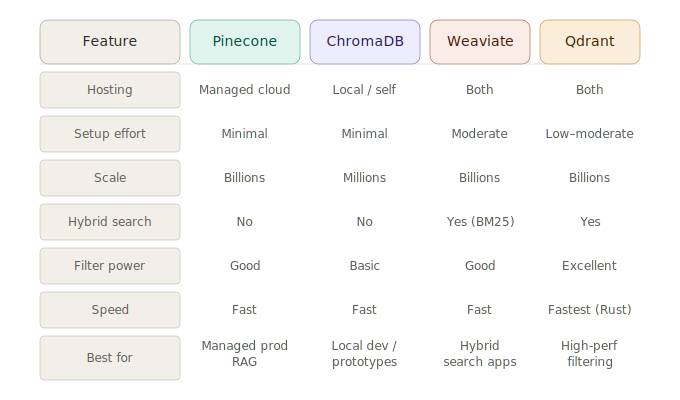

# Weaviate & Qdrant Overview

> **Roadmap:** Embeddings & Vector DBs → Topic 7 of 9
> **File:** `25_weaviate_qdrant.md`

---

## What are they?

Weaviate and Qdrant sit between ChromaDB and Pinecone — self-hosted or cloud, production-grade, with extra capabilities neither of the others offer out of the box.



---

## Weaviate — best for hybrid search

Weaviate's differentiator is **hybrid search** — combining vector search with BM25 keyword search in a single query. Pure vector search sometimes misses exact matches (product SKUs, names, codes). Weaviate lets you blend both and tune the balance with an `alpha` parameter.

- `alpha=1.0` → pure vector search
- `alpha=0.0` → pure BM25 keyword search
- `alpha=0.5` → balanced blend

It also supports auto-embedding via pluggable modules, but you can supply your own vectors too.

---

## Qdrant — best for filtering and speed

Qdrant is written in Rust — extremely fast and memory-efficient. Its filter system is the most expressive of any vector DB: ranges, nested fields, geo-coordinates, AND/OR/NOT combinations. It also supports **named vectors** — multiple different embeddings per object (e.g. title vector + image vector for the same product).

---

## Weaviate code

```python
# pip install weaviate-client sentence-transformers groq
# Run Weaviate locally: docker run -p 8080:8080 semitechnologies/weaviate

import weaviate
from weaviate.classes.config import Configure, Property, DataType
from sentence_transformers import SentenceTransformer

model  = SentenceTransformer("all-MiniLM-L6-v2")
client = weaviate.connect_to_local()
```

```python
# --- Create collection ---
client.collections.create(
    name="Document",
    vectorizer_config=Configure.Vectorizer.none(),
    properties=[
        Property(name="text",     data_type=DataType.TEXT),
        Property(name="category", data_type=DataType.TEXT),
    ]
)

collection = client.collections.get("Document")
```

```python
# --- Add documents ---
docs = [
    {"text": "Refunds are accepted within 30 days.",         "category": "refunds"},
    {"text": "Free shipping on orders over $50.",            "category": "shipping"},
    {"text": "Support is open Monday to Friday 9am–6pm.",   "category": "support"},
    {"text": "Return policy requires the original receipt.", "category": "refunds"},
]

with collection.batch.dynamic() as batch:
    for doc in docs:
        vector = model.encode(doc["text"], normalize_embeddings=True).tolist()
        batch.add_object(properties=doc, vector=vector)
```

```python
# --- Pure vector search ---
from weaviate.classes.query import MetadataQuery

q_vec   = model.encode("Can I return my order?", normalize_embeddings=True).tolist()
results = collection.query.near_vector(
    near_vector     = q_vec,
    limit           = 3,
    return_metadata = MetadataQuery(certainty=True)
)

for obj in results.objects:
    print(f"{obj.metadata.certainty:.3f}  {obj.properties['text']}")
```

```python
# --- Hybrid search (Weaviate's superpower) ---
results = collection.query.hybrid(
    query  = "Can I return my order?",   # BM25 keyword signal
    vector = q_vec,                       # vector signal
    alpha  = 0.5,                         # blend: 0=keyword only, 1=vector only
    limit  = 3
)
for obj in results.objects:
    print(obj.properties["text"])
```

```python
# --- With metadata filter ---
from weaviate.classes.query import Filter

results = collection.query.near_vector(
    near_vector = q_vec,
    limit       = 3,
    filters     = Filter.by_property("category").equal("refunds")
)
```

---

## Qdrant code

```python
# pip install qdrant-client sentence-transformers groq

from qdrant_client import QdrantClient
from qdrant_client.models import (
    Distance, VectorParams, PointStruct,
    Filter, FieldCondition, MatchValue
)
from sentence_transformers import SentenceTransformer

model  = SentenceTransformer("all-MiniLM-L6-v2")
client = QdrantClient(":memory:")           # in-memory
# client = QdrantClient(path="./qdrant_db") # persistent
```

```python
# --- Create collection ---
client.create_collection(
    collection_name = "knowledge_base",
    vectors_config  = VectorParams(size=384, distance=Distance.COSINE)
)
```

```python
# --- Add points ---
docs = [
    {"id": 1, "text": "Refunds are accepted within 30 days.",         "category": "refunds"},
    {"id": 2, "text": "Free shipping on orders over $50.",            "category": "shipping"},
    {"id": 3, "text": "Support is open Monday to Friday 9am–6pm.",   "category": "support"},
    {"id": 4, "text": "Return policy requires the original receipt.", "category": "refunds"},
]

points = [
    PointStruct(
        id      = doc["id"],
        vector  = model.encode(doc["text"], normalize_embeddings=True).tolist(),
        payload = {"text": doc["text"], "category": doc["category"]}
    )
    for doc in docs
]

client.upsert(collection_name="knowledge_base", points=points)
```

```python
# --- Query ---
q_vec   = model.encode("Can I return my order?", normalize_embeddings=True).tolist()
results = client.search(
    collection_name = "knowledge_base",
    query_vector    = q_vec,
    limit           = 3,
    with_payload    = True
)

for r in results:
    print(f"{r.score:.3f}  {r.payload['text']}")
```

```python
# --- Advanced filtering (Qdrant's superpower) ---
# Supports must/should/must_not = AND/OR/NOT
results = client.search(
    collection_name = "knowledge_base",
    query_vector    = q_vec,
    limit           = 3,
    with_payload    = True,
    query_filter    = Filter(
        must=[FieldCondition(key="category", match=MatchValue(value="refunds"))]
    )
)
```

```python
# --- Groq + Qdrant RAG ---
from groq import Groq

groq = Groq(api_key="your-groq-api-key")

def ask(question: str, category_filter: str = None) -> str:
    q_vec = model.encode(question, normalize_embeddings=True).tolist()

    search_kwargs = dict(
        collection_name="knowledge_base", query_vector=q_vec,
        limit=3, with_payload=True
    )
    if category_filter:
        search_kwargs["query_filter"] = Filter(
            must=[FieldCondition(key="category", match=MatchValue(value=category_filter))]
        )

    results = client.search(**search_kwargs)
    context = "\n".join(r.payload["text"] for r in results)

    resp = groq.chat.completions.create(
        model="llama-3.3-70b-versatile",
        messages=[
            {"role": "system", "content": f"Answer using this context:\n{context}"},
            {"role": "user",   "content": question},
        ]
    )
    return resp.choices[0].message.content

print(ask("What is the return policy?"))
```

---

## When to reach for each

- Zero friction, local dev → **ChromaDB**
- Managed cloud, no infra → **Pinecone**
- Keyword + vector hybrid search → **Weaviate**
- Complex filters, maximum speed → **Qdrant**

---

> **Key insight:** The biggest practical difference between these databases isn't vector search quality — they all do that well. It's the surrounding features. Weaviate's hybrid search saves you from building a separate keyword search system. Qdrant's filter expressiveness lets you build multi-condition queries (range + category + geo) that would need workarounds in the others.

---

➡️ **Next: Chunking Strategies**