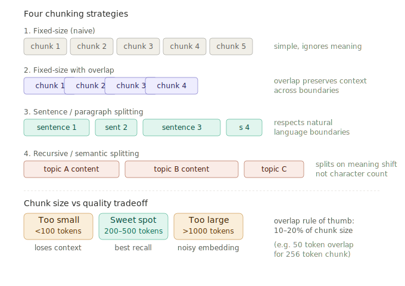

# Chunking Strategies

> **Roadmap:** Embeddings & Vector DBs → Topic 8 of 9
> **File:** `26_chunking_strategies.md`

---

## What is it?

Before embedding a document you must split it into smaller pieces called chunks. The embedding model encodes each chunk as a single vector. If chunks are too large the embedding averages out multiple topics and retrieval gets noisy. If chunks are too small they lose context and retrieved pieces make no sense alone.



---

## The four strategies

**1. Fixed-size (naive)** — split every N characters regardless of content. Fast but can cut sentences mid-way. Never use in production.

**2. Fixed-size with overlap** — same but each chunk shares content with its neighbours (10–20% overlap). Prevents important info near boundaries from being missed.

**3. Sentence / paragraph splitting** — split on natural language boundaries (`.`, `\n\n`). Each chunk is a complete thought. Good default for most documents.

**4. Recursive / semantic splitting** — try to split on the largest natural boundary first (paragraphs), then sentences, then words. LangChain's `RecursiveCharacterTextSplitter` does this. Best overall quality.

---

## Sweet spot

| Size | Effect |
|---|---|
| < 100 tokens | Chunks lose context — retrieved pieces are meaningless alone |
| 200–500 tokens | Sweet spot — one clear idea per chunk |
| > 1000 tokens | Embedding averages multiple topics — noisy retrieval |

**Overlap rule of thumb:** 10–20% of chunk size. For a 256-token chunk, use 50-token overlap.

---

## Code — all four strategies

```python
# pip install langchain sentence-transformers chromadb groq

from langchain.text_splitter import (
    CharacterTextSplitter,
    RecursiveCharacterTextSplitter,
    SentenceTransformersTokenTextSplitter,
)

sample_text = """
Artificial intelligence is transforming the way we work. Machine learning models
can now process vast amounts of data and find patterns humans would never notice.

Natural language processing is one of the most exciting subfields. It enables
computers to understand and generate human language. Large language models like
GPT and LLaMA are trained on billions of documents.

Vector databases store embeddings and allow semantic search at scale. They are
a critical component of modern RAG systems. Pinecone, ChromaDB, and Qdrant are
popular choices depending on your use case.
"""
```

```python
# --- 1. Fixed-size, no overlap ---
splitter = CharacterTextSplitter(chunk_size=200, chunk_overlap=0, separator="")
chunks   = splitter.split_text(sample_text)

# --- 2. Fixed-size with overlap ---
splitter = CharacterTextSplitter(chunk_size=200, chunk_overlap=40, separator="")
chunks   = splitter.split_text(sample_text)

# --- 3. Recursive (best default) ---
splitter = RecursiveCharacterTextSplitter(
    chunk_size    = 300,
    chunk_overlap = 50,
    separators    = ["\n\n", "\n", ". ", " ", ""]
)
chunks = splitter.split_text(sample_text)

# --- 4. Token-aware ---
splitter = SentenceTransformersTokenTextSplitter(
    chunk_overlap    = 50,
    tokens_per_chunk = 128,
    model_name       = "all-MiniLM-L6-v2"
)
chunks = splitter.split_text(sample_text)
```

---

## Code — ingest document into ChromaDB

```python
import chromadb
from sentence_transformers import SentenceTransformer

model  = SentenceTransformer("all-MiniLM-L6-v2")
client = chromadb.EphemeralClient()
col    = client.get_or_create_collection("docs", metadata={"hnsw:space": "cosine"})

def ingest_document(doc_id: str, text: str, source: str):
    splitter = RecursiveCharacterTextSplitter(
        chunk_size=300, chunk_overlap=50,
        separators=["\n\n", "\n", ". ", " ", ""]
    )
    chunks     = splitter.split_text(text)
    embeddings = model.encode(chunks, normalize_embeddings=True).tolist()

    col.add(
        ids        = [f"{doc_id}_chunk_{i}" for i in range(len(chunks))],
        documents  = chunks,
        embeddings = embeddings,
        metadatas  = [{"source": source, "chunk_index": i, "doc_id": doc_id}
                      for i in range(len(chunks))]
    )
    print(f"Ingested '{source}': {len(chunks)} chunks")

ingest_document("doc_001", sample_text, source="ai_overview.txt")
```

---

## Code — RAG pipeline with Groq

```python
from groq import Groq

groq = Groq(api_key="your-groq-api-key")

def ask(question: str) -> str:
    q_vec   = model.encode([question], normalize_embeddings=True).tolist()
    results = col.query(query_embeddings=q_vec, n_results=3,
                        include=["documents", "metadatas"])

    context = "\n\n".join(results["documents"][0])

    resp = groq.chat.completions.create(
        model="llama-3.3-70b-versatile",
        messages=[
            {"role": "system", "content": f"Answer using this context:\n{context}"},
            {"role": "user",   "content": question},
        ]
    )
    return resp.choices[0].message.content

print(ask("What are vector databases used for?"))
```

---

## Code — test chunk sizes to find sweet spot

```python
def test_chunk_sizes(text: str, sizes: list[int]):
    for size in sizes:
        splitter = RecursiveCharacterTextSplitter(
            chunk_size=size, chunk_overlap=size // 5
        )
        chunks  = splitter.split_text(text)
        avg_len = sum(len(c) for c in chunks) / len(chunks)
        print(f"size={size:4d} → {len(chunks):3d} chunks, avg={avg_len:.0f} chars")

test_chunk_sizes(sample_text, [100, 200, 300, 500, 1000])
```

---

## Choosing a strategy

| Strategy | When to use |
|---|---|
| Fixed-size, no overlap | Never in production |
| Fixed-size with overlap | Uniform text — logs, CSVs |
| Recursive / paragraph | Most documents — good default |
| Token-aware | Precise token budget control |
| Semantic (embedding-based) | Long docs with clear topic shifts |

---

> **Key insight:** The single biggest RAG improvement most teams make is tuning chunk size and adding overlap. Start with `chunk_size=300, chunk_overlap=50` using `RecursiveCharacterTextSplitter` — this respects paragraph and sentence boundaries and works well for almost any document type. Only deviate once you've measured that retrieval quality is suffering.

---

➡️ **Next: Metadata Filtering**