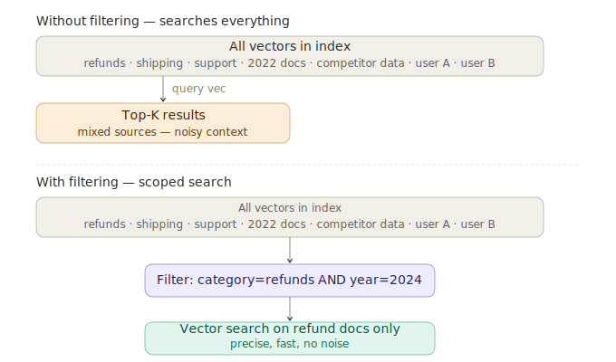

# Metadata Filtering

> **Roadmap:** Embeddings & Vector DBs → Topic 9 of 9
> **File:** `27_metadata_filtering.md`

---

## What is it?

Metadata filtering scopes a vector search to a subset of documents before the similarity comparison runs. Without it, a query returns the most semantically similar chunks from everywhere — including wrong dates, wrong users, and wrong categories. With it, you search only the relevant slice.



---

## What metadata to store

Store any field you might ever want to filter on. Common fields:

| Field | Example values | Use case |
|---|---|---|
| `category` | refunds, shipping, legal | Topic scoping |
| `source` | policy.pdf, faq.html | Source attribution |
| `doc_id` | doc_001 | Group chunks by parent doc |
| `chunk_index` | 0, 1, 2 | Chunk position in doc |
| `year` / `date` | 2024, 2022-03-01 | Time-sensitive filtering |
| `user_id` | user_A, global | Multi-tenant isolation |
| `verified` | True, False | Quality gating |
| `language` | en, fr, de | Multilingual corpora |

Metadata is cheap to store. Missing a field later is expensive to fix.

---

## Code — ingest with rich metadata

```python
import chromadb
from sentence_transformers import SentenceTransformer

model  = SentenceTransformer("all-MiniLM-L6-v2")
client = chromadb.EphemeralClient()
col    = client.get_or_create_collection("docs", metadata={"hnsw:space": "cosine"})

docs = [
    {"id": "d1", "text": "Refunds accepted within 30 days.",
     "category": "refunds",  "year": 2024, "verified": True,  "user_id": "global"},
    {"id": "d2", "text": "Our 2022 refund window was 14 days.",
     "category": "refunds",  "year": 2022, "verified": False, "user_id": "global"},
    {"id": "d3", "text": "Free shipping on orders over $50.",
     "category": "shipping", "year": 2024, "verified": True,  "user_id": "global"},
    {"id": "d5", "text": "User A's note: prefer email contact.",
     "category": "support",  "year": 2024, "verified": True,  "user_id": "user_A"},
    {"id": "d6", "text": "User B's note: VIP account holder.",
     "category": "support",  "year": 2024, "verified": True,  "user_id": "user_B"},
]

embeddings = model.encode([d["text"] for d in docs], normalize_embeddings=True).tolist()

col.add(
    ids        = [d["id"] for d in docs],
    documents  = [d["text"] for d in docs],
    embeddings = embeddings,
    metadatas  = [{k: v for k, v in d.items() if k not in ("id", "text")} for d in docs]
)
```

---

## Code — filter patterns

```python
q_vec = model.encode(["refund policy"], normalize_embeddings=True).tolist()

# Single field
results = col.query(
    query_embeddings=q_vec, n_results=3,
    where={"category": "refunds"},
    include=["documents", "metadatas"]
)

# Compound AND — verified, current year, right category
results = col.query(
    query_embeddings=q_vec, n_results=3,
    where={"$and": [
        {"category": {"$eq": "refunds"}},
        {"year":     {"$eq": 2024}},
        {"verified": {"$eq": True}}
    ]},
    include=["documents"]
)

# Range — year >= 2023
results = col.query(
    query_embeddings=q_vec, n_results=5,
    where={"year": {"$gte": 2023}},
    include=["documents"]
)

# Multi-tenant — user's own docs + global docs
def search_for_user(user_id: str, question: str):
    q = model.encode([question], normalize_embeddings=True).tolist()
    return col.query(
        query_embeddings=q, n_results=3,
        where={"$or": [
            {"user_id": {"$eq": user_id}},
            {"user_id": {"$eq": "global"}}
        ]},
        include=["documents"]
    )
```

---

## Code — production RAG with dynamic filters + Groq

```python
from groq import Groq

groq = Groq(api_key="your-groq-api-key")

def ask(
    question:      str,
    category:      str  = None,
    user_id:       str  = "global",
    year_min:      int  = None,
    verified_only: bool = False
) -> str:
    conditions = [
        {"$or": [{"user_id": {"$eq": user_id}}, {"user_id": {"$eq": "global"}}]}
    ]
    if category:
        conditions.append({"category": {"$eq": category}})
    if year_min:
        conditions.append({"year": {"$gte": year_min}})
    if verified_only:
        conditions.append({"verified": {"$eq": True}})

    where = {"$and": conditions} if len(conditions) > 1 else conditions[0]

    q_vec   = model.encode([question], normalize_embeddings=True).tolist()
    results = col.query(
        query_embeddings=q_vec, n_results=3,
        where=where, include=["documents"]
    )
    context = "\n".join(results["documents"][0])

    resp = groq.chat.completions.create(
        model="llama-3.3-70b-versatile",
        messages=[
            {"role": "system", "content": f"Answer using this context:\n{context}"},
            {"role": "user",   "content": question},
        ]
    )
    return resp.choices[0].message.content

print(ask("Can I return my order?", category="refunds", year_min=2023, verified_only=True))
print(ask("How should I contact support?", user_id="user_A"))
```

---

## Filter syntax across databases

| Operation | ChromaDB | Pinecone | Qdrant |
|---|---|---|---|
| Equals | `{"field": "val"}` | `{"field": {"$eq": "val"}}` | `MatchValue(value="val")` |
| Not equals | `{"field": {"$ne": "val"}}` | `{"field": {"$ne": "val"}}` | `MatchExcept(...)` |
| Greater than | `{"field": {"$gt": 5}}` | `{"field": {"$gt": 5}}` | `Range(gt=5)` |
| AND | `{"$and": [...]}` | `{"$and": [...]}` | `must=[...]` |
| OR | `{"$or": [...]}` | `{"$or": [...]}` | `should=[...]` |
| NOT | — | `{"$not": {...}}` | `must_not=[...]` |

---

> **Key insight:** Metadata filtering is what separates a demo RAG from a production one. It prevents hallucination from wrong-era content, enforces user data isolation, and narrows the search space so vector similarity scores are more meaningful. Store any field you might ever filter on — even if you don't need it today.

---

✅ **Section 3 — Embeddings & Vector DBs complete**

➡️ **Next section: Section 4 — RAG (Retrieval-Augmented Generation)**