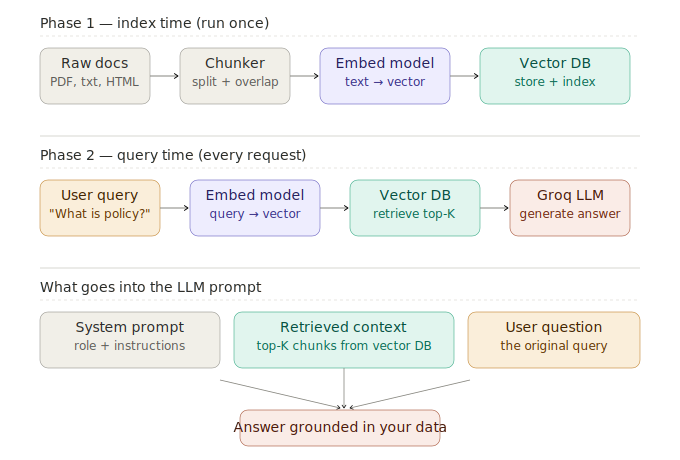

# What is RAG?

> **Roadmap:** RAG → Topic 1
> **File:** `28_what_is_rag.md`

---

## What is it?

RAG (Retrieval-Augmented Generation) gives an LLM access to external knowledge at query time by retrieving relevant documents and injecting them into the prompt. It solves the two core problems of LLMs: knowledge cutoff and hallucination.



---

## The two phases

**Phase 1 — Index time (run once)**
Raw docs → Chunker → Embed model → Vector DB

**Phase 2 — Query time (every request)**
User query → Embed model → Vector DB (retrieve top-K) → LLM → Answer

---

## What goes into the LLM prompt

1. **System prompt** — role and instructions (including "only use the context below")
2. **Retrieved context** — the top-K chunks from the vector DB
3. **User question** — the original query

---

## RAG vs fine-tuning

| | RAG | Fine-tuning |
|---|---|---|
| Knowledge updates | Instant — edit the DB | Requires retraining |
| Cost | Low | High (GPU time) |
| Auditability | High — trace to source chunks | Low — baked into weights |
| Best for | Factual Q&A, docs, policies | Style, tone, domain behaviour |
| Hallucination risk | Low (grounded in context) | Higher |

**Mental model:** Fine-tuning changes how a model behaves. RAG changes what it knows.

---

## Code — minimal RAG from scratch

```python
# pip install chromadb sentence-transformers groq langchain

import chromadb
from sentence_transformers import SentenceTransformer
from langchain.text_splitter import RecursiveCharacterTextSplitter
from groq import Groq

model    = SentenceTransformer("all-MiniLM-L6-v2")
client   = chromadb.PersistentClient(path="./rag_db")
col      = client.get_or_create_collection("knowledge", metadata={"hnsw:space": "cosine"})
groq     = Groq(api_key="your-groq-api-key")
splitter = RecursiveCharacterTextSplitter(chunk_size=300, chunk_overlap=50)
```

```python
# --- Phase 1: Index ---
def index_document(doc_id: str, text: str, metadata: dict = {}):
    chunks     = splitter.split_text(text)
    embeddings = model.encode(chunks, normalize_embeddings=True).tolist()
    col.add(
        ids        = [f"{doc_id}_{i}" for i in range(len(chunks))],
        documents  = chunks,
        embeddings = embeddings,
        metadatas  = [{**metadata, "doc_id": doc_id, "chunk_index": i}
                      for i in range(len(chunks))]
    )
    print(f"Indexed '{doc_id}': {len(chunks)} chunks")

index_document("policy_2024", """
    Our refund policy allows returns within 30 days of purchase.
    Items must be unused and in original packaging.
    Refunds processed within 5–7 business days.
    Contact support@example.com to initiate a return.
""", metadata={"category": "policy", "year": 2024})
```

```python
# --- Phase 2: Retrieve and generate ---
def retrieve(query: str, n_results: int = 3, where: dict = None) -> list[str]:
    q_vec  = model.encode([query], normalize_embeddings=True).tolist()
    kwargs = dict(query_embeddings=q_vec, n_results=n_results, include=["documents"])
    if where:
        kwargs["where"] = where
    return col.query(**kwargs)["documents"][0]

def ask(question: str, where: dict = None) -> str:
    context = "\n\n".join(retrieve(question, where=where))
    resp    = groq.chat.completions.create(
        model="llama-3.3-70b-versatile",
        messages=[
            {"role": "system", "content": (
                "Answer using ONLY the context below. "
                "If the answer is not in the context, say you don't know.\n\n"
                f"Context:\n{context}"
            )},
            {"role": "user", "content": question},
        ]
    )
    return resp.choices[0].message.content

print(ask("How do I return an item?"))
print(ask("What is the meaning of life?"))  # → "I don't have information about that"
```

```python
# --- With source attribution ---
def ask_with_sources(question: str) -> dict:
    q_vec   = model.encode([question], normalize_embeddings=True).tolist()
    results = col.query(
        query_embeddings=q_vec, n_results=3,
        include=["documents", "metadatas", "distances"]
    )
    chunks  = results["documents"][0]
    metas   = results["metadatas"][0]
    scores  = [round(1 - d, 3) for d in results["distances"][0]]
    context = "\n\n".join(chunks)

    resp = groq.chat.completions.create(
        model="llama-3.3-70b-versatile",
        messages=[
            {"role": "system", "content": f"Answer using only this context:\n{context}"},
            {"role": "user",   "content": question},
        ]
    )
    return {
        "answer":  resp.choices[0].message.content,
        "sources": [{"doc_id": m["doc_id"], "score": s} for m, s in zip(metas, scores)]
    }
```

```python
# --- The system prompt is critical ---
# BAD — model will hallucinate when context is missing
bad_system = "You are a helpful assistant."

# GOOD — model stays grounded
good_system = """You are a helpful assistant for Example Co.
Answer using ONLY the context below.
If the answer is not in the context, say:
"I don't have information about that in my knowledge base."
Never invent facts, prices, dates, or policies.

Context:
{context}"""
```

---

> **Key insight:** RAG is not a replacement for a good LLM — it's a knowledge delivery system. The LLM still does the reasoning, summarising, and language generation. RAG just makes sure it's reasoning over the right information. The quality of your chunking, retrieval, and system prompt all matter as much as the model you pick.

---

➡️ **Next: RAG pipeline architecture (in depth)**