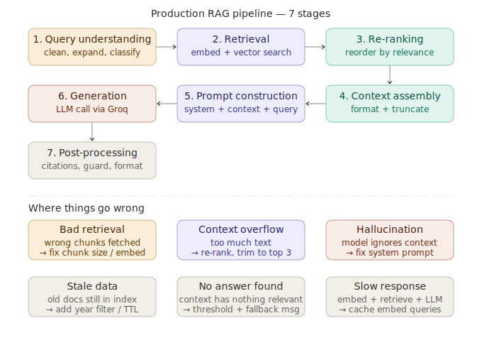

# RAG Pipeline Architecture (In Depth)

> **Roadmap:** RAG → Topic 2
> **File:** `29_rag_pipeline_architecture.md`

---

## What is it?

A production RAG pipeline has 7 distinct stages, each of which can fail independently and each of which you can tune. A naive RAG only has 3 (retrieve, stuff, generate) — that's why naive RAG breaks in production.



---

## The 7 stages

| Stage | What it does | Failure mode |
|---|---|---|
| 1. Query understanding | Clean, expand, classify the query | Vague query → bad embedding |
| 2. Retrieval | Embed + vector search, fetch top-K | Wrong chunks fetched |
| 3. Re-ranking | Cross-encoder rescores (query, chunk) pairs | Skipped → relevant chunk buried |
| 4. Context assembly | Format, deduplicate, truncate | Context window overflow |
| 5. Prompt construction | System + context + question | Missing grounding instruction |
| 6. Generation | LLM call via Groq | Hallucination, ignores context |
| 7. Post-processing | Citations, guards, format | Raw answer without attribution |

---

## Code — full 7-stage pipeline

```python
import chromadb
from sentence_transformers import SentenceTransformer, CrossEncoder
from langchain.text_splitter import RecursiveCharacterTextSplitter
from groq import Groq

embed_model  = SentenceTransformer("all-MiniLM-L6-v2")
rerank_model = CrossEncoder("cross-encoder/ms-marco-MiniLM-L-6-v2")
client       = chromadb.PersistentClient(path="./rag_db")
col          = client.get_or_create_collection("knowledge", metadata={"hnsw:space": "cosine"})
groq         = Groq(api_key="your-groq-api-key")
splitter     = RecursiveCharacterTextSplitter(chunk_size=300, chunk_overlap=50)
```

```python
# Stage 1 — query understanding
def clean_query(raw_query: str) -> str:
    q = raw_query.strip()
    if len(q) < 10:
        resp = groq.chat.completions.create(
            model="llama-3.3-70b-versatile",
            messages=[{"role": "user",
                        "content": f"Rewrite as a clear search query: '{q}'"}],
            max_tokens=60
        )
        q = resp.choices[0].message.content.strip()
    return q

# Stage 2 — retrieval (fetch more than needed for re-ranker)
def retrieve(query: str, top_k: int = 10, where: dict = None) -> list[dict]:
    q_vec  = embed_model.encode([query], normalize_embeddings=True).tolist()
    kwargs = dict(query_embeddings=q_vec, n_results=top_k,
                  include=["documents", "metadatas", "distances"])
    if where:
        kwargs["where"] = where
    results = col.query(**kwargs)
    return [
        {"text": doc, "metadata": meta, "score": round(1 - dist, 3)}
        for doc, meta, dist in zip(results["documents"][0],
                                   results["metadatas"][0],
                                   results["distances"][0])
    ]

# Stage 3 — re-ranking
def rerank(query: str, candidates: list[dict], top_k: int = 3) -> list[dict]:
    if not candidates:
        return []
    pairs  = [(query, c["text"]) for c in candidates]
    scores = rerank_model.predict(pairs)
    for cand, score in zip(candidates, scores):
        cand["rerank_score"] = float(score)
    return sorted(candidates, key=lambda x: x["rerank_score"], reverse=True)[:top_k]

# Stage 4 — context assembly
def assemble_context(chunks: list[dict], max_chars: int = 2000) -> str:
    seen, parts, total = set(), [], 0
    for chunk in chunks:
        text = chunk["text"].strip()
        if text in seen or total + len(text) > max_chars:
            continue
        seen.add(text)
        parts.append(text)
        total += len(text)
    return "\n\n".join(parts)

# Stage 5 + 6 — prompt construction + generation
SYSTEM_TEMPLATE = """You are a helpful assistant for Example Co.
Answer using ONLY the context below.
If the answer is not in the context, say:
"I don't have information about that in my knowledge base."
Never invent facts, prices, or policies.

Context:
{context}"""

def generate(question: str, context: str) -> str:
    resp = groq.chat.completions.create(
        model="llama-3.3-70b-versatile",
        messages=[
            {"role": "system", "content": SYSTEM_TEMPLATE.format(context=context)},
            {"role": "user",   "content": question},
        ]
    )
    return resp.choices[0].message.content

# Stage 7 — post-processing
def add_citations(answer: str, chunks: list[dict]) -> str:
    sources = list({c["metadata"].get("doc_id", "unknown") for c in chunks})
    return answer + f"\n\nSources: {', '.join(sources)}"

def check_grounded(answer: str) -> bool:
    return "i don't have information" not in answer.lower()
```

```python
# Full pipeline
def ask(raw_query: str, where: dict = None,
        fetch_k: int = 10, return_k: int = 3) -> dict:

    query      = clean_query(raw_query)            # Stage 1
    candidates = retrieve(query, top_k=fetch_k, where=where)  # Stage 2
    if not candidates:
        return {"answer": "I don't have information about that.", "sources": []}
    top_chunks = rerank(query, candidates, top_k=return_k)     # Stage 3
    context    = assemble_context(top_chunks)                  # Stage 4
    answer     = generate(query, context)                      # Stage 5 + 6
    answer     = add_citations(answer, top_chunks)             # Stage 7

    return {
        "answer":   answer,
        "grounded": check_grounded(answer),
        "sources":  [c["metadata"].get("doc_id") for c in top_chunks],
        "scores":   [c["rerank_score"] for c in top_chunks]
    }

result = ask("How do I return a damaged item?")
print(result["answer"])
print("Grounded:", result["grounded"])
```

---

## The re-ranker — why it matters

Vector search retrieves by approximate direction in embedding space. A cross-encoder reads query and passage together and scores true relevance. Pattern: **retrieve broad (top 10–20), re-rank narrow (keep top 3).**

```python
# See the difference
query      = "How do I get a refund?"
candidates = retrieve(query, top_k=5)

print("Vector scores:")
for c in candidates:
    print(f"  {c['score']:.3f}  {c['text'][:60]}")

top = rerank(query, candidates, top_k=3)
print("\nAfter re-ranking:")
for c in top:
    print(f"  {c['rerank_score']:.3f}  {c['text'][:60]}")
# Order often changes — re-ranker catches what vector search misses
```

---

> **Key insight:** Most RAG failures happen at two specific stages — retrieval (wrong chunks) and the system prompt (model ignores context). The re-ranker fixes retrieval failures. A strict grounding instruction in the system prompt fixes hallucination. Everything else is refinement.

---

➡️ **Next: Query expansion & rewriting**