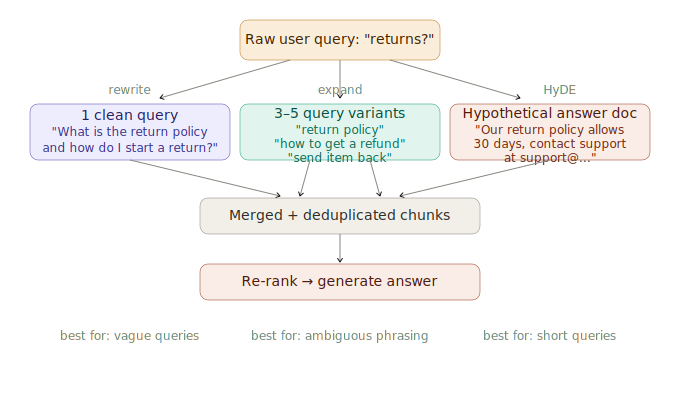

# Query Expansion & Rewriting

> **Roadmap:** RAG → Topic 3
> **File:** `30_query_expansion_rewriting.md`

---

## What is it?

A user's raw query is often the worst possible input to your retrieval system. Query expansion and rewriting transforms that raw input into something that retrieves better — before the embedding ever runs.



---

## Three techniques

**1. Query rewriting** — use the LLM to rephrase the query into a cleaner, more specific version. Best for vague or short queries.

**2. Query expansion** — generate multiple alternative versions of the query, retrieve for each, merge and deduplicate results. Best for ambiguous phrasing where the answer could be reached from different angles.

**3. HyDE (Hypothetical Document Embeddings)** — ask the LLM to write a hypothetical answer document, then embed *that* instead of the query. Works because the hypothesis lives in "document language" rather than "question language" — much closer to real docs in embedding space.

---

## When to use each

| Technique | Best for | Extra cost |
|---|---|---|
| Rewrite | Short, vague, typo-laden queries | 1 LLM call |
| Expand | Ambiguous phrasing, multiple angles | 1 LLM call + N retrievals |
| HyDE | Short precise questions, technical topics | 1 LLM call |
| Vanilla | Clean, well-formed queries | 0 extra calls |

---

## Code — setup

```python
import chromadb
from sentence_transformers import SentenceTransformer
from groq import Groq

model  = SentenceTransformer("all-MiniLM-L6-v2")
client = chromadb.EphemeralClient()
col    = client.get_or_create_collection("docs", metadata={"hnsw:space": "cosine"})
groq   = Groq(api_key="your-groq-api-key")

docs = [
    {"id": "d1", "text": "Refunds are accepted within 30 days of purchase. Items must be in original packaging."},
    {"id": "d2", "text": "To initiate a return, email support@example.com with your order number."},
    {"id": "d3", "text": "Express shipping takes 1–2 business days and costs $15."},
    {"id": "d4", "text": "Free standard shipping on all orders over $50."},
]
vecs = model.encode([d["text"] for d in docs], normalize_embeddings=True).tolist()
col.add(ids=[d["id"] for d in docs], documents=[d["text"] for d in docs], embeddings=vecs)
```

---

## Code — technique 1: query rewriting

```python
def rewrite_query(raw_query: str) -> str:
    resp = groq.chat.completions.create(
        model="llama-3.3-70b-versatile",
        messages=[{"role": "user", "content": (
            "Rewrite the following user query to be more specific and searchable "
            "for a document retrieval system. Return only the rewritten query.\n\n"
            f"Query: {raw_query}"
        )}],
        max_tokens=80
    )
    return resp.choices[0].message.content.strip()

print(rewrite_query("returns?"))
# → "What is the return policy and how do I initiate a product return?"
```

---

## Code — technique 2: query expansion

```python
def expand_query(query: str, n: int = 4) -> list[str]:
    resp = groq.chat.completions.create(
        model="llama-3.3-70b-versatile",
        messages=[{"role": "user", "content": (
            f"Generate {n} different search queries to find information answering: "
            f"'{query}'\nReturn only the queries, one per line, no numbering."
        )}],
        max_tokens=200
    )
    return [q.strip() for q in resp.choices[0].message.content.strip().split("\n") if q.strip()]

def multi_query_retrieve(query: str, n_variants: int = 4, top_k: int = 3) -> list[str]:
    variants = expand_query(query, n=n_variants) + [query]
    seen, chunks = set(), []
    for variant in variants:
        vec     = model.encode([variant], normalize_embeddings=True).tolist()
        results = col.query(query_embeddings=vec, n_results=top_k, include=["documents"])
        for doc in results["documents"][0]:
            if doc not in seen:
                seen.add(doc)
                chunks.append(doc)
    return chunks
```

---

## Code — technique 3: HyDE

```python
def hyde_retrieve(query: str, top_k: int = 3) -> list[str]:
    # Generate hypothetical answer document
    resp = groq.chat.completions.create(
        model="llama-3.3-70b-versatile",
        messages=[{"role": "user", "content": (
            "Write a short paragraph that would be a perfect answer to this "
            f"question, as if from a company FAQ document:\n\n{query}"
        )}],
        max_tokens=150
    )
    hypothesis = resp.choices[0].message.content.strip()

    # Embed the hypothesis, not the query
    h_vec   = model.encode([hypothesis], normalize_embeddings=True).tolist()
    results = col.query(query_embeddings=h_vec, n_results=top_k, include=["documents"])
    return results["documents"][0]
```

---

## Code — unified smart retrieval + Groq RAG

```python
def smart_retrieve(query: str, strategy: str = "expand", top_k: int = 3) -> list[str]:
    if strategy == "rewrite":
        q   = rewrite_query(query)
        vec = model.encode([q], normalize_embeddings=True).tolist()
        return col.query(query_embeddings=vec, n_results=top_k,
                         include=["documents"])["documents"][0]
    elif strategy == "expand":
        return multi_query_retrieve(query, n_variants=3, top_k=top_k)
    elif strategy == "hyde":
        return hyde_retrieve(query, top_k=top_k)
    else:
        vec = model.encode([query], normalize_embeddings=True).tolist()
        return col.query(query_embeddings=vec, n_results=top_k,
                         include=["documents"])["documents"][0]

def ask(question: str, strategy: str = "expand") -> str:
    chunks  = smart_retrieve(question, strategy=strategy)
    context = "\n\n".join(chunks)
    resp    = groq.chat.completions.create(
        model="llama-3.3-70b-versatile",
        messages=[
            {"role": "system", "content": (
                "Answer using ONLY the context below. "
                "If the answer isn't there, say you don't know.\n\n"
                f"Context:\n{context}"
            )},
            {"role": "user", "content": question},
        ]
    )
    return resp.choices[0].message.content

print(ask("returns?",        strategy="rewrite"))
print(ask("send stuff back", strategy="expand"))
print(ask("refund process",  strategy="hyde"))
```

---

> **Key insight:** HyDE works because the LLM's hypothetical answer lives in "document language" rather than "question language". A question and its answer often don't sit close in embedding space even though they're semantically related. HyDE bridges that gap by converting the question into answer-shaped text before embedding.

---

➡️ **Next: Context window management in RAG**