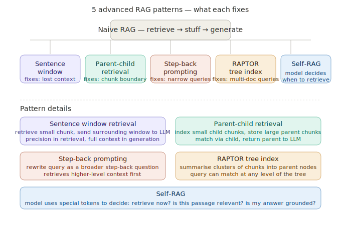

# Advanced RAG Patterns

> **Roadmap:** RAG → Topic 5 of 10
> **File:** `31_advanced_rag_patterns.md`

---

## What is it?

Naive RAG fails in predictable ways. Advanced RAG patterns are targeted fixes — each one solves a specific failure mode. You identify your problem first, then apply the right pattern.



---

## The 5 patterns

| Pattern | Fixes | How |
|---|---|---|
| Sentence window | Retrieved chunk has no surrounding context | Retrieve small, send window of neighbours to LLM |
| Parent-child | Chunk boundaries cut important info | Match on small child, return large parent |
| Step-back prompting | Query too specific to find background context | Rewrite as broader question, retrieve for both |
| RAPTOR | Queries spanning multiple documents | Build summarised tree of document clusters |
| Self-RAG | Unnecessary retrieval, unchecked answers | Model decides when to retrieve and critiques output |

---

## Code — Pattern 1: Sentence window retrieval

```python
import chromadb
from sentence_transformers import SentenceTransformer
from langchain.text_splitter import RecursiveCharacterTextSplitter

model  = SentenceTransformer("all-MiniLM-L6-v2")
client = chromadb.EphemeralClient()

small_splitter = RecursiveCharacterTextSplitter(chunk_size=100, chunk_overlap=0)
small_chunks   = small_splitter.split_text(LONG_DOC)

col = client.get_or_create_collection("small_chunks", metadata={"hnsw:space": "cosine"})
vecs = model.encode(small_chunks, normalize_embeddings=True).tolist()
col.add(ids=[f"s{i}" for i in range(len(small_chunks))],
        documents=small_chunks, embeddings=vecs,
        metadatas=[{"index": i} for i in range(len(small_chunks))])

def sentence_window_retrieve(query: str, window: int = 2, top_k: int = 2) -> list[str]:
    q_vec   = model.encode([query], normalize_embeddings=True).tolist()
    results = col.query(query_embeddings=q_vec, n_results=top_k,
                        include=["metadatas"])
    windows = []
    for meta in results["metadatas"][0]:
        idx   = meta["index"]
        start = max(0, idx - window)
        end   = min(len(small_chunks), idx + window + 1)
        windows.append(" ".join(small_chunks[start:end]))
    return windows
```

---

## Code — Pattern 2: Parent-child retrieval

```python
child_splitter  = RecursiveCharacterTextSplitter(chunk_size=100, chunk_overlap=10)
parent_splitter = RecursiveCharacterTextSplitter(chunk_size=400, chunk_overlap=50)
child_chunks    = child_splitter.split_text(LONG_DOC)
parent_chunks   = parent_splitter.split_text(LONG_DOC)

def find_parent(child_text: str, parents: list[str]) -> int:
    for i, parent in enumerate(parents):
        if child_text[:40] in parent:
            return i
    return 0

col_child = client.get_or_create_collection("child_chunks",
                                             metadata={"hnsw:space": "cosine"})
child_vecs = model.encode(child_chunks, normalize_embeddings=True).tolist()
col_child.add(
    ids=[f"c{i}" for i in range(len(child_chunks))],
    documents=child_chunks, embeddings=child_vecs,
    metadatas=[{"parent_id": find_parent(c, parent_chunks)} for c in child_chunks]
)

def parent_child_retrieve(query: str, top_k: int = 3) -> list[str]:
    q_vec   = model.encode([query], normalize_embeddings=True).tolist()
    results = col_child.query(query_embeddings=q_vec, n_results=top_k,
                              include=["metadatas"])
    seen, parents = set(), []
    for meta in results["metadatas"][0]:
        pid = meta["parent_id"]
        if pid not in seen:
            seen.add(pid)
            parents.append(parent_chunks[pid])
    return parents
```

---

## Code — Pattern 3: Step-back prompting

```python
from groq import Groq
groq = Groq(api_key="your-groq-api-key")

def step_back_retrieve(query: str, top_k: int = 2) -> list[str]:
    resp = groq.chat.completions.create(
        model="llama-3.3-70b-versatile",
        messages=[{"role": "user", "content": (
            "Given this specific question, write a broader, more general version "
            "that would help retrieve relevant background context.\n\n"
            f"Question: {query}\n\nBroader question (one sentence only):"
        )}],
        max_tokens=60
    )
    broader = resp.choices[0].message.content.strip()

    def retrieve(q):
        vec = model.encode([q], normalize_embeddings=True).tolist()
        return col.query(query_embeddings=vec, n_results=top_k,
                         include=["documents"])["documents"][0]

    seen, out = set(), []
    for doc in retrieve(query) + retrieve(broader):
        if doc not in seen:
            seen.add(doc)
            out.append(doc)
    return out
```

---

## Code — full pipeline with pattern selection

```python
def ask(question: str, pattern: str = "parent_child") -> str:
    if pattern == "sentence_window":
        chunks = sentence_window_retrieve(question)
    elif pattern == "parent_child":
        chunks = parent_child_retrieve(question)
    elif pattern == "step_back":
        chunks = step_back_retrieve(question)
    else:
        vec    = model.encode([question], normalize_embeddings=True).tolist()
        chunks = col.query(query_embeddings=vec, n_results=3,
                           include=["documents"])["documents"][0]

    context = "\n\n".join(chunks)
    resp    = groq.chat.completions.create(
        model="llama-3.3-70b-versatile",
        messages=[
            {"role": "system", "content": (
                "Answer using ONLY the context below. "
                "Say you don't know if the answer isn't there.\n\n"
                f"Context:\n{context}"
            )},
            {"role": "user", "content": question},
        ]
    )
    return resp.choices[0].message.content

print(ask("What is the return window for defective items?", pattern="parent_child"))
print(ask("What happens if my package arrives damaged?",   pattern="step_back"))
```

---

## Which pattern to reach for

| Pattern | When to use |
|---|---|
| Sentence window | Documents where sentences need surrounding context |
| Parent-child | Long docs with natural section boundaries |
| Step-back | Specific queries missing broader background |
| RAPTOR | Large corpora, queries spanning multiple docs |
| Self-RAG | Selective retrieval, answer grounding checks |

---

> **Key insight:** You don't pick one advanced pattern and apply it everywhere. Identify your specific failure mode first — are retrieved chunks missing context? Are queries too narrow? Are answers spanning multiple docs? — then apply the pattern targeting that exact problem. Most production RAG systems combine two or three of these.

---

➡️ **Next: Hybrid search (dense + sparse)**