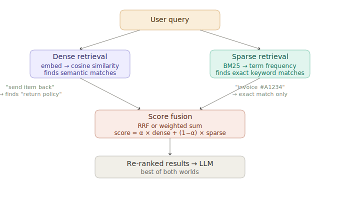

# Hybrid Search (Dense + Sparse)

> **Roadmap:** RAG → Topic 6 of 10
> **File:** `32_hybrid_search.md`

---

## What is it?

Hybrid search combines dense vector search (semantic similarity) with sparse BM25 keyword search (exact term matching). Each solves the other's blind spot. The scores are fused — using RRF or weighted sum — to produce a ranked list that beats either approach alone.



---

## Why each retriever fails alone

- **Dense only:** misses exact matches — "invoice #A1234", product SKUs, proper nouns
- **Sparse (BM25) only:** misses semantic similarity — "send it back" ≠ "return policy"
- **Hybrid:** catches both

---

## Score fusion methods

**Weighted sum:** `score = α × dense + (1−α) × sparse`
Simple, but requires normalising scores that live on different scales.

**Reciprocal Rank Fusion (RRF):** Each result gets `1 / (k + rank)` from each retriever, summed together. More robust — works directly on ranks, no normalisation needed. Use this as default.

---

## Code — setup

```python
# pip install rank-bm25 chromadb sentence-transformers groq

import chromadb, numpy as np
from rank_bm25 import BM25Okapi
from sentence_transformers import SentenceTransformer
from groq import Groq

model  = SentenceTransformer("all-MiniLM-L6-v2")
client = chromadb.EphemeralClient()
groq   = Groq(api_key="your-groq-api-key")

docs = [
    "Refunds are accepted within 30 days of purchase.",
    "To initiate a return, email support@example.com with your order number.",
    "Express shipping takes 1–2 business days and costs $15.",
    "Free standard shipping on all orders over $50.",
    "Invoice #A1234 was processed on 2024-03-15 for $89.99.",
    "Customer support is open Monday to Friday, 9am to 6pm EST.",
    "Damaged items qualify for a 90-day extended return window.",
]

# Dense index
col  = client.get_or_create_collection("hybrid", metadata={"hnsw:space": "cosine"})
vecs = model.encode(docs, normalize_embeddings=True).tolist()
col.add(ids=[f"d{i}" for i in range(len(docs))], documents=docs, embeddings=vecs)

# Sparse index
tokenised = [doc.lower().split() for doc in docs]
bm25      = BM25Okapi(tokenised)
```

---

## Code — retrievers

```python
def dense_retrieve(query: str, top_k: int = 5) -> list[tuple[int, float]]:
    q_vec   = model.encode([query], normalize_embeddings=True).tolist()
    results = col.query(query_embeddings=q_vec, n_results=top_k,
                        include=["documents", "distances"])
    return [(docs.index(doc), 1 - dist)
            for doc, dist in zip(results["documents"][0], results["distances"][0])]

def sparse_retrieve(query: str, top_k: int = 5) -> list[tuple[int, float]]:
    tokens = query.lower().split()
    scores = bm25.get_scores(tokens)
    top    = np.argsort(scores)[::-1][:top_k]
    return [(int(i), float(scores[i])) for i in top if scores[i] > 0]
```

---

## Code — RRF fusion (recommended)

```python
def rrf_fusion(dense_results, sparse_results, k=60, top_k=3) -> list[str]:
    scores: dict[int, float] = {}
    for rank, (idx, _) in enumerate(dense_results):
        scores[idx] = scores.get(idx, 0) + 1 / (k + rank + 1)
    for rank, (idx, _) in enumerate(sparse_results):
        scores[idx] = scores.get(idx, 0) + 1 / (k + rank + 1)
    ranked = sorted(scores.items(), key=lambda x: x[1], reverse=True)[:top_k]
    return [docs[idx] for idx, _ in ranked]
```

---

## Code — weighted sum fusion

```python
def weighted_fusion(dense_results, sparse_results, alpha=0.5, top_k=3) -> list[str]:
    def normalise(results):
        if not results: return {}
        scores = [s for _, s in results]
        mn, mx = min(scores), max(scores)
        if mx == mn: return {idx: 1.0 for idx, _ in results}
        return {idx: (s - mn) / (mx - mn) for idx, s in results}

    d_norm = normalise(dense_results)
    s_norm = normalise(sparse_results)
    fused  = {
        idx: alpha * d_norm.get(idx, 0) + (1 - alpha) * s_norm.get(idx, 0)
        for idx in set(d_norm) | set(s_norm)
    }
    ranked = sorted(fused.items(), key=lambda x: x[1], reverse=True)[:top_k]
    return [docs[idx] for idx, _ in ranked]
```

---

## Code — full hybrid search + Groq RAG

```python
def hybrid_search(query, alpha=0.5, method="rrf", top_k=3) -> list[str]:
    dense  = dense_retrieve(query,  top_k=8)
    sparse = sparse_retrieve(query, top_k=8)
    if method == "rrf":
        return rrf_fusion(dense, sparse, top_k=top_k)
    return weighted_fusion(dense, sparse, alpha=alpha, top_k=top_k)

def ask(question: str, alpha: float = 0.5) -> str:
    chunks  = hybrid_search(question, alpha=alpha, method="rrf", top_k=3)
    context = "\n\n".join(chunks)
    resp    = groq.chat.completions.create(
        model="llama-3.3-70b-versatile",
        messages=[
            {"role": "system", "content": (
                "Answer using ONLY the context below. "
                "Say you don't know if the answer isn't there.\n\n"
                f"Context:\n{context}"
            )},
            {"role": "user", "content": question},
        ]
    )
    return resp.choices[0].message.content

print(ask("What is the return policy for damaged items?"))
print(ask("What happened with invoice A1234?"))  # BM25 saves exact match
```

---

## When to use hybrid search

| Scenario | Best approach |
|---|---|
| General Q&A on prose | Pure dense (vector) |
| Exact IDs, codes, SKUs | Pure sparse (BM25) |
| Real-world mixed apps | Hybrid — RRF, α=0.5 |
| Domain-specific jargon | Hybrid — lean sparse, α=0.3 |

---

> **Key insight:** RRF is almost always better than weighted sum for hybrid fusion because it sidesteps the score normalisation problem — BM25 scores and cosine similarity live on completely different scales. RRF converts both to ranks first, making them directly comparable. Use RRF as your default.

---

➡️ **Next: Re-ranking with cross-encoders**