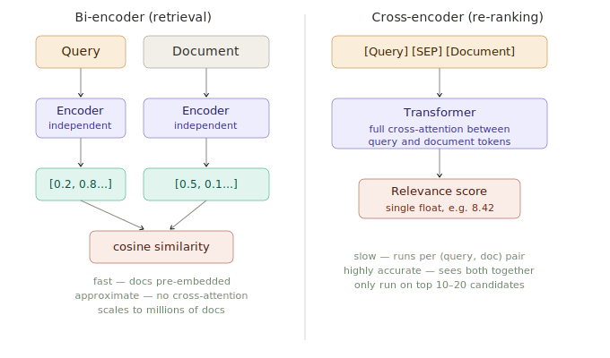

# Re-ranking with Cross-Encoders

> **Roadmap:** RAG → Topic 7 of 10
> **File:** `33_reranking_cross_encoders.md`

---

## What is it?

A cross-encoder takes a (query, document) pair as a single input, processes them jointly through a transformer with full cross-attention, and outputs a single relevance score. It is far more accurate than cosine similarity but too slow to run on an entire corpus — so it runs only on the top 10–20 candidates from initial retrieval.

The pattern: **retrieve broad with a bi-encoder, re-rank narrow with a cross-encoder.**



---

## Why it's more accurate

A bi-encoder embeds query and document independently — they never "see" each other. A cross-encoder concatenates them with `[SEP]` and runs full attention over the combined sequence. Every query token can attend to every document token, producing a much more accurate relevance score.

---

## Popular cross-encoder models

| Model | Speed | Quality |
|---|---|---|
| `cross-encoder/ms-marco-MiniLM-L-6-v2` | Fast | Good — best default |
| `cross-encoder/ms-marco-MiniLM-L-12-v2` | Moderate | Higher |
| `cross-encoder/ms-marco-electra-base` | Slow | Highest |

---

## Code — bi-encoder retrieval + cross-encoder re-ranking

```python
# pip install sentence-transformers chromadb groq

import chromadb
from sentence_transformers import SentenceTransformer, CrossEncoder
from groq import Groq

bi_encoder    = SentenceTransformer("all-MiniLM-L6-v2")
cross_encoder = CrossEncoder("cross-encoder/ms-marco-MiniLM-L-6-v2")
client        = chromadb.EphemeralClient()
col           = client.get_or_create_collection("docs", metadata={"hnsw:space": "cosine"})
groq          = Groq(api_key="your-groq-api-key")

docs = [
    "Refunds are accepted within 30 days of purchase.",
    "To initiate a return, email support@example.com with your order number.",
    "Express shipping takes 1–2 business days and costs $15.",
    "Damaged items qualify for a 90-day extended return window.",
    "Customer support is open Monday to Friday, 9am to 6pm EST.",
    "Returns require items to be in original, unused condition.",
    "Refund processing takes 5–7 business days after we receive the item.",
    "You can track your refund status by logging into your account.",
]
vecs = bi_encoder.encode(docs, normalize_embeddings=True).tolist()
col.add(ids=[f"d{i}" for i in range(len(docs))], documents=docs, embeddings=vecs)
```

```python
# Step 1: Bi-encoder (broad retrieval)
def bi_encode_retrieve(query: str, top_k: int = 6) -> list[str]:
    q_vec   = bi_encoder.encode([query], normalize_embeddings=True).tolist()
    results = col.query(query_embeddings=q_vec, n_results=top_k, include=["documents"])
    return results["documents"][0]

# Step 2: Cross-encoder (precise re-ranking)
def rerank(query: str, candidates: list[str], top_k: int = 3) -> list[dict]:
    pairs  = [(query, doc) for doc in candidates]
    scores = cross_encoder.predict(pairs)
    ranked = sorted(zip(scores, candidates), key=lambda x: x[0], reverse=True)
    return [{"score": float(s), "text": doc} for s, doc in ranked[:top_k]]

# Combined
def retrieve_and_rerank(query: str, fetch_k: int = 8, return_k: int = 3) -> list[dict]:
    candidates = bi_encode_retrieve(query, top_k=fetch_k)
    return rerank(query, candidates, top_k=return_k)
```

---

## Code — full RAG pipeline with Groq

```python
def ask(question: str, fetch_k: int = 8, return_k: int = 3) -> str:
    top_chunks = retrieve_and_rerank(question, fetch_k=fetch_k, return_k=return_k)
    context    = "\n\n".join(r["text"] for r in top_chunks)

    resp = groq.chat.completions.create(
        model="llama-3.3-70b-versatile",
        messages=[
            {"role": "system", "content": (
                "Answer using ONLY the context below. "
                "Say you don't know if the answer isn't there.\n\n"
                f"Context:\n{context}"
            )},
            {"role": "user", "content": question},
        ]
    )
    return resp.choices[0].message.content

print(ask("How long does a refund take after I return a damaged item?"))
```

---

## Code — see the improvement

```python
def compare(query: str):
    print(f"\nQuery: '{query}'")
    print("  Bi-encoder only:")
    for doc in bi_encode_retrieve(query, top_k=3):
        print(f"    • {doc[:70]}")
    print("  After re-ranking:")
    for r in retrieve_and_rerank(query, fetch_k=8, return_k=3):
        print(f"    [{r['score']:.1f}] {r['text'][:70]}")

compare("when does my refund arrive?")
compare("do I need the original box to return something?")
```

---

## Tradeoff table

| | Bi-encoder | Cross-encoder |
|---|---|---|
| Speed | Very fast (pre-computed) | Slow (per pair) |
| Accuracy | Good | Excellent |
| Scalability | Millions of docs | Top 10–30 only |
| Use at | Retrieval stage | Re-ranking stage |

---

> **Key insight:** The cross-encoder doesn't replace the bi-encoder — it comes after it. The bi-encoder casts a wide net fast; the cross-encoder picks the best results carefully. `fetch_k=8, return_k=3` is a good starting point. If retrieval quality is poor, increase `fetch_k` before tuning anything else.

---

➡️ **Next: Contextual compression**