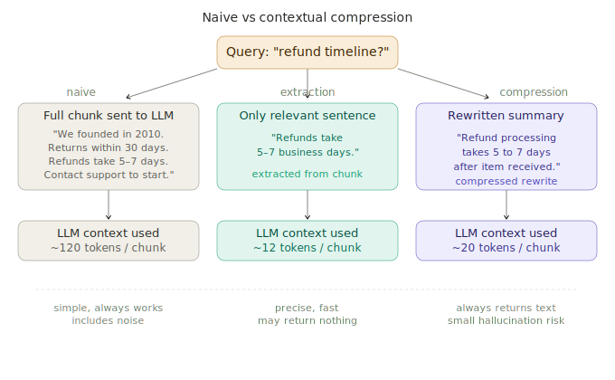

# Contextual Compression

> **Roadmap:** RAG → Topic 8 of 10
> **File:** `34_contextual_compression.md`

---

## What is it?

Retrieved chunks contain more than just the answer — surrounding sentences, tangential info, and filler. Contextual compression extracts or rewrites each chunk down to only the parts relevant to the specific query. This reduces context window usage, removes noise, and lets you fit more distinct sources into the same prompt.



---

## Two approaches

**Extraction** — LLM pulls only the directly relevant sentences verbatim. Precise but may return nothing if no sentences match.

**Compression** — LLM rewrites the chunk as a focused summary. Always returns output but carries small hallucination risk.

---

## Code — setup

```python
import chromadb
from sentence_transformers import SentenceTransformer
from groq import Groq

model  = SentenceTransformer("all-MiniLM-L6-v2")
client = chromadb.EphemeralClient()
col    = client.get_or_create_collection("docs", metadata={"hnsw:space": "cosine"})
groq   = Groq(api_key="your-groq-api-key")

docs = [
    """Our company was founded in 2010. Refunds are accepted within 30 days.
    Items must be unused. Refund processing takes 5–7 business days.""",
    """Standard shipping takes 3–5 days. Express costs $15 and takes 1–2 days.
    Free shipping on orders over $50. Tracking is emailed once the order ships.""",
    """Support is open Monday to Friday 9am–6pm. For damaged items we offer a
    90-day return window. Photograph the damage before initiating a return.""",
]
vecs = model.encode(docs, normalize_embeddings=True).tolist()
col.add(ids=[f"d{i}" for i in range(len(docs))], documents=docs, embeddings=vecs)
```

---

## Code — extraction

```python
def extract_relevant(query: str, chunk: str) -> str | None:
    resp = groq.chat.completions.create(
        model="llama-3.3-70b-versatile",
        messages=[{"role": "user", "content": (
            "Extract only the sentences from the passage that directly answer "
            "the question. Return them verbatim. If none apply, return: NONE\n\n"
            f"Question: {query}\n\nPassage:\n{chunk}"
        )}],
        max_tokens=200
    )
    result = resp.choices[0].message.content.strip()
    return None if result == "NONE" else result
```

---

## Code — compression

```python
def compress_chunk(query: str, chunk: str, max_words: int = 30) -> str:
    resp = groq.chat.completions.create(
        model="llama-3.3-70b-versatile",
        messages=[{"role": "user", "content": (
            f"Summarise in under {max_words} words, keeping only info relevant "
            f"to: '{query}'\n\nPassage:\n{chunk}\n\nSummary:"
        )}],
        max_tokens=100
    )
    return resp.choices[0].message.content.strip()
```

---

## Code — retrieve → compress → generate

```python
def retrieve_and_compress(query: str, top_k: int = 3,
                           method: str = "extract") -> list[str]:
    q_vec   = model.encode([query], normalize_embeddings=True).tolist()
    results = col.query(query_embeddings=q_vec, n_results=top_k,
                        include=["documents"])
    chunks  = results["documents"][0]
    compressed = []
    for chunk in chunks:
        if method == "extract":
            result = extract_relevant(query, chunk)
            if result:
                compressed.append(result)
        else:
            compressed.append(compress_chunk(query, chunk))
    return compressed

def ask(question: str, method: str = "extract") -> str:
    chunks  = retrieve_and_compress(question, top_k=3, method=method)
    if not chunks:
        return "I don't have information about that."
    context = "\n\n".join(chunks)
    resp    = groq.chat.completions.create(
        model="llama-3.3-70b-versatile",
        messages=[
            {"role": "system", "content": (
                "Answer using ONLY the context below. "
                "Say you don't know if the answer isn't there.\n\n"
                f"Context:\n{context}"
            )},
            {"role": "user", "content": question},
        ]
    )
    return resp.choices[0].message.content

print(ask("How long does a refund take?",           method="extract"))
print(ask("What are the shipping options?",          method="compress"))
print(ask("What do I do if my item is defective?",  method="extract"))
```

---

## Code — retrieve → re-rank → compress (full stack)

```python
from sentence_transformers import CrossEncoder

cross_encoder = CrossEncoder("cross-encoder/ms-marco-MiniLM-L-6-v2")

def retrieve_rerank_compress(query: str, fetch_k: int = 6, return_k: int = 3) -> str:
    q_vec      = model.encode([query], normalize_embeddings=True).tolist()
    candidates = col.query(query_embeddings=q_vec, n_results=fetch_k,
                           include=["documents"])["documents"][0]
    pairs      = [(query, doc) for doc in candidates]
    scores     = cross_encoder.predict(pairs)
    ranked     = sorted(zip(scores, candidates), key=lambda x: x[0], reverse=True)
    top_chunks = [doc for _, doc in ranked[:return_k]]

    compressed = [extract_relevant(query, chunk) for chunk in top_chunks]
    compressed = [c for c in compressed if c]
    return "\n\n".join(compressed) if compressed else "\n\n".join(top_chunks)
```

---

## When to use

| Situation | Use compression? |
|---|---|
| Chunks are short and focused | No — adds latency for no gain |
| Chunks are long with mixed content | Yes — big context reduction |
| Context window is tight | Yes — fit more sources in |
| High hallucination risk | Extraction preferred |
| Guaranteed output length needed | Compression |

---

> **Key insight:** Contextual compression is most valuable when chunks are large and heterogeneous. The cost is one extra LLM call per chunk — for 3 chunks that's 3 extra calls, worth it when each saves 200 tokens and improves answer precision. Always use extraction over compression when accuracy matters.

---

➡️ **Next: Agentic RAG**