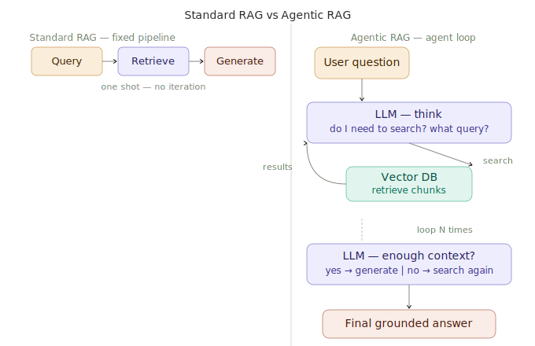

# Agentic RAG

> **Roadmap:** RAG → Topic 9 of 10
> **File:** `35_agentic_rag.md`

---

## What is it?

Agentic RAG gives the LLM control over the retrieval process. Instead of a fixed pipeline, the model decides whether to retrieve, what to search for, how many times to search, and when it has enough information to answer. Complex multi-step questions that fail in standard RAG are handled natively.



---

## How it works

The LLM is given a `search` tool via function/tool calling. It loops:
1. Think — do I need more information?
2. If yes → generate a search query → call the tool → read results
3. Repeat until confident
4. Generate final grounded answer

---

## Standard RAG vs Agentic RAG

| | Standard RAG | Agentic RAG |
|---|---|---|
| Query handling | User's raw query | LLM generates its own search queries |
| Retrieval steps | Always exactly 1 | 1 to N based on complexity |
| Multi-step questions | Fails | Handles natively |
| Latency | Low | Higher |
| Cost | Low | Higher |
| Best for | Simple Q&A | Complex, multi-part questions |

---

## Code — define the search tool

```python
import json, chromadb
from sentence_transformers import SentenceTransformer
from groq import Groq

model  = SentenceTransformer("all-MiniLM-L6-v2")
client = chromadb.EphemeralClient()
col    = client.get_or_create_collection("kb", metadata={"hnsw:space": "cosine"})
groq   = Groq(api_key="your-groq-api-key")

SEARCH_TOOL = {
    "type": "function",
    "function": {
        "name": "search_knowledge_base",
        "description": (
            "Search the knowledge base for information relevant to a query. "
            "Call this whenever you need facts to answer the question. "
            "You can call it multiple times with different queries."
        ),
        "parameters": {
            "type": "object",
            "properties": {
                "query":    {"type": "string", "description": "The search query"},
                "category": {"type": "string",
                             "enum": ["refunds", "shipping", "support", "competitor"]}
            },
            "required": ["query"]
        }
    }
}

def execute_search(query: str, category: str = None) -> str:
    q_vec   = model.encode([query], normalize_embeddings=True).tolist()
    kwargs  = dict(query_embeddings=q_vec, n_results=3, include=["documents"])
    if category:
        kwargs["where"] = {"category": category}
    results = col.query(**kwargs)
    chunks  = results["documents"][0]
    return "\n".join(f"- {c}" for c in chunks) if chunks else "No results found."
```

---

## Code — the agentic loop

```python
def agentic_rag(question: str, max_iterations: int = 5) -> str:
    messages = [
        {"role": "system", "content": (
            "You are a helpful assistant with access to a knowledge base search tool. "
            "Use the search tool to find information needed to answer the question. "
            "You can search multiple times with different queries if needed. "
            "Only answer once you have sufficient information. "
            "Base your final answer only on what you retrieved."
        )},
        {"role": "user", "content": question}
    ]

    for iteration in range(max_iterations):
        resp    = groq.chat.completions.create(
            model="llama-3.3-70b-versatile",
            messages=messages, tools=[SEARCH_TOOL], tool_choice="auto"
        )
        message = resp.choices[0].message

        # No tool call = model has enough info → return answer
        if not message.tool_calls:
            return message.content

        messages.append({"role": "assistant", "content": message.content,
                          "tool_calls": message.tool_calls})

        for tool_call in message.tool_calls:
            args    = json.loads(tool_call.function.arguments)
            results = execute_search(args["query"], args.get("category"))
            print(f"  [iter {iteration+1}] Searched: '{args['query']}'")
            messages.append({"role": "tool",
                              "tool_call_id": tool_call.id,
                              "content": results})

    # Fallback after max iterations
    messages.append({"role": "user",
                      "content": "Provide your final answer based on what you've found."})
    final = groq.chat.completions.create(
        model="llama-3.3-70b-versatile", messages=messages)
    return final.choices[0].message.content
```

---

## Code — test with simple and complex questions

```python
# Simple — one search
print(agentic_rag("How long do refunds take?"))

# Complex — multiple searches + synthesis
print(agentic_rag(
    "Compare our return policy and shipping to our competitors. "
    "Who is more customer-friendly?"
))

# Multi-step — chain of facts
print(agentic_rag(
    "If I order today using free shipping and need to return a damaged item, "
    "what is my deadline and how long will my refund take?"
))
```

---

## Code — traced version (shows what was searched)

```python
def agentic_rag_traced(question: str, max_iterations: int = 5) -> dict:
    messages = [
        {"role": "system", "content": (
            "You have a search tool. Search to find facts, then answer. "
            "Only answer based on what you retrieved."
        )},
        {"role": "user", "content": question}
    ]
    searches = []

    for _ in range(max_iterations):
        resp    = groq.chat.completions.create(
            model="llama-3.3-70b-versatile",
            messages=messages, tools=[SEARCH_TOOL], tool_choice="auto"
        )
        message = resp.choices[0].message
        if not message.tool_calls:
            return {"answer": message.content, "searches": searches}

        messages.append({"role": "assistant", "content": message.content,
                          "tool_calls": message.tool_calls})
        for tc in message.tool_calls:
            args    = json.loads(tc.function.arguments)
            results = execute_search(args["query"], args.get("category"))
            searches.append({"query": args["query"], "results": results})
            messages.append({"role": "tool", "tool_call_id": tc.id, "content": results})

    return {"answer": "Max iterations reached.", "searches": searches}

result = agentic_rag_traced("Compare our refund policy to competitor B's.")
print(f"Searches: {len(result['searches'])}")
for s in result["searches"]:
    print(f"  → '{s['query']}'")
print(f"Answer:\n{result['answer']}")
```

---

> **Key insight:** Agentic RAG is not always better — it's slower and more expensive. For simple factual Q&A, standard RAG wins on cost and speed. Agentic RAG shines when questions require multiple pieces of information, comparison across sources, or reasoning steps between retrievals. A good production system often combines both: route simple questions to standard RAG and complex ones to the agentic loop.

---

➡️ **Next: RAG evaluation (RAGAS)**