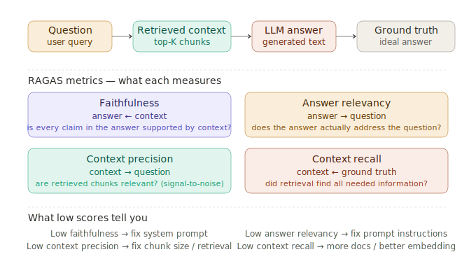

# RAG Evaluation (RAGAS)

> **Roadmap:** RAG → Topic 10 of 10
> **File:** `36_rag_evaluation_ragas.md`

---

## What is it?

RAGAS (RAG Assessment) is the standard framework for evaluating RAG pipelines across four independent dimensions. Each metric targets a different failure mode. Without evaluation, RAG improvement is guesswork.



---

## The 4 metrics

| Metric | Measures | Inputs needed |
|---|---|---|
| Faithfulness | Are all answer claims supported by context? | question, context, answer |
| Answer relevancy | Does the answer address the question? | question, answer |
| Context precision | Are retrieved chunks relevant? (signal/noise) | question, context |
| Context recall | Did retrieval find everything needed? | question, context, ground truth |

---

## What low scores tell you

| Low metric | Root cause | Fix |
|---|---|---|
| Faithfulness | Model hallucinates beyond context | Tighten system prompt grounding |
| Answer relevancy | Answer drifts off topic | Add "answer only the question asked" |
| Context precision | Retrieval pulls irrelevant chunks | Smaller chunks, better embed, metadata filter |
| Context recall | Missing relevant information | More docs, larger top-K, better chunking |

---

## Code — setup

```python
# pip install ragas chromadb sentence-transformers groq langchain-groq

import chromadb
from sentence_transformers import SentenceTransformer
from groq import Groq
from datasets import Dataset
from ragas import evaluate
from ragas.metrics import (faithfulness, answer_relevancy,
                            context_precision, context_recall)
from ragas.llms import LangchainLLMWrapper
from langchain_groq import ChatGroq

model  = SentenceTransformer("all-MiniLM-L6-v2")
client = chromadb.EphemeralClient()
col    = client.get_or_create_collection("kb", metadata={"hnsw:space": "cosine"})
groq   = Groq(api_key="your-groq-api-key")

docs = [
    "Refunds are accepted within 30 days of purchase.",
    "Damaged items qualify for a 90-day extended return window.",
    "Refund processing takes 5–7 business days after item is received.",
    "To initiate a return, email support@example.com with your order number.",
    "Standard shipping takes 3–5 business days.",
    "Express shipping costs $15 and takes 1–2 business days.",
    "Free shipping on all orders over $50.",
]
vecs = model.encode(docs, normalize_embeddings=True).tolist()
col.add(ids=[f"d{i}" for i in range(len(docs))], documents=docs, embeddings=vecs)
```

---

## Code — RAG pipeline + eval dataset

```python
def retrieve(query: str, top_k: int = 3) -> list[str]:
    q_vec = model.encode([query], normalize_embeddings=True).tolist()
    return col.query(query_embeddings=q_vec, n_results=top_k,
                     include=["documents"])["documents"][0]

def generate(question: str, context: list[str]) -> str:
    resp = groq.chat.completions.create(
        model="llama-3.3-70b-versatile",
        messages=[
            {"role": "system", "content": (
                "Answer using ONLY the context below. Say you don't know if "
                "the answer isn't there.\n\nContext:\n" + "\n".join(context)
            )},
            {"role": "user", "content": question},
        ]
    )
    return resp.choices[0].message.content

eval_questions = [
    {"question": "How long do I have to return a regular item?",
     "ground_truth": "You have 30 days to return a regular item."},
    {"question": "How long does a refund take to process?",
     "ground_truth": "Refunds take 5 to 7 business days to process."},
    {"question": "How do I start a return?",
     "ground_truth": "Email support@example.com with your order number."},
    {"question": "What is the return window for damaged items?",
     "ground_truth": "Damaged items have a 90-day extended return window."},
    {"question": "Is there free shipping?",
     "ground_truth": "Free shipping is available on orders over $50."},
]

eval_samples = []
for item in eval_questions:
    context = retrieve(item["question"])
    answer  = generate(item["question"], context)
    eval_samples.append({
        "question":     item["question"],
        "answer":       answer,
        "contexts":     context,        # RAGAS expects "contexts" (list of str)
        "ground_truth": item["ground_truth"]
    })

eval_dataset = Dataset.from_list(eval_samples)
```

---

## Code — run RAGAS

```python
judge_llm = LangchainLLMWrapper(
    ChatGroq(model="llama-3.3-70b-versatile", api_key="your-groq-api-key")
)

results = evaluate(
    dataset = eval_dataset,
    metrics = [faithfulness, answer_relevancy, context_precision, context_recall],
    llm     = judge_llm,
)

print(results)
# {'faithfulness': 0.92, 'answer_relevancy': 0.88,
#  'context_precision': 0.85, 'context_recall': 0.79}

# Per-sample breakdown
df = results.to_pandas()
print(df[["question", "faithfulness", "answer_relevancy",
          "context_precision", "context_recall"]])
```

---

## Code — manual eval without RAGAS library

```python
def eval_faithfulness(question: str, context: list[str], answer: str) -> float:
    resp = groq.chat.completions.create(
        model="llama-3.3-70b-versatile",
        messages=[{"role": "user", "content": (
            "Rate how faithful the answer is to the context (0.0 to 1.0). "
            "1.0 = every claim is supported. 0.0 = claims not in context.\n\n"
            f"Question: {question}\nContext: {chr(10).join(context)}\n"
            f"Answer: {answer}\n\nReturn only a number."
        )}],
        max_tokens=10
    )
    try:    return float(resp.choices[0].message.content.strip())
    except: return 0.0

def eval_context_precision(question: str, context: list[str]) -> float:
    scores = []
    for chunk in context:
        resp = groq.chat.completions.create(
            model="llama-3.3-70b-versatile",
            messages=[{"role": "user", "content": (
                f"Is this chunk relevant to answering: '{question}'?\n"
                f"Chunk: {chunk}\nReply with 1 (relevant) or 0 (not relevant)."
            )}],
            max_tokens=5
        )
        try:    scores.append(int(resp.choices[0].message.content.strip()))
        except: scores.append(0)
    return sum(scores) / len(scores) if scores else 0.0
```

---

## Code — A/B test two RAG configs

```python
from sentence_transformers import CrossEncoder
cross_encoder = CrossEncoder("cross-encoder/ms-marco-MiniLM-L-6-v2")

def run_rag_reranked(question: str) -> dict:
    candidates = retrieve(question, top_k=6)
    scores     = cross_encoder.predict([(question, c) for c in candidates])
    ranked     = sorted(zip(scores, candidates), reverse=True)
    context    = [doc for _, doc in ranked[:3]]
    return {"question": question, "answer": generate(question, context), "context": context}

# Compare vanilla vs re-ranked
samples_v = [{"question": q["question"], "ground_truth": q["ground_truth"],
               "answer": generate(q["question"], retrieve(q["question"])),
               "contexts": retrieve(q["question"])} for q in eval_questions]

samples_r = [{"question": q["question"], "ground_truth": q["ground_truth"],
               **{k: v for k, v in run_rag_reranked(q["question"]).items()
                  if k != "question"},
               "contexts": run_rag_reranked(q["question"])["context"]}
              for q in eval_questions]

results_v = evaluate(Dataset.from_list(samples_v),
                     metrics=[faithfulness, context_precision], llm=judge_llm)
results_r = evaluate(Dataset.from_list(samples_r),
                     metrics=[faithfulness, context_precision], llm=judge_llm)

print("Vanilla:      ", results_v)
print("Re-ranked:    ", results_r)
```

---

> **Key insight:** Build your eval dataset first — even 20–30 representative questions with ground truth answers — before tuning anything. Every change you make should move the metrics. If it doesn't, it's not actually an improvement. RAGAS turns RAG improvement from guesswork into a measurable feedback loop.

---

✅ **Section 4 — RAG complete**

➡️ **Next section: Section 5 — LangChain & LlamaIndex**