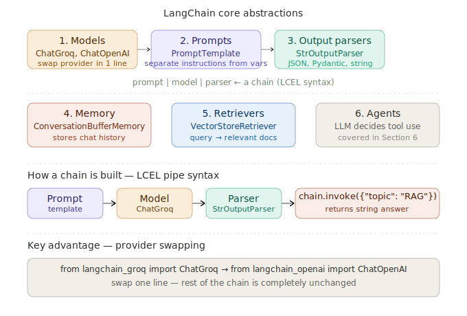

# LangChain Core Concepts

> **Roadmap:** LangChain & LlamaIndex → Topic 1 of 9
> **File:** `37_langchain_core_concepts.md`

---

## What is LangChain?

LangChain is a framework for building applications powered by language models. It standardises the building blocks of LLM applications — prompts, models, output parsers, memory, retrievers, and agents — into composable components that can be chained together with a clean pipe syntax.

Before LangChain, every developer wired together their own prompt management, memory, retrieval, and output parsing from scratch. LangChain gives you reusable, interoperable components so you can focus on application logic rather than plumbing.



---

## The 6 core abstractions

### 1. Models
Wrappers around LLM providers. LangChain supports ChatGroq, ChatOpenAI, ChatAnthropic, and dozens more. The key value: you can swap providers by changing a single line. Your chains, prompts, and memory work identically regardless of which model is underneath.

### 2. Prompts
Structured templates that separate your instructions from the variables that fill them. Instead of writing f-strings everywhere, you define a `PromptTemplate` or `ChatPromptTemplate` once and reuse it across chains. This makes prompts version-controllable, testable, and shareable.

### 3. Output parsers
Components that transform raw LLM output into structured formats. `StrOutputParser` gives you a clean string. `JsonOutputParser` with a Pydantic model gives you a typed Python object. This eliminates the need to manually parse LLM responses.

### 4. Memory
Components that store and retrieve conversation history so the LLM has context from previous turns. `ConversationBufferMemory` keeps everything. `ConversationSummaryMemory` compresses old history. We cover these deeply in topic 41.

### 5. Retrievers
Interfaces over vector stores that take a query and return relevant documents. They're the bridge between your vector DB and a LangChain chain. Any vector store can be wrapped as a retriever and plugged into any RAG chain.

### 6. Agents
Components where the LLM itself decides which tools to call and in what order. Covered in depth in Section 6.

---

## LCEL — LangChain Expression Language

LCEL is the modern way to compose chains using the `|` pipe operator. Data flows left to right. Each component receives the output of the previous one.

```python
chain = prompt | model | parser
result = chain.invoke({"question": "What is RAG?"})
```

LCEL chains automatically support:
- `.invoke()` — single input, synchronous
- `.stream()` — streaming token by token
- `.batch()` — parallel processing of multiple inputs
- `.ainvoke()` / `.astream()` — async versions

---

## Code — setup

```python
# pip install langchain langchain-groq langchain-community

from langchain_groq import ChatGroq
from langchain_core.prompts import ChatPromptTemplate, PromptTemplate
from langchain_core.output_parsers import StrOutputParser, JsonOutputParser
from langchain_core.messages import HumanMessage, SystemMessage
from langchain_core.runnables import RunnablePassthrough, RunnableLambda
from pydantic import BaseModel, Field

llm = ChatGroq(
    model       = "llama-3.3-70b-versatile",
    api_key     = "your-groq-api-key",
    temperature = 0.7,
    max_tokens  = 500,
)
```

---

## Code — direct model calls

```python
# Simplest usage — call the model directly
response = llm.invoke("What is retrieval-augmented generation?")
print(response.content)

# With structured messages
response = llm.invoke([
    SystemMessage(content="You are a concise technical assistant."),
    HumanMessage(content="What is RAG in one sentence?"),
])
print(response.content)
```

---

## Code — prompt templates

```python
# Simple string prompt — reusable across chains
template = PromptTemplate.from_template(
    "Explain {concept} to a {audience} in {length}."
)
formatted = template.format(
    concept  = "vector databases",
    audience = "beginner",
    length   = "two sentences"
)

# Chat prompt template — system + human messages
chat_template = ChatPromptTemplate.from_messages([
    ("system", "You are a helpful {role}. Always be {tone}."),
    ("human",  "{question}"),
])
messages = chat_template.format_messages(
    role     = "AI engineering tutor",
    tone     = "concise and clear",
    question = "What is a vector database?"
)
```

---

## Code — output parsers

```python
# String parser — clean string output
str_parser = StrOutputParser()

# JSON parser — structured Pydantic output
class TopicSummary(BaseModel):
    topic:      str       = Field(description="The topic name")
    summary:    str       = Field(description="One sentence summary")
    difficulty: str       = Field(description="beginner/intermediate/advanced")
    prereqs:    list[str] = Field(description="Prerequisite topics")

json_parser = JsonOutputParser(pydantic_object=TopicSummary)

json_prompt = ChatPromptTemplate.from_messages([
    ("system", "You return structured JSON. {format_instructions}"),
    ("human",  "Summarise the topic: {topic}"),
]).partial(format_instructions=json_parser.get_format_instructions())
```

---

## Code — building chains with LCEL

```python
# Simple chain: prompt → model → string
simple_chain = (
    ChatPromptTemplate.from_template("Explain {topic} in one paragraph.") |
    llm |
    StrOutputParser()
)
result = simple_chain.invoke({"topic": "embeddings"})
print(result)  # clean string

# JSON chain: prompt → model → typed dict
json_chain = json_prompt | llm | json_parser
result = json_chain.invoke({"topic": "RAG"})
print(result)
# {'topic': 'RAG', 'summary': '...', 'difficulty': 'intermediate', 'prereqs': [...]}
```

---

## Code — multi-step chains

```python
# Output of step 1 feeds automatically into step 2
step1 = ChatPromptTemplate.from_template(
    "List 3 key concepts to understand {topic}. One per line."
)
step2 = ChatPromptTemplate.from_template(
    "Given these prerequisites:\n{prereqs}\n\nExplain {topic} assuming "
    "the reader knows these concepts."
)

prereq_chain = step1 | llm | StrOutputParser()

full_chain = (
    {"prereqs": prereq_chain, "topic": RunnablePassthrough()}
    | step2
    | llm
    | StrOutputParser()
)

result = full_chain.invoke("vector databases")
print(result)
```

---

## Code — streaming, batching, custom steps

```python
# Streaming — same chain, different call
for chunk in simple_chain.stream({"topic": "LangChain"}):
    print(chunk, end="", flush=True)

# Batching — multiple inputs in parallel
results = simple_chain.batch([
    {"topic": "embeddings"},
    {"topic": "RAG"},
    {"topic": "fine-tuning"},
])

# Custom Python function as a chain step
def count_words(text: str) -> dict:
    return {"text": text, "word_count": len(text.split())}

chain_with_fn = (
    ChatPromptTemplate.from_template("Explain {topic} briefly.") |
    llm |
    StrOutputParser() |
    RunnableLambda(count_words)
)
result = chain_with_fn.invoke({"topic": "cosine similarity"})
print(result)  # {'text': '...', 'word_count': 47}
```

---

## Code — provider swapping

```python
# Groq
from langchain_groq import ChatGroq
llm = ChatGroq(model="llama-3.3-70b-versatile", api_key="your-groq-api-key")

# Swap to OpenAI — chain unchanged
# from langchain_openai import ChatOpenAI
# llm = ChatOpenAI(model="gpt-4o", api_key="your-openai-api-key")

# Swap to Anthropic — chain unchanged
# from langchain_anthropic import ChatAnthropic
# llm = ChatAnthropic(model="claude-3-5-sonnet-20241022")

# This chain works identically with any provider above
chain = ChatPromptTemplate.from_template("Explain {topic}.") | llm | StrOutputParser()
```

---

## Why LangChain matters

**Composability** — build small reusable pieces, snap them together. A prompt template can be shared across ten chains. A retriever can be swapped into any RAG chain.

**Provider independence** — application logic is decoupled from the LLM provider. A/B test Groq vs OpenAI without rewriting chains.

**Ecosystem** — hundreds of pre-built integrations: document loaders for PDFs, Word docs, web pages, databases. Vector store connectors. Memory backends. You don't build these from scratch.

---

> **Key insight:** LangChain doesn't do anything you couldn't do manually — every chain is just function composition. What it provides is a **standard interface** so that every component speaks the same language and can be composed with any other. That's what makes it worth learning — the composability and provider-independence pay off as your application grows in complexity.

---

➡️ **Next: LLM chains & LCEL syntax (in depth)**