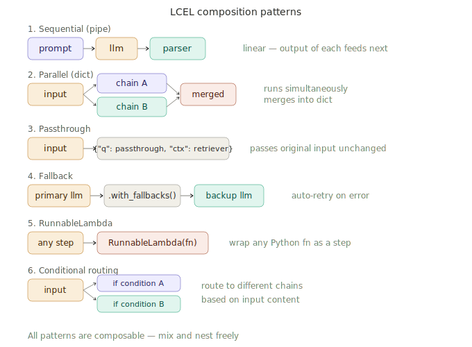

# LLM Chains & LCEL Syntax

> **Roadmap:** LangChain & LlamaIndex → Topic 2 of 9
> **File:** `38_llm_chains_lcel.md`

---

## What is LCEL?

LCEL (LangChain Expression Language) is the composition system at the heart of modern LangChain. It uses the `|` pipe operator to connect components — exactly like Unix pipes. Data flows left to right, with the output of each component becoming the input of the next.

Every LangChain component — prompts, models, parsers, retrievers, custom functions — implements the `Runnable` interface, which guarantees four methods: `.invoke()`, `.stream()`, `.batch()`, and their async equivalents. When you connect runnables with `|`, LangChain creates a `RunnableSequence` that calls them in order. This is why every LCEL chain automatically supports streaming and batching with no extra work.



---

## The Runnable interface — what every component shares

```
invoke(input)         → single result, synchronous
stream(input)         → iterator of chunks, streaming
batch([input1, ...])  → list of results, parallel
ainvoke / astream / abatch → async versions of the above
```

Because every component shares this interface, any component can slot into any chain position. A retriever, a lambda function, a prompt, and an LLM are all interchangeable at the interface level.

---

## Pattern 1: Sequential chain

```python
from langchain_groq import ChatGroq
from langchain_core.prompts import ChatPromptTemplate
from langchain_core.output_parsers import StrOutputParser

llm    = ChatGroq(model="llama-3.3-70b-versatile", api_key="your-groq-api-key")
parser = StrOutputParser()

chain = (
    ChatPromptTemplate.from_template("Explain {topic} clearly and concisely.") |
    llm |
    parser
)

# All three execution modes work identically on the same chain
result  = chain.invoke({"topic": "cosine similarity"})
results = chain.batch([{"topic": "RAG"}, {"topic": "embeddings"}])
for chunk in chain.stream({"topic": "LangChain"}):
    print(chunk, end="", flush=True)
```

---

## Pattern 2: Parallel chains (RunnableParallel)

Run multiple chains simultaneously and merge results into a dict. All branches receive the same input. Essential for getting multiple outputs from a single input — e.g. a summary, an example, and an analogy all at once.

```python
from langchain_core.runnables import RunnableParallel

summary_chain = (
    ChatPromptTemplate.from_template("Summarise {topic} in one sentence.") | llm | parser
)
example_chain = (
    ChatPromptTemplate.from_template("Give a real-world example of {topic}.") | llm | parser
)
analogy_chain = (
    ChatPromptTemplate.from_template("Explain {topic} with a beginner analogy.") | llm | parser
)

parallel = RunnableParallel(
    summary = summary_chain,
    example = example_chain,
    analogy = analogy_chain,
)

result = parallel.invoke({"topic": "vector databases"})
print(result["summary"])
print(result["example"])
print(result["analogy"])
```

---

## Pattern 3: RunnablePassthrough — essential for RAG

`RunnablePassthrough` passes the original input forward unchanged. `RunnablePassthrough.assign()` adds new keys to the input dict. This is the canonical LCEL pattern for RAG — you need both the original question and the retrieved context in the final prompt.

```python
from langchain_core.runnables import RunnablePassthrough, RunnableLambda

def retrieve(question: str) -> str:
    # your retrieval logic here
    return "Refunds accepted within 30 days."

rag_prompt = ChatPromptTemplate.from_messages([
    ("system", "Answer using ONLY this context:\n{context}"),
    ("human",  "{question}"),
])

# assign() adds "context" to the dict while keeping "question" intact
rag_chain = (
    RunnablePassthrough.assign(
        context = RunnableLambda(lambda x: retrieve(x["question"]))
    )
    | rag_prompt
    | llm
    | parser
)

result = rag_chain.invoke({"question": "How long do refunds take?"})
print(result)
```

---

## Pattern 4: itemgetter for cleaner dict access

```python
from operator import itemgetter

prompt = ChatPromptTemplate.from_messages([
    ("system", "You are a {role}. Use this context:\n{context}"),
    ("human",  "{question}"),
])

chain = (
    {
        "role":     itemgetter("role"),
        "context":  itemgetter("context"),
        "question": itemgetter("question"),
    }
    | prompt | llm | parser
)

result = chain.invoke({
    "role":     "customer service agent",
    "context":  "Refunds take 5-7 business days.",
    "question": "When will I get my money back?",
})
```

---

## Pattern 5: RunnableLambda — custom logic

```python
from langchain_core.runnables import RunnableLambda

def count_words(text: str) -> dict:
    return {"text": text, "word_count": len(text.split())}

def format_output(data: dict) -> str:
    return f"[{data['word_count']} words]\n\n{data['text']}"

chain = (
    ChatPromptTemplate.from_template("Explain {topic} briefly.") |
    llm |
    parser |
    RunnableLambda(count_words) |
    RunnableLambda(format_output)
)

result = chain.invoke({"topic": "cosine similarity"})
print(result)  # "[47 words]\n\nCosine similarity..."
```

---

## Pattern 6: Fallbacks

```python
primary_llm = ChatGroq(model="llama-3.3-70b-versatile", api_key="your-groq-api-key")
backup_llm  = ChatGroq(model="llama-3.1-8b-instant",    api_key="your-groq-api-key")

# If primary errors, backup is tried automatically
llm_with_fallback = primary_llm.with_fallbacks([backup_llm])

chain = (
    ChatPromptTemplate.from_template("Explain {topic}.") |
    llm_with_fallback |
    parser
)
```

---

## Pattern 7: Conditional routing (RunnableBranch)

```python
from langchain_core.runnables import RunnableBranch

simple_chain   = ChatPromptTemplate.from_template("Answer briefly: {question}")   | llm | parser
technical_chain = ChatPromptTemplate.from_template("Detailed technical answer: {question}") | llm | parser
code_chain     = ChatPromptTemplate.from_template("Python code example for: {question}")    | llm | parser

routing_chain = RunnableBranch(
    (lambda x: "code" in x["question"].lower() or "implement" in x["question"].lower(), code_chain),
    (lambda x: any(kw in x["question"].lower() for kw in ["how", "explain", "what"]),   technical_chain),
    simple_chain  # default
)

print(routing_chain.invoke({"question": "What is cosine similarity?"}))   # → technical
print(routing_chain.invoke({"question": "Implement a vector search"}))    # → code
print(routing_chain.invoke({"question": "Is RAG useful?"}))              # → simple
```

---

## Pattern 8: Two-step chain with self-critique

```python
draft_chain = (
    ChatPromptTemplate.from_template("Write a beginner explanation of {topic}.") | llm | parser
)
improve_chain = (
    RunnablePassthrough.assign(draft=draft_chain)
    | ChatPromptTemplate.from_template(
        "Draft:\n{draft}\n\nCritique this and write an improved version."
    )
    | llm | parser
)

result = improve_chain.invoke({"topic": "embeddings"})
print(result)
```

---

## Pattern 9: Full RAG chain

```python
import chromadb
from sentence_transformers import SentenceTransformer

embed_model = SentenceTransformer("all-MiniLM-L6-v2")
chroma      = chromadb.EphemeralClient()
col         = chroma.get_or_create_collection("docs", metadata={"hnsw:space": "cosine"})

def retrieve_docs(question: str) -> str:
    q_vec   = embed_model.encode([question], normalize_embeddings=True).tolist()
    results = col.query(query_embeddings=q_vec, n_results=3, include=["documents"])
    return "\n".join(results["documents"][0])

rag_chain = (
    RunnablePassthrough.assign(
        context = RunnableLambda(lambda x: retrieve_docs(x["question"]))
    )
    | ChatPromptTemplate.from_messages([
        ("system", "Answer using ONLY this context. Say 'I don't know' if not covered.\n\nContext:\n{context}"),
        ("human",  "{question}"),
    ])
    | llm
    | parser
)

# Works with invoke, stream, and batch
result = rag_chain.invoke({"question": "How long does a refund take?"})
for chunk in rag_chain.stream({"question": "Is there free shipping?"}):
    print(chunk, end="", flush=True)
```

---

## Inspecting chains

```python
# Every LCEL chain is self-describing
print(chain.input_schema.schema())   # what inputs it expects
print(chain.output_schema.schema())  # what it returns
print(chain)                          # full pipeline structure
```

---

## Summary of LCEL patterns

| Pattern | Use when |
|---|---|
| Sequential `\|` | Linear pipeline — most common case |
| `RunnableParallel` | Need multiple outputs from same input |
| `RunnablePassthrough.assign()` | Need to add context while keeping original input |
| `itemgetter` | Clean extraction from multi-key dicts |
| `RunnableLambda` | Custom Python logic between steps |
| `.with_fallbacks()` | Reliability — handle provider errors |
| `RunnableBranch` | Route different query types to different chains |

---

> **Key insight:** The most important LCEL pattern is `RunnablePassthrough.assign()`. It's what makes RAG chains clean — you take the input dict, add a `context` key by running the retriever, and then the full dict with both `question` and `context` flows into the prompt template. Without this, you'd need to manually manage both values across steps. Mastering this one pattern unlocks clean, readable RAG chains.

---

➡️ **Next: Document loaders & splitters**