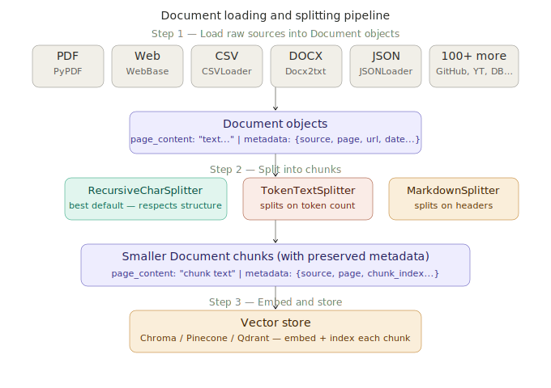

# Document Loaders & Splitters

> **Roadmap:** LangChain & LlamaIndex → Topic 3 of 9
> **File:** `39_document_loaders_splitters.md`

---

## What are they?

Document loaders convert raw data sources (PDFs, web pages, CSVs, Word docs, databases) into `Document` objects. Text splitters break those Documents into smaller, appropriately sized chunks. Together they form the ingestion stage of every RAG pipeline.

Everything in LangChain's document pipeline is built around the `Document` data structure:
- `page_content` — the raw text string
- `metadata` — a dict with source, page number, URL, and any other fields

Metadata is preserved and propagated through every split, so every chunk knows where it came from.



---

## Document loaders — the most important ones

| Loader | Use for | Key metadata |
|---|---|---|
| `TextLoader` | `.txt` files | source path |
| `PyPDFLoader` | PDF files | source, page number |
| `WebBaseLoader` | Web pages | source URL |
| `CSVLoader` | CSV files | source, row index |
| `JSONLoader` | JSON files | source, sequence number |
| `Docx2txtLoader` | Word documents | source path |
| `DirectoryLoader` | Entire folders | source path per file |
| `UnstructuredMarkdownLoader` | Markdown files | source, section |
| `GitLoader` | Git repos | file_path, commit hash |
| `YoutubeLoader` | YouTube transcripts | source URL |

---

## Text splitters — the most important ones

| Splitter | Best for | How it splits |
|---|---|---|
| `RecursiveCharacterTextSplitter` | Any prose — best default | Tries `\n\n` then `\n` then `.` then ` ` then char |
| `MarkdownHeaderTextSplitter` | Markdown docs | On `#`, `##`, `###` headers |
| `TokenTextSplitter` | Precise token budgets | Actual token count |
| `CharacterTextSplitter` | Simple uniform text | Single separator |
| `RecursiveJsonSplitter` | Large JSON objects | Preserves JSON structure |

---

## Code — setup

```python
# pip install langchain langchain-community pypdf docx2txt beautifulsoup4

from langchain_community.document_loaders import (
    PyPDFLoader, WebBaseLoader, TextLoader,
    CSVLoader, JSONLoader, DirectoryLoader,
)
from langchain.text_splitter import (
    RecursiveCharacterTextSplitter,
    MarkdownHeaderTextSplitter,
    TokenTextSplitter,
)
from langchain_core.documents import Document
```

---

## Code — loaders

```python
# Text file
loader = TextLoader("my_document.txt", encoding="utf-8")
docs   = loader.load()
print(docs[0].metadata)  # {'source': 'my_document.txt'}

# PDF — one Document per page
loader = PyPDFLoader("company_policy.pdf")
docs   = loader.load()
print(docs[0].metadata)  # {'source': 'company_policy.pdf', 'page': 0}

# Web page — strips HTML tags
loader = WebBaseLoader("https://example.com/policy")
docs   = loader.load()
print(docs[0].metadata)  # {'source': 'https://example.com/policy', ...}

# Multiple URLs at once
loader = WebBaseLoader(["https://example.com/policy", "https://example.com/shipping"])
docs   = loader.load()  # one Document per URL

# CSV — one Document per row
loader = CSVLoader("products.csv", source_column="product_id")
docs   = loader.load()
print(docs[0].page_content)  # "product_id: P001\nname: Laptop\nprice: 999.99"
print(docs[0].metadata)      # {'source': 'P001', 'row': 0}

# JSON with jq selector
loader = JSONLoader(
    file_path    = "kb.json",
    jq_schema    = ".[].text",
    text_content = True,
)
docs = loader.load()

# Directory — all .txt files recursively
loader = DirectoryLoader(
    "./documents/",
    glob="**/*.txt",
    loader_cls=TextLoader,
    show_progress=True,
    use_multithreading=True,
)
docs = loader.load()
print(f"Loaded {len(docs)} files")
```

---

## Code — text splitters

```python
# RecursiveCharacterTextSplitter — best default
splitter = RecursiveCharacterTextSplitter(
    chunk_size    = 500,
    chunk_overlap = 50,
    separators    = ["\n\n", "\n", ". ", " ", ""],
)

# ALWAYS use split_documents() — it preserves metadata
split_docs = splitter.split_documents(docs)
print(split_docs[0].metadata)  # includes all original metadata
```

```python
# MarkdownHeaderTextSplitter — puts header hierarchy into metadata
md_splitter = MarkdownHeaderTextSplitter(
    headers_to_split_on=[
        ("#",  "section"),
        ("##", "subsection"),
        ("###","subsubsection"),
    ]
)
md_chunks = md_splitter.split_text(markdown_text)
print(md_chunks[0].metadata)
# {'section': 'Company Policy', 'subsection': 'Refunds'}

# Best practice: combine both splitters
header_chunks = md_splitter.split_text(markdown_text)         # step 1: headers
char_splitter = RecursiveCharacterTextSplitter(chunk_size=300, chunk_overlap=30)
final_chunks  = char_splitter.split_documents(header_chunks)  # step 2: size
```

```python
# TokenTextSplitter — precise token budget control
token_splitter = TokenTextSplitter(chunk_size=256, chunk_overlap=20)
token_chunks   = token_splitter.split_documents(docs)
```

---

## Code — full ingestion pipeline

```python
import chromadb
from sentence_transformers import SentenceTransformer

embed_model = SentenceTransformer("all-MiniLM-L6-v2")
chroma      = chromadb.PersistentClient(path="./chroma_db")
col         = chroma.get_or_create_collection("docs", metadata={"hnsw:space": "cosine"})

def ingest(source, loader_cls=TextLoader, chunk_size=400, chunk_overlap=50):
    loader     = loader_cls(source)
    raw_docs   = loader.load()
    splitter   = RecursiveCharacterTextSplitter(
        chunk_size=chunk_size, chunk_overlap=chunk_overlap)
    split_docs = splitter.split_documents(raw_docs)
    texts = [d.page_content for d in split_docs]
    metas = [d.metadata     for d in split_docs]
    vecs  = embed_model.encode(texts, normalize_embeddings=True).tolist()
    col.add(
        ids        = [f"{source}_chunk_{i}" for i in range(len(split_docs))],
        documents  = texts,
        embeddings = vecs,
        metadatas  = metas
    )
    print(f"Ingested '{source}': {len(split_docs)} chunks")

ingest("policy.txt")
ingest("policy.pdf", loader_cls=PyPDFLoader)
```

---

## Code — custom loader for any source

```python
from langchain_core.document_loaders import BaseLoader
from typing import Iterator
import sqlite3

class SQLiteLoader(BaseLoader):
    def __init__(self, db_path, table, content_col, metadata_cols):
        self.db_path       = db_path
        self.table         = table
        self.content_col   = content_col
        self.metadata_cols = metadata_cols

    def lazy_load(self) -> Iterator[Document]:
        conn   = sqlite3.connect(self.db_path)
        cursor = conn.execute(f"SELECT * FROM {self.table}")
        cols   = [d[0] for d in cursor.description]
        for row in cursor:
            row_dict = dict(zip(cols, row))
            content  = str(row_dict.pop(self.content_col, ""))
            metadata = {k: row_dict[k] for k in self.metadata_cols if k in row_dict}
            yield Document(page_content=content, metadata=metadata)
        conn.close()

loader = SQLiteLoader("products.db", "products", "description", ["id", "category"])
docs   = loader.load()
```

---

> **Key insight:** Always use `split_documents()` not `split_text()` when you have Document objects. `split_documents()` preserves the `metadata` dict from each source into every chunk it creates. When you retrieve a chunk and want to cite its source — which file, which page, which URL — that metadata is what tells you. Without it, your retrieved chunks are anonymous and you lose source attribution entirely.

---

➡️ **Next: LangChain retrievers**