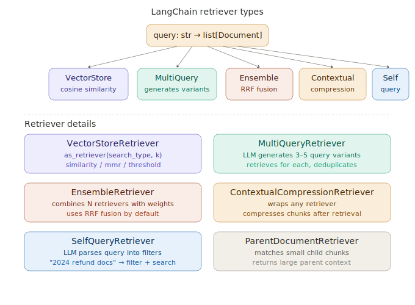

# LangChain Retrievers

> **Roadmap:** LangChain & LlamaIndex → Topic 4 of 9
> **File:** `40_langchain_retrievers.md`

---

## What is a retriever?

A retriever is LangChain's standard interface for anything that takes a query string and returns a list of relevant `Document` objects. The key value is the shared interface — whether you are searching a vector store, a keyword index, a database, or a web API, every retriever exposes the same method:

```python
retriever.invoke("my query") -> list[Document]
```

This means any retriever can plug into any LCEL chain without changing the chain. You can swap a vector retriever for an ensemble retriever with one line change.



---

## Retriever types and when to use them

| Retriever | Use when |
|---|---|
| `VectorStoreRetriever` similarity | Most cases — solid default |
| `VectorStoreRetriever` mmr | Retrieved chunks are too similar to each other |
| `VectorStoreRetriever` threshold | Only want high-confidence results |
| `MultiQueryRetriever` | User queries are vague, short, or poorly phrased |
| `EnsembleRetriever` | Need hybrid search (semantic + keyword) |
| `ContextualCompressionRetriever` | Chunks are large with mixed content |
| `SelfQueryRetriever` | Rich metadata and natural language filtering needed |
| `ParentDocumentRetriever` | Need precise child match but full parent context |

---

## Code — setup

```python
# pip install langchain langchain-groq langchain-community chromadb rank-bm25

from langchain_groq import ChatGroq
from langchain_community.vectorstores import Chroma
from langchain_community.embeddings import SentenceTransformerEmbeddings
from langchain.retrievers import (
    MultiQueryRetriever, EnsembleRetriever,
    ContextualCompressionRetriever, SelfQueryRetriever,
)
from langchain.retrievers.document_compressors import LLMChainExtractor
from langchain_community.retrievers import BM25Retriever
from langchain_core.documents import Document

llm        = ChatGroq(model="llama-3.3-70b-versatile", api_key="your-groq-api-key")
embeddings = SentenceTransformerEmbeddings(model_name="all-MiniLM-L6-v2")

docs = [
    Document(page_content="Refunds are accepted within 30 days of purchase.",
             metadata={"category": "refunds", "year": 2024}),
    Document(page_content="Damaged items qualify for a 90-day extended return window.",
             metadata={"category": "refunds", "year": 2024}),
    Document(page_content="Refund processing takes 5 to 7 business days.",
             metadata={"category": "refunds", "year": 2024}),
    Document(page_content="Standard shipping takes 3 to 5 business days.",
             metadata={"category": "shipping", "year": 2024}),
    Document(page_content="Free shipping on all orders over $50.",
             metadata={"category": "shipping", "year": 2024}),
    Document(page_content="Our 2022 policy allowed only 14 days for returns.",
             metadata={"category": "refunds", "year": 2022}),
]

vectorstore = Chroma.from_documents(docs, embeddings)
```

---

## Code — VectorStoreRetriever (3 search modes)

```python
# Similarity search (default) — returns top-k most similar chunks
base_retriever = vectorstore.as_retriever(
    search_type   = "similarity",
    search_kwargs = {"k": 4}
)

# MMR — Maximal Marginal Relevance
# Balances relevance WITH diversity — avoids returning 4 near-identical chunks
# fetch_k: how many candidates to consider; k: how many to keep
mmr_retriever = vectorstore.as_retriever(
    search_type   = "mmr",
    search_kwargs = {"k": 4, "fetch_k": 10, "lambda_mult": 0.5}
    # lambda_mult: 0 = max diversity, 1 = max relevance, 0.5 = balanced
)

# Score threshold — only return docs above minimum relevance score
threshold_retriever = vectorstore.as_retriever(
    search_type   = "similarity_score_threshold",
    search_kwargs = {"score_threshold": 0.5, "k": 4}
)

results = base_retriever.invoke("how long do I have to return something?")
for doc in results:
    print(f"[{doc.metadata['category']}] {doc.page_content}")
```

---

## Code — MultiQueryRetriever

```python
import logging
logging.getLogger("langchain.retrievers.multi_query").setLevel(logging.INFO)

multi_retriever = MultiQueryRetriever.from_llm(
    retriever = base_retriever,
    llm       = llm,
)

# "returns?" is a terrible embedding input.
# MultiQueryRetriever asks the LLM to generate variants like:
# "return policy", "how to return an item", "return window duration"
# Retrieves for each, deduplicates, returns the union.
results = multi_retriever.invoke("returns?")
print(f"Found {len(results)} unique docs across all query variants")
```

---

## Code — EnsembleRetriever (hybrid search)

```python
# BM25 keyword retriever — no embeddings needed
bm25_retriever = BM25Retriever.from_documents(docs)
bm25_retriever.k = 4

# Ensemble combines both with RRF fusion
ensemble_retriever = EnsembleRetriever(
    retrievers = [bm25_retriever, vectorstore.as_retriever(search_kwargs={"k": 4})],
    weights    = [0.5, 0.5]
    # Tune: more semantic → [0.3, 0.7], more keyword → [0.7, 0.3]
)

results = ensemble_retriever.invoke("how do I return something?")
# BM25 handles exact keyword matches
# Vector search handles semantic meaning
# RRF merges and ranks the combined results
```

---

## Code — ContextualCompressionRetriever

```python
# LLM extracts only the relevant sentences from each retrieved chunk
# Reduces context window noise significantly
compressor = LLMChainExtractor.from_llm(llm)

compression_retriever = ContextualCompressionRetriever(
    base_compressor = compressor,
    base_retriever  = base_retriever,
)

results = compression_retriever.invoke("how long do I have to return something?")
for doc in results:
    print(f"(compressed) {doc.page_content}")
# Returns only the directly relevant sentence(s), not the whole chunk
# Typical reduction: 120 chars → 30 chars per chunk
```

---

## Code — SelfQueryRetriever

```python
from langchain.chains.query_constructor.base import AttributeInfo

# Describe your metadata fields so the LLM knows what to filter on
metadata_field_info = [
    AttributeInfo(
        name        = "category",
        description = "Topic category: 'refunds', 'shipping', or 'support'",
        type        = "string",
    ),
    AttributeInfo(
        name        = "year",
        description = "Year this policy was in effect",
        type        = "integer",
    ),
]

self_query_retriever = SelfQueryRetriever.from_llm(
    llm                 = llm,
    vectorstore         = vectorstore,
    document_contents   = "Company policy documents",
    metadata_field_info = metadata_field_info,
    verbose             = True,
)

# "What was the return policy in 2022?"
# LLM generates: filter={year: 2022, category: "refunds"} + semantic query
results = self_query_retriever.invoke("What was the return policy in 2022?")
for doc in results:
    print(f"[year={doc.metadata['year']}] {doc.page_content}")
# Only returns the 2022 policy doc — not the 2024 ones
```

---

## Code — all retrievers plug into the same LCEL chain

```python
from langchain_core.prompts import ChatPromptTemplate
from langchain_core.output_parsers import StrOutputParser
from langchain_core.runnables import RunnablePassthrough, RunnableLambda

rag_prompt = ChatPromptTemplate.from_messages([
    ("system",
     "Answer using ONLY this context. Say 'I don't know' if not covered.\n\n"
     "Context:\n{context}"),
    ("human", "{question}"),
])

def build_rag_chain(retriever):
    return (
        RunnablePassthrough.assign(
            context = RunnableLambda(
                lambda x: "\n\n".join(d.page_content for d in retriever.invoke(x["question"]))
            )
        )
        | rag_prompt | llm | StrOutputParser()
    )

# The chain is identical — only the retriever changes
base_chain     = build_rag_chain(base_retriever)
ensemble_chain = build_rag_chain(ensemble_retriever)
multi_chain    = build_rag_chain(multi_retriever)

question = "How long do I have to return an item?"
print("Base:     ", base_chain.invoke({"question": question}))
print("Ensemble: ", ensemble_chain.invoke({"question": question}))
print("Multi:    ", multi_chain.invoke({"question": question}))
```

---

## Code — custom retriever

```python
from langchain_core.retrievers import BaseRetriever
from langchain_core.callbacks import CallbackManagerForRetrieverRun

class KeywordRetriever(BaseRetriever):
    documents: list[Document]
    top_k: int = 3

    def _get_relevant_documents(
        self, query: str, *, run_manager: CallbackManagerForRetrieverRun
    ) -> list[Document]:
        keywords = query.lower().split()
        scored   = [(sum(1 for kw in keywords if kw in doc.page_content.lower()), doc)
                    for doc in self.documents]
        scored   = sorted([(s, d) for s, d in scored if s > 0], reverse=True)
        return [doc for _, doc in scored[:self.top_k]]

kw_retriever = KeywordRetriever(documents=docs, top_k=3)
results      = kw_retriever.invoke("return policy 30 days")

# Even plug it into an ensemble
custom_ensemble = EnsembleRetriever(
    retrievers = [kw_retriever, vectorstore.as_retriever(search_kwargs={"k": 4})],
    weights    = [0.4, 0.6]
)
```

---

> **Key insight:** In production you almost never use just one retriever. The recommended production stack is `EnsembleRetriever` (vector + BM25) wrapped in `ContextualCompressionRetriever`, with `MultiQueryRetriever` on top for query expansion. Build this stack incrementally, measuring improvement with RAGAS after each addition. Each layer fixes one specific failure mode — hybrid search fixes exact match misses, compression reduces noise, multi-query fixes phrasing mismatches.

---

➡️ **Next: LangChain memory modules**