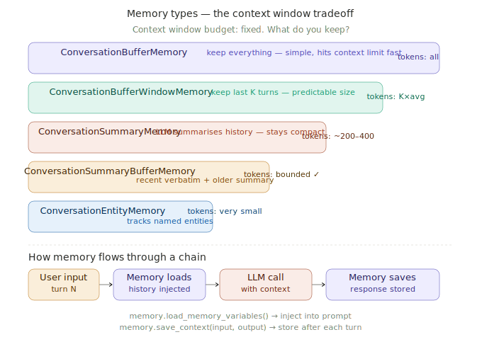

# LangChain Memory Modules

> **Roadmap:** LangChain & LlamaIndex → Topic 5 of 9
> **File:** `41_langchain_memory.md`

---

## What is memory in LangChain?

Memory gives a chain or agent access to conversation history so it can maintain context across turns. Without memory, every message is treated as the first — the LLM has no knowledge of what was said before.

The fundamental challenge: **LLMs have a fixed context window.** You cannot append messages forever. Every memory strategy is a different answer to: "given a fixed token budget, what history is most valuable to keep?"



---

## The two memory operations

Every memory type has the same two operations regardless of how it works internally:

```python
# Load history before the LLM call
variables = memory.load_memory_variables({})
# → {"history": [...messages or summary string...]}

# Save new turn after the LLM response
memory.save_context(
    {"input": "user message"},
    {"output": "AI response"}
)
```

---

## The 5 memory types

### ConversationBufferMemory
Keeps every message. Simple, zero loss. Grows without bound — unsafe for long conversations.

### ConversationBufferWindowMemory
Keeps only the last `k` exchanges. Predictable token cost. Older turns discarded permanently.

### ConversationSummaryMemory
LLM maintains a running summary. Token usage stays constant. Slight detail loss. Extra LLM calls for summarisation.

### ConversationSummaryBufferMemory ← production default
Keeps recent messages verbatim (detail) + summarises older ones (context). When buffer exceeds `max_token_limit`, oldest messages get summarised. Best tradeoff for production.

### ConversationEntityMemory
Extracts named entities and stores facts about each. Very token-efficient. Best for personal assistants that need to remember user-specific facts.

---

## Code — setup

```python
# pip install langchain langchain-groq

from langchain_groq import ChatGroq
from langchain.memory import (
    ConversationBufferMemory,
    ConversationBufferWindowMemory,
    ConversationSummaryMemory,
    ConversationSummaryBufferMemory,
    ConversationEntityMemory,
)
from langchain.chains import ConversationChain
from langchain_core.prompts import ChatPromptTemplate, MessagesPlaceholder
from langchain_core.runnables import RunnablePassthrough, RunnableLambda
from langchain_core.output_parsers import StrOutputParser

llm = ChatGroq(model="llama-3.3-70b-versatile", api_key="your-groq-api-key")
```

---

## Code — ConversationBufferMemory

```python
memory = ConversationBufferMemory(
    memory_key      = "history",
    return_messages = True,
)

conversation = ConversationChain(llm=llm, memory=memory, verbose=True)

conversation.predict(input="My name is Arjun and I'm learning AI engineering.")
conversation.predict(input="What topics have I mentioned?")
resp = conversation.predict(input="What's my name?")
print(resp)  # → "Your name is Arjun."

# Inspect stored history
print(memory.load_memory_variables({}))
print(memory.buffer_as_str)
```

---

## Code — ConversationBufferWindowMemory

```python
window_memory = ConversationBufferWindowMemory(
    k               = 3,     # keep last 3 exchanges = 6 messages
    memory_key      = "history",
    return_messages = True,
)

conv = ConversationChain(llm=llm, memory=window_memory)
conv.predict(input="I'm building a chess app.")
conv.predict(input="It needs move validation.")
conv.predict(input="I want to add an AI opponent.")
conv.predict(input="And a web interface.")

# Turn 1 ("chess app") is gone — only last 3 turns retained
resp = conv.predict(input="What project am I working on?")
print(f"Window size: {len(window_memory.buffer)} messages")
```

---

## Code — ConversationSummaryMemory

```python
summary_memory = ConversationSummaryMemory(
    llm             = llm,
    memory_key      = "history",
    return_messages = False,  # return as string
)

conv = ConversationChain(llm=llm, memory=summary_memory)
conv.predict(input="I'm Arjun, learning AI engineering.")
conv.predict(input="I've just finished studying RAG pipelines.")
conv.predict(input="Now I'm learning about LangChain memory.")

print(summary_memory.load_memory_variables({})["history"])
# → "Arjun is learning AI engineering. He studied RAG pipelines
#    and is now learning about LangChain memory."
# All 3 turns compressed into ~30 words
```

---

## Code — ConversationSummaryBufferMemory (production default)

```python
summary_buffer = ConversationSummaryBufferMemory(
    llm             = llm,
    max_token_limit = 200,   # summarise when buffer exceeds this
    memory_key      = "history",
    return_messages = True,
)

conv = ConversationChain(llm=llm, memory=summary_buffer)

topics = [
    "I'm Arjun, an AI engineering student.",
    "I've learned prompt engineering and context management.",
    "I'm now on Section 5 covering LangChain.",
    "My favourite topic so far was RAG pipelines.",
    "I'm planning to build a personal assistant app.",
]

for msg in topics:
    conv.predict(input=msg)
    print(f"Buffer: {len(summary_buffer.buffer)} messages")

# After buffer fills: oldest messages summarised, recent kept verbatim
if summary_buffer.moving_summary_buffer:
    print("Summary of old turns:", summary_buffer.moving_summary_buffer)
```

---

## Code — ConversationEntityMemory

```python
entity_memory = ConversationEntityMemory(llm=llm, memory_key="history")
conv          = ConversationChain(llm=llm, memory=entity_memory)

conv.predict(input="I'm Arjun and I work at a startup called NexAI.")
conv.predict(input="My colleague Priya is the lead engineer there.")
conv.predict(input="We're building SmartDocs for legal teams.")

# Entity store — compact facts per entity
print(entity_memory.entity_store.store)
# {
#   "Arjun": "Works at NexAI startup",
#   "Priya": "Lead engineer at NexAI",
#   "NexAI": "Startup building SmartDocs",
#   "SmartDocs": "Product for legal teams"
# }

resp = conv.predict(input="What does Priya do?")
print(resp)  # → "Priya is the lead engineer at NexAI."
```

---

## Code — LCEL with RunnableWithMessageHistory (modern approach)

```python
from langchain_core.chat_history import BaseChatMessageHistory, InMemoryChatMessageHistory
from langchain_core.runnables.history import RunnableWithMessageHistory

prompt = ChatPromptTemplate.from_messages([
    ("system", "You are a helpful assistant. Be concise."),
    MessagesPlaceholder(variable_name="history"),
    ("human", "{input}"),
])

chain = prompt | llm | StrOutputParser()

# Session store — one history object per session ID
store: dict[str, InMemoryChatMessageHistory] = {}

def get_session_history(session_id: str) -> BaseChatMessageHistory:
    if session_id not in store:
        store[session_id] = InMemoryChatMessageHistory()
    return store[session_id]

chain_with_history = RunnableWithMessageHistory(
    chain,
    get_session_history,
    input_messages_key   = "input",
    history_messages_key = "history",
)

# Sessions are completely isolated from each other
config_a = {"configurable": {"session_id": "session_a"}}
config_b = {"configurable": {"session_id": "session_b"}}

chain_with_history.invoke({"input": "My name is Arjun."}, config=config_a)
chain_with_history.invoke({"input": "My name is Priya."},  config=config_b)

r_a = chain_with_history.invoke({"input": "What's my name?"}, config=config_a)
r_b = chain_with_history.invoke({"input": "What's my name?"}, config=config_b)
print("Session A:", r_a)  # → "Your name is Arjun."
print("Session B:", r_b)  # → "Your name is Priya."
```

---

## Code — persistent memory (survives restarts)

```python
import json, os
from langchain_core.chat_history import BaseChatMessageHistory
from langchain_core.messages import messages_from_dict, messages_to_dict

class FileChatHistory(BaseChatMessageHistory):
    def __init__(self, session_id: str, dir: str = "./chat_history"):
        os.makedirs(dir, exist_ok=True)
        self.path      = os.path.join(dir, f"{session_id}.json")
        self._messages = self._load()

    def _load(self):
        if os.path.exists(self.path):
            with open(self.path) as f:
                return messages_from_dict(json.load(f))
        return []

    def _save(self):
        with open(self.path, "w") as f:
            json.dump(messages_to_dict(self._messages), f, indent=2)

    @property
    def messages(self): return self._messages

    def add_message(self, message):
        self._messages.append(message)
        self._save()

    def clear(self):
        self._messages = []
        self._save()
```

---

## Code — memory + RAG combined

```python
rag_prompt = ChatPromptTemplate.from_messages([
    ("system",
     "You are a helpful customer service assistant.\n\n"
     "Policy context:\n{context}\n\n"
     "Answer using the policy AND conversation history."),
    MessagesPlaceholder(variable_name="history"),
    ("human", "{input}"),
])

rag_chain = (
    RunnablePassthrough.assign(
        context = RunnableLambda(lambda x: retrieve(x["input"]))
    )
    | rag_prompt | llm | StrOutputParser()
)

rag_with_memory = RunnableWithMessageHistory(
    rag_chain,
    get_session_history,
    input_messages_key   = "input",
    history_messages_key = "history",
)

config = {"configurable": {"session_id": "customer_001"}}
rag_with_memory.invoke({"input": "What's the refund policy?"}, config=config)
rag_with_memory.invoke({"input": "Can you summarise what you told me?"}, config=config)
# Uses memory to reference earlier answers — not just the docs
```

---

## Choosing the right memory

| Memory type | Best for | Token cost | Info loss |
|---|---|---|---|
| `BufferMemory` | Short sessions, full fidelity | Grows unbounded | None |
| `BufferWindowMemory` | Predictable cost, recent context | Fixed (k × avg) | Old turns |
| `SummaryMemory` | Long sessions, low budget | ~200–400 fixed | Minor detail |
| `SummaryBufferMemory` | **Production default** | Bounded | Minimal |
| `EntityMemory` | Personal assistants, fact tracking | Very small | Non-entity details |

---

> **Key insight:** `ConversationSummaryBufferMemory` is the right default for almost every production chatbot. It gives you verbatim recent messages for detail, a summary of older messages for context, and a hard token ceiling. The `max_token_limit` parameter is the single knob you tune — lower it for cheaper models, raise it when more context matters. Combine it with a vector retriever for the complete production pattern: memory handles "what was said in this conversation", retrieval handles "what do the documents say".

---

➡️ **Next: LlamaIndex data connectors**