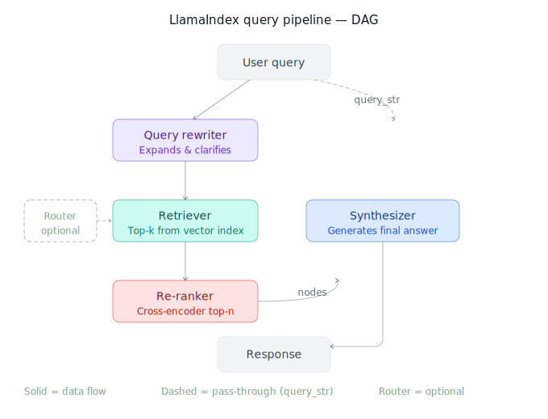

# LlamaIndex Query Pipeline

> **Roadmap:** LangChain & LlamaIndex → Topic 7 of 9
> **File:** `43_llamaindex_query_pipeline.md`

---

## What is a Query Pipeline?

A **Query Pipeline** is LlamaIndex's declarative way to compose query logic as a **DAG (Directed Acyclic Graph)** of components. Instead of writing imperative step-by-step code, you define *what connects to what* — and LlamaIndex handles execution order, data passing, and optional async/batch runs.

Think of it as LCEL (LangChain Expression Language) but optimised for retrieval and RAG workflows rather than LLM chain composition.

> **Why use it over a plain query engine?**
> Query engines are opinionated (retrieve → synthesize). Query pipelines are composable — you can inject re-rankers, routers, query transformers, or even nest pipelines inside pipelines.



---

## Core components

| Component | Role |
|---|---|
| `QueryPipeline` | Orchestrator — holds the DAG |
| `InputComponent` | Entry point for the user query string |
| `QueryTransform` | Rewrites/expands the query before retrieval |
| `BaseRetriever` | Fetches relevant nodes from an index |
| `BaseNodePostprocessor` | Re-ranks, filters, or compresses retrieved nodes |
| `BaseSynthesizer` | Generates the final answer from nodes |
| `RouterComponent` | Routes query to different sub-pipelines |

---

## Code — minimal pipeline (retrieve → synthesize)

```python
# pip install llama-index

from llama_index.core.query_pipeline import QueryPipeline, InputComponent
from llama_index.core import VectorStoreIndex, Settings
from llama_index.core.response_synthesizers import CompactAndRefine

# Assume index is already built (see topic 42)
retriever   = index.as_retriever(similarity_top_k=3)
synthesizer = CompactAndRefine(llm=Settings.llm)

pipeline = QueryPipeline(verbose=True)
pipeline.add_modules({
    "input":      InputComponent(),
    "retriever":  retriever,
    "synthesizer": synthesizer,
})
pipeline.add_link("input",     "retriever")
pipeline.add_link("input",     "synthesizer", dest_key="query_str")
pipeline.add_link("retriever", "synthesizer", dest_key="nodes")

response = pipeline.run(input="What is the refund policy?")
print(response)
```

---

## Code — adding a query rewriter

The most impactful single upgrade to RAG: rewrite the user's sloppy query into a crisp retrieval query *before* hitting the vector store.

```python
from llama_index.core.query_pipeline import QueryPipeline, InputComponent
from llama_index.core.llms import LLM
from llama_index.core import PromptTemplate

rewrite_prompt = PromptTemplate(
    "Rewrite this question to be more specific and retrieval-friendly.\n"
    "Original: {query_str}\n"
    "Rewritten:"
)

pipeline = QueryPipeline(verbose=True)
pipeline.add_modules({
    "input":       InputComponent(),
    "rewriter":    Settings.llm,         # LLM used as a transform node
    "retriever":   retriever,
    "synthesizer": synthesizer,
})

# Chain: input → rewriter (prompt) → retriever → synthesizer
pipeline.add_link("input",    "rewriter",    src_key="query_str",
                               dest_key="messages")       # passes query to LLM
pipeline.add_link("rewriter", "retriever")                # LLM output → retriever
pipeline.add_link("input",    "synthesizer", dest_key="query_str")
pipeline.add_link("retriever","synthesizer", dest_key="nodes")

response = pipeline.run(input="refund if item breaks?")
```

---

## Code — re-ranking postprocessor

Re-ranking is the highest-ROI upgrade after query rewriting. Retrieve more candidates (top-k=10), then a cross-encoder re-ranks and keeps only the best (top-n=3).

```python
# pip install llama-index-postprocessor-flag-embedding-reranker
from llama_index.postprocessor.flag_embedding_reranker import FlagEmbeddingReranker

reranker = FlagEmbeddingReranker(
    model="BAAI/bge-reranker-base",
    top_n=3,
)

retriever_wide = index.as_retriever(similarity_top_k=10)   # cast wide net

pipeline = QueryPipeline(verbose=True)
pipeline.add_modules({
    "input":      InputComponent(),
    "retriever":  retriever_wide,
    "reranker":   reranker,
    "synthesizer": synthesizer,
})
pipeline.add_link("input",     "retriever")
pipeline.add_link("input",     "reranker",   dest_key="query_str")
pipeline.add_link("retriever", "reranker",   dest_key="nodes")
pipeline.add_link("input",     "synthesizer",dest_key="query_str")
pipeline.add_link("reranker",  "synthesizer",dest_key="nodes")

response = pipeline.run(input="What is the refund policy?")
```

---

## Code — router pipeline (multi-index routing)

When you have multiple indexes (e.g., a policy doc index and a product catalog index), a router picks the right one per query.

```python
from llama_index.core.query_pipeline import RouterComponent
from llama_index.core.selectors import LLMSingleSelector

# Two separate retrievers
policy_retriever  = policy_index.as_retriever(similarity_top_k=3)
product_retriever = product_index.as_retriever(similarity_top_k=3)

selector = LLMSingleSelector.from_defaults(llm=Settings.llm)

router = RouterComponent(
    selector=selector,
    choices=[
        "Use for questions about policies, refunds, and returns",
        "Use for questions about products, specs, and availability",
    ],
    components=[policy_retriever, product_retriever],
    verbose=True,
)

pipeline = QueryPipeline(verbose=True)
pipeline.add_modules({
    "input":      InputComponent(),
    "router":     router,
    "synthesizer": synthesizer,
})
pipeline.add_link("input",  "router")
pipeline.add_link("input",  "synthesizer", dest_key="query_str")
pipeline.add_link("router", "synthesizer", dest_key="nodes")

response = pipeline.run(input="Is the laptop in stock?")
```

---

## Code — async + batch execution

```python
import asyncio

# Async single query
async def run_async():
    response = await pipeline.arun(input="What is the return window?")
    return response

# Batch — run multiple queries in parallel
queries = [
    "What is the refund policy?",
    "Do you ship internationally?",
    "How long does delivery take?",
]

async def run_batch():
    tasks = [pipeline.arun(input=q) for q in queries]
    return await asyncio.gather(*tasks)

responses = asyncio.run(run_batch())
for q, r in zip(queries, responses):
    print(f"Q: {q}\nA: {r}\n")
```

---

## Response synthesizers — choosing the right one

| Synthesizer | How it works | Best for |
|---|---|---|
| `CompactAndRefine` | Stuffs nodes into one prompt; refines if overflow | General use, default choice |
| `Refine` | Iteratively refines answer over each node | Long docs, high accuracy |
| `TreeSummarize` | Summarises nodes in a tree structure | Many nodes, summarisation tasks |
| `SimpleSummarize` | Single-shot, no refinement | Speed-critical, short docs |
| `Generation` | Ignores retrieved nodes, pure generation | Fallback / creative tasks |

```python
from llama_index.core.response_synthesizers import (
    CompactAndRefine, Refine, TreeSummarize
)

# Switch synthesizer in the pipeline without rewiring links
pipeline.update_module("synthesizer", TreeSummarize(llm=Settings.llm))
response = pipeline.run(input="Summarise the entire refund policy")
```

---

## Debugging a pipeline

```python
# verbose=True on the pipeline prints every module's input/output
pipeline = QueryPipeline(verbose=True)

# Inspect the DAG structure
print(pipeline.dag)   # NetworkX DiGraph — visualise with nx.draw()

# Check what a module received
pipeline.run_with_intermediates(input="test query")
# Returns dict: {module_name: output} for every node in the DAG
```

---

## Full pipeline — query rewrite + wide retrieval + re-rank

The production-grade pattern combining all three upgrades:

```python
pipeline = QueryPipeline(verbose=True)
pipeline.add_modules({
    "input":      InputComponent(),
    "rewriter":   Settings.llm,
    "retriever":  index.as_retriever(similarity_top_k=10),
    "reranker":   FlagEmbeddingReranker(model="BAAI/bge-reranker-base", top_n=3),
    "synthesizer": CompactAndRefine(llm=Settings.llm),
})
pipeline.add_link("input",     "rewriter",    dest_key="messages")
pipeline.add_link("rewriter",  "retriever")
pipeline.add_link("input",     "reranker",    dest_key="query_str")
pipeline.add_link("retriever", "reranker",    dest_key="nodes")
pipeline.add_link("input",     "synthesizer", dest_key="query_str")
pipeline.add_link("reranker",  "synthesizer", dest_key="nodes")

response = pipeline.run(input="refund if item breaks after 2 months?")
print(response)
```

---

## Query Pipeline vs Query Engine — when to use which

| Situation | Use |
|---|---|
| Standard retrieval + answer, no customisation | `index.as_query_engine()` |
| Need query rewriting | Query Pipeline |
| Need re-ranking | Query Pipeline |
| Need routing across indexes | Query Pipeline |
| Async / batch queries | Query Pipeline (`arun`) |
| Nesting sub-pipelines | Query Pipeline |

---

> **Key insight:** The three upgrades stack multiplicatively — query rewriting improves what goes *in*, wide retrieval + re-ranking improves what comes *back*, and a good synthesizer improves what goes *out*. Each can be swapped independently inside a pipeline without rewriting the rest of the logic.

---

➡️ **Next: Custom tools & integrations**