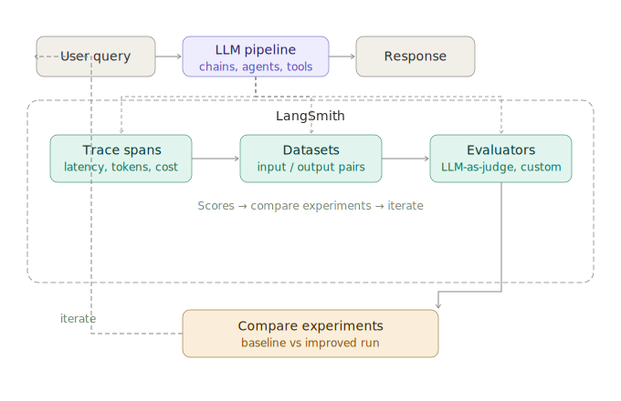

# LangSmith for Tracing & Eval

> **Roadmap:** LangChain & LlamaIndex → Topic 9 of 9
> **File:** `45_langsmith_tracing_eval.md`

---

## What is LangSmith?

LangSmith is Anthropic's observability and evaluation platform for LLM applications. It gives you three things that are impossible to get from log files alone:

- **Tracing** — a full visual trace of every LLM call, tool invocation, retrieval step, and token count in your chain or agent run.
- **Datasets** — curated input/output pairs you can version, share, and run evaluations against.
- **Evaluators** — automated or LLM-as-judge scoring of your app's outputs against ground truth.

> Without LangSmith, debugging a multi-step agent is like debugging a program with `print()` statements removed. Tracing makes the invisible visible.



---

## Setup — one environment variable

```python
import os

os.environ["LANGCHAIN_TRACING_V2"] = "true"
os.environ["LANGCHAIN_API_KEY"]    = "your-langsmith-api-key"
os.environ["LANGCHAIN_PROJECT"]    = "my-rag-app"   # groups traces by project

# That's it. All LangChain/LangGraph calls now auto-trace to LangSmith.
# No code changes needed — tracing is injected automatically.
```

---

## Tracing — what you see

Every trace shows a **tree of spans**. Each span is one unit of work:

```
Run: "What is the refund policy?"
├── ChatGroq                          [412ms]  [in: 210 tok] [out: 87 tok]
│   ├── Prompt                        "You are a helpful assistant..."
│   └── Output                        "I'll search for that information."
├── Tool: search_knowledge_base       [88ms]
│   ├── Input                         query="refund policy"
│   └── Output                        "Items can be returned within 30 days..."
└── ChatGroq (final synthesis)        [380ms]  [in: 340 tok] [out: 112 tok]
    ├── Prompt                        "Based on these documents..."
    └── Output                        "Our refund policy allows returns..."

Total: 880ms | 662 tokens | $0.0008
```

You can click into any span to see the exact prompt sent, the exact output received, latency, and token cost.

---

## Manual tracing with `@traceable`

For functions outside LangChain (e.g. pure Python preprocessing, custom retrievers):

```python
from langsmith import traceable

@traceable(name="preprocess_query", run_type="chain")
def preprocess_query(raw_query: str) -> str:
    """Cleans and normalises the user query before retrieval."""
    query = raw_query.strip().lower()
    query = query.replace("?", "").replace("!", "")
    return query

@traceable(name="full_pipeline", run_type="chain")
def run_pipeline(user_input: str) -> str:
    clean  = preprocess_query(user_input)
    result = agent_executor.invoke({"input": clean})
    return result["output"]

# Both functions now appear as spans in the LangSmith trace
response = run_pipeline("What's the REFUND POLICY??")
```

---

## Datasets — curating test cases

```python
from langsmith import Client

client = Client()

# Create a dataset
dataset = client.create_dataset(
    dataset_name="rag_refund_policy_evals",
    description="Test cases for the refund policy RAG pipeline",
)

# Add examples — each is an (input, expected_output) pair
examples = [
    {
        "inputs":  {"question": "What is the return window?"},
        "outputs": {"answer": "Items can be returned within 30 days of purchase."},
    },
    {
        "inputs":  {"question": "Can I return a digital product?"},
        "outputs": {"answer": "Digital products are non-refundable once downloaded."},
    },
    {
        "inputs":  {"question": "How long does a refund take?"},
        "outputs": {"answer": "Refunds are processed within 5-7 business days."},
    },
]

client.create_examples(
    inputs=[e["inputs"]  for e in examples],
    outputs=[e["outputs"] for e in examples],
    dataset_id=dataset.id,
)
```

---

## Evaluators — scoring outputs

### Built-in evaluator: exact match

```python
from langsmith.evaluation import evaluate, LangChainStringEvaluator

def predict(inputs: dict) -> dict:
    """Your pipeline wrapped as a callable for evaluation."""
    result = agent_executor.invoke({"input": inputs["question"]})
    return {"answer": result["output"]}

# Run evaluation on the dataset
results = evaluate(
    predict,
    data="rag_refund_policy_evals",
    evaluators=[
        LangChainStringEvaluator("exact_match"),   # exact string match
    ],
    experiment_prefix="baseline-v1",
)
print(results)
```

### LLM-as-judge evaluator (most powerful)

```python
from langsmith.evaluation import LangChainStringEvaluator

# correctness — LLM grades whether the answer matches ground truth
correctness_evaluator = LangChainStringEvaluator(
    "labeled_score_string",
    config={
        "criteria": {
            "correctness": "Is the answer factually correct based on the reference?"
        },
        "normalize_by": 10,   # score 0–1
    },
    prepare_data=lambda run, example: {
        "prediction": run.outputs["answer"],
        "reference":  example.outputs["answer"],
        "input":      example.inputs["question"],
    },
)

# faithfulness — LLM checks answer is grounded in retrieved context (no hallucination)
faithfulness_evaluator = LangChainStringEvaluator(
    "score_string",
    config={
        "criteria": {
            "faithfulness": "Is the answer supported by the retrieved context?"
        },
    },
)

results = evaluate(
    predict,
    data="rag_refund_policy_evals",
    evaluators=[correctness_evaluator, faithfulness_evaluator],
    experiment_prefix="with-reranker-v2",
)
```

---

## Custom evaluator

```python
from langsmith.schemas import Run, Example

def length_penalty_evaluator(run: Run, example: Example) -> dict:
    """Penalise answers longer than 100 words — should be concise."""
    answer    = run.outputs.get("answer", "")
    word_count = len(answer.split())
    score     = 1.0 if word_count <= 100 else max(0, 1 - (word_count - 100) / 200)
    return {
        "key":     "conciseness",
        "score":   score,
        "comment": f"{word_count} words",
    }

results = evaluate(
    predict,
    data="rag_refund_policy_evals",
    evaluators=[correctness_evaluator, length_penalty_evaluator],
    experiment_prefix="conciseness-check-v1",
)
```

---

## Comparing experiments

LangSmith's UI lets you compare two experiment runs side-by-side — e.g. "baseline-v1" vs "with-reranker-v2" — to see whether your change improved correctness and by how much. Each row is one test case, columns are evaluator scores.

```python
# Programmatically fetch comparison data
from langsmith import Client

client = Client()
runs   = list(client.list_runs(project_name="my-rag-app", is_root=True))

# Filter by experiment tag
baseline = [r for r in runs if "baseline-v1"      in (r.tags or [])]
reranked = [r for r in runs if "with-reranker-v2" in (r.tags or [])]

# Compare mean latency
import statistics
print("Baseline latency:   ", statistics.mean([r.total_cost for r in baseline]))
print("Re-ranked latency:  ", statistics.mean([r.total_cost for r in reranked]))
```

---

## The eval loop — using LangSmith in practice

```
1. Build v1 of your pipeline
2. Collect 20–50 real user queries → add to dataset as examples
3. Run evaluate() → get baseline scores
4. Make a change (add re-ranker, tweak prompt, change chunk size)
5. Run evaluate() with new experiment_prefix → compare vs baseline
6. If scores improve → ship. If not → revert or iterate.
↻ Repeat for every significant change
```

This is the difference between "I think it got better" and "it got better by 12 points on correctness."

---

## LangSmith vs alternatives

| Tool | Tracing | Datasets | Eval | Cost |
|---|---|---|---|---|
| **LangSmith** | Full span tree | Yes, versioned | LLM-as-judge + custom | Free tier available |
| Helicone | LLM calls only | No | No | Cheap, simple |
| Weights & Biases | Custom code only | Yes | Custom | ML-focused |
| Arize Phoenix | Full span tree | Basic | Basic | Open source |

---

> **Key insight:** The eval loop is the highest-leverage practice in production LLM engineering. Every RAG paper that shows improvement over a baseline is running this loop — they just call it an ablation study. LangSmith makes it accessible outside research: you can run a proper experiment in an afternoon, not a week.

---

➡️ **Next: Phase 6 — Agents & Tool Use → What are AI agents?**
