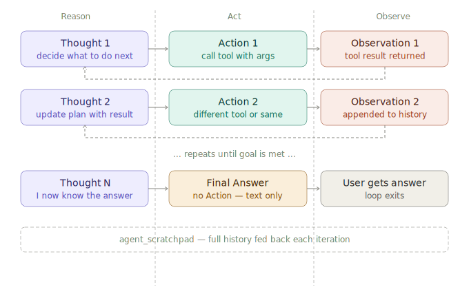

# ReAct Agent Loop

> **Roadmap:** Agents & Tool Use → Topic 3 of 10
> **File:** `48_react_agent_loop.md`

---

## What is ReAct?

**ReAct** (Reasoning + Acting) is the foundational prompting pattern behind almost every LLM agent. Published by Yao et al. (2022), the core idea is simple: **interleave reasoning traces with actions**. The model thinks out loud (Thought), acts (Action), and reads the result (Observation) — and repeats until done.

```
Thought: I need to find the capital of France first.
Action: search_web("capital of France")
Observation: Paris is the capital of France.

Thought: Now I have the capital. I need its population.
Action: search_web("population of Paris 2024")
Observation: Paris has approximately 2.1 million residents in the city proper.

Thought: I have both pieces of information. I can answer.
Final Answer: The capital of France is Paris, with a city population of ~2.1 million.
```

The interleaving is what makes ReAct powerful — reasoning can reference observations, and observations inform the next reasoning step. The model is not planning upfront (which requires perfect knowledge) but **reacting** to what it discovers.



---

## ReAct in LangChain

```python
from langchain.agents import create_react_agent, AgentExecutor
from langchain import hub
from langchain_groq import ChatGroq
from langchain.tools import tool

llm = ChatGroq(model="llama-3.3-70b-versatile", api_key="your-key")

@tool
def search(query: str) -> str:
    """Search the web for factual information."""
    return f"Search results for: {query}"   # replace with real search

@tool
def calculator(expression: str) -> str:
    """Evaluate a mathematical expression. Input must be valid Python math."""
    try:
        return str(eval(expression, {"__builtins__": {}}, {}))
    except Exception as e:
        return f"Error: {e}"

tools = [search, calculator]

# Pull the standard ReAct prompt from LangChain Hub
prompt = hub.pull("hwchase17/react")
# Prompt template contains: {tools}, {tool_names}, {input}, {agent_scratchpad}

agent          = create_react_agent(llm, tools, prompt)
agent_executor = AgentExecutor(
    agent=agent,
    tools=tools,
    verbose=True,            # prints Thought/Action/Observation to stdout
    max_iterations=8,
    handle_parsing_errors=True,
)

result = agent_executor.invoke({
    "input": "What is the population of Paris divided by the population of Delhi?"
})
print(result["output"])
```

---

## What verbose=True shows

```
> Entering new AgentExecutor chain...

Thought: I need to find the populations of Paris and Delhi, then divide them.
Action: search
Action Input: population of Paris 2024
Observation: Paris has approximately 2.1 million residents.

Thought: Now I need Delhi's population.
Action: search
Action Input: population of Delhi 2024
Observation: Delhi has approximately 33 million residents.

Thought: I have both populations. Paris / Delhi = 2.1M / 33M.
Action: calculator
Action Input: 2100000 / 33000000
Observation: 0.06363636363636363

Thought: I now have the answer.
Final Answer: The population of Paris (~2.1M) divided by Delhi (~33M) is approximately 0.064, meaning Paris has about 6.4% of Delhi's population.

> Finished chain.
```

This trace is the ReAct loop made visible. Each `Thought → Action → Observation` is one iteration.

---

## The ReAct prompt — what's inside

```python
# The standard ReAct prompt structure (simplified):
REACT_PROMPT = """
Answer the following questions as best you can. You have access to these tools:

{tools}

Use the following format:

Question: the input question you must answer
Thought: you should always think about what to do
Action: the action to take, should be one of [{tool_names}]
Action Input: the input to the action
Observation: the result of the action
... (this Thought/Action/Action Input/Observation can repeat N times)
Thought: I now know the final answer
Final Answer: the final answer to the original input question

Begin!

Question: {input}
Thought: {agent_scratchpad}
"""
```

The `{agent_scratchpad}` accumulates all previous Thought/Action/Observation turns. The model reads the full history each iteration — this is how it maintains context across steps.

---

## Custom ReAct prompt

```python
from langchain_core.prompts import PromptTemplate

custom_prompt = PromptTemplate.from_template("""
You are a precise financial research assistant.
Always verify numbers with at least one tool call before stating them.
Never guess. If a tool fails, try a different approach.

Available tools:
{tools}
Tool names: {tool_names}

Format:
Question: {input}
Thought: (what should I do?)
Action: (tool name)
Action Input: (tool input)
Observation: (result)
... repeat as needed ...
Thought: I now know the final answer
Final Answer: (your final answer)

Question: {input}
Thought: {agent_scratchpad}
""")

agent = create_react_agent(llm, tools, custom_prompt)
```

---

## ReAct vs OpenAI Functions agent

| | ReAct | OpenAI Functions / Tool Use |
|---|---|---|
| Mechanism | Text parsing (Thought/Action format) | Native JSON tool_use blocks |
| Model requirement | Any instruction-following LLM | Needs tool-call-trained model |
| Reliability | Lower — regex parsing can fail | Higher — structured output |
| Transparency | High — thoughts are readable | Medium — thoughts hidden |
| Speed | Slower — extra text generation | Faster — no text parsing |
| Best for | Open-source models, transparency | GPT-4o, Claude, Groq Llama |

```python
# OpenAI functions agent (preferred for modern APIs)
from langchain.agents import create_openai_functions_agent
agent = create_openai_functions_agent(llm, tools, prompt)

# ReAct agent (works with any LLM, including local Ollama models)
from langchain.agents import create_react_agent
agent = create_react_agent(llm, tools, react_prompt)
```

---

## Handling ReAct failures

```python
agent_executor = AgentExecutor(
    agent=agent,
    tools=tools,
    handle_parsing_errors=True,   # retry if LLM output doesn't match format
    max_iterations=10,
    max_execution_time=30,        # seconds
    verbose=True,
    return_intermediate_steps=True,   # include all Thought/Action/Obs in output
)

result = agent_executor.invoke({"input": "..."})

# Inspect every step
for action, observation in result["intermediate_steps"]:
    print(f"Tool: {action.tool}")
    print(f"Input: {action.tool_input}")
    print(f"Output: {observation}\n")
```

---

## ReAct with LlamaIndex

```python
from llama_index.core.agent import ReActAgent
from llama_index.core.tools import FunctionTool

search_tool = FunctionTool.from_defaults(fn=search, name="search",
    description="Search the web for factual information.")
calc_tool   = FunctionTool.from_defaults(fn=calculator, name="calculator",
    description="Evaluate math expressions.")

agent = ReActAgent.from_tools(
    tools=[search_tool, calc_tool],
    llm=Settings.llm,
    verbose=True,
    max_iterations=10,
    react_chat_formatter=None,   # use default ReAct formatter
)

response = agent.chat("What is the GDP of India divided by its population?")
print(response)
```

---

> **Key insight:** ReAct is the original agent pattern and still the most transparent. When an agent using JSON tool calls misbehaves, you're guessing what it was thinking. With ReAct, every thought is printed — debugging a wrong answer means reading the trace and seeing exactly where reasoning went wrong. For new agent builds, start with ReAct; switch to function calling once you're confident in the logic.

---

➡️ **Next: Planning & task decomposition**
