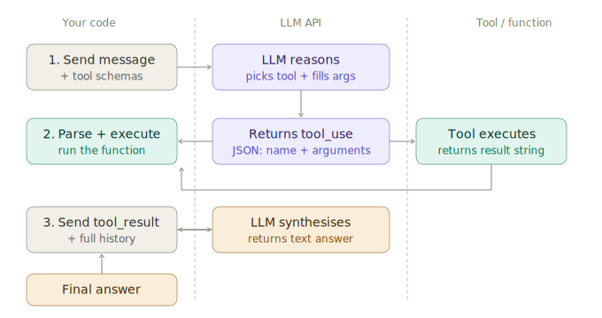

# Function / Tool Calling (APIs)

> **Roadmap:** Agents & Tool Use → Topic 2 of 10
> **File:** `47_function_tool_calling.md`

---

## What is function calling?

Function calling is a feature built into modern LLM APIs (OpenAI, Anthropic, Groq, Gemini) where the model can respond not with text, but with a **structured JSON object** specifying which function to call and what arguments to pass.

The model never executes the function itself — it outputs the call specification, your code runs the function, and you feed the result back to the model.

```
User: "What's the weather in Delhi?"

LLM output (function call):
{
  "name": "get_weather",
  "arguments": { "city": "Delhi", "unit": "celsius" }
}

Your code: runs get_weather("Delhi", "celsius") → "32°C, humid"

LLM final response: "It's currently 32°C and humid in Delhi."
```



---

## How the API works — raw protocol

### Anthropic Claude API

```python
import anthropic

client = anthropic.Anthropic(api_key="your-key")

# 1. Define tools as JSON schema
tools = [
    {
        "name": "get_weather",
        "description": "Get current weather for a city. Use when user asks about weather.",
        "input_schema": {
            "type": "object",
            "properties": {
                "city": {
                    "type": "string",
                    "description": "The city name, e.g. Delhi"
                },
                "unit": {
                    "type": "string",
                    "enum": ["celsius", "fahrenheit"],
                    "description": "Temperature unit"
                }
            },
            "required": ["city"]
        }
    }
]

# 2. First API call — model may return a tool_use block
response = client.messages.create(
    model="claude-sonnet-4-20250514",
    max_tokens=1024,
    tools=tools,
    messages=[
        {"role": "user", "content": "What's the weather in Delhi?"}
    ]
)

print(response.stop_reason)   # "tool_use"
tool_use = next(b for b in response.content if b.type == "tool_use")
print(tool_use.name)          # "get_weather"
print(tool_use.input)         # {"city": "Delhi"}
```

```python
# 3. Execute the function
def get_weather(city: str, unit: str = "celsius") -> str:
    return f"32°C, humid"   # replace with real API call

result = get_weather(**tool_use.input)

# 4. Second API call — send result back as tool_result
response2 = client.messages.create(
    model="claude-sonnet-4-20250514",
    max_tokens=1024,
    tools=tools,
    messages=[
        {"role": "user",      "content": "What's the weather in Delhi?"},
        {"role": "assistant", "content": response.content},   # includes tool_use block
        {"role": "user",      "content": [
            {
                "type": "tool_result",
                "tool_use_id": tool_use.id,
                "content": result,
            }
        ]},
    ]
)

print(response2.content[0].text)
# "It's currently 32°C and humid in Delhi."
```

---

### OpenAI-compatible API (works with Groq, Together, etc.)

```python
from openai import OpenAI
import json

client = OpenAI(
    base_url="https://api.groq.com/openai/v1",
    api_key="your-groq-key"
)

tools = [
    {
        "type": "function",
        "function": {
            "name": "get_weather",
            "description": "Get current weather for a city.",
            "parameters": {
                "type": "object",
                "properties": {
                    "city": {"type": "string", "description": "City name"},
                },
                "required": ["city"]
            }
        }
    }
]

# First call
response = client.chat.completions.create(
    model="llama-3.3-70b-versatile",
    messages=[{"role": "user", "content": "What's the weather in Delhi?"}],
    tools=tools,
    tool_choice="auto",   # "auto" | "none" | {"type":"function","function":{"name":"..."}}
)

msg        = response.choices[0].message
tool_calls = msg.tool_calls

if tool_calls:
    tool_call = tool_calls[0]
    args      = json.loads(tool_call.function.arguments)
    result    = get_weather(**args)

    # Second call with result
    response2 = client.chat.completions.create(
        model="llama-3.3-70b-versatile",
        messages=[
            {"role": "user",      "content": "What's the weather in Delhi?"},
            msg,                                            # assistant message with tool_calls
            {
                "role":         "tool",
                "tool_call_id": tool_call.id,
                "content":      result,
            }
        ],
        tools=tools,
    )
    print(response2.choices[0].message.content)
```

---

## Parallel tool calls

Modern APIs support calling multiple tools in a single response — the model returns a list of tool calls, you execute them (optionally in parallel), and return all results.

```python
import asyncio, json
from openai import AsyncOpenAI

async_client = AsyncOpenAI(base_url="https://api.groq.com/openai/v1", api_key="your-key")

tools = [get_weather_tool, get_time_tool, get_news_tool]   # 3 tools defined

response = await async_client.chat.completions.create(
    model="llama-3.3-70b-versatile",
    messages=[{"role": "user", "content": "Weather, time, and top news in Delhi?"}],
    tools=tools,
)

tool_calls = response.choices[0].message.tool_calls
# Model may return: [get_weather("Delhi"), get_time("Delhi"), get_news("Delhi")]

# Execute all in parallel
async def run_tool(tc):
    fn   = {"get_weather": get_weather, "get_time": get_time, "get_news": get_news}[tc.function.name]
    args = json.loads(tc.function.arguments)
    return tc.id, fn(**args)

results = await asyncio.gather(*[run_tool(tc) for tc in tool_calls])

# Feed all results back
tool_messages = [
    {"role": "tool", "tool_call_id": tid, "content": str(res)}
    for tid, res in results
]
```

---

## Tool choice control

```python
# Let the model decide
tool_choice = "auto"

# Force a specific tool (useful for structured extraction)
tool_choice = {"type": "function", "function": {"name": "extract_entities"}}

# Disable tool use entirely
tool_choice = "none"

# Anthropic equivalent
tool_choice = {"type": "auto"}
tool_choice = {"type": "tool", "name": "get_weather"}   # force specific
tool_choice = {"type": "any"}    # must use some tool, model picks which
```

---

## Defining schemas well

The schema is what the model reads to understand your tool. Quality here directly determines call accuracy.

```python
# Bad schema — vague, no descriptions
{
    "name": "search",
    "parameters": {
        "type": "object",
        "properties": {
            "q": {"type": "string"}
        }
    }
}

# Good schema — precise, with descriptions and constraints
{
    "name": "search_products",
    "description": "Search the product catalogue by keyword. Use when user asks about products, specs, or availability. Do NOT use for order history or account questions.",
    "parameters": {
        "type": "object",
        "properties": {
            "query": {
                "type": "string",
                "description": "Search keywords, e.g. 'red running shoes size 10'"
            },
            "max_results": {
                "type": "integer",
                "description": "Number of results to return (1–20)",
                "minimum": 1,
                "maximum": 20,
                "default": 5
            },
            "category": {
                "type": "string",
                "enum": ["shoes", "clothing", "accessories", "all"],
                "description": "Product category filter"
            }
        },
        "required": ["query"]
    }
}
```

---

## Full loop helper — reusable pattern

```python
def run_tool_loop(client, model, messages, tools, available_fns, max_rounds=5):
    """Run the tool-call loop until the model produces a text response."""
    for _ in range(max_rounds):
        response = client.chat.completions.create(
            model=model, messages=messages, tools=tools
        )
        msg = response.choices[0].message
        messages.append(msg)

        if not msg.tool_calls:
            return msg.content   # final text answer

        for tc in msg.tool_calls:
            fn     = available_fns[tc.function.name]
            args   = json.loads(tc.function.arguments)
            result = fn(**args)
            messages.append({
                "role": "tool", "tool_call_id": tc.id, "content": str(result)
            })

    return "Max rounds reached."

# Usage
answer = run_tool_loop(
    client=client,
    model="llama-3.3-70b-versatile",
    messages=[{"role": "user", "content": "What's the weather and top news in Delhi?"}],
    tools=tools,
    available_fns={"get_weather": get_weather, "get_news": get_news},
)
print(answer)
```

---

> **Key insight:** Function calling is not magic — it's the model outputting JSON instead of text. The model learned during training what JSON tool-call format looks like, and it pattern-matches your schema description to decide when and how to fill it in. Better descriptions = better JSON = better tool calls.

---

➡️ **Next: ReAct agent loop**
