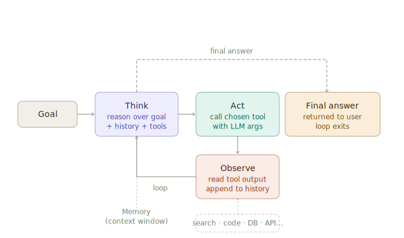

# What are AI agents?

> **Roadmap:** Agents & Tool Use → Topic 1 of 10
> **File:** `46_what_are_ai_agents.md`

---

## Definition

An **AI agent** is an LLM that can take actions in a loop until a goal is achieved. Instead of a single prompt → single response, an agent:

1. Receives a goal
2. Decides what action to take (reason)
3. Executes the action (act)
4. Observes the result
5. Repeats until the goal is met or it gives up

The key difference from a plain LLM call: **the model controls the loop**. It decides when it has enough information, which tools to call, and when to stop.



---

## Agent vs chain vs pipeline

| | Chain / Pipeline | Agent |
|---|---|---|
| Control flow | Predetermined by developer | Decided by LLM at runtime |
| Tool use | Fixed sequence | Dynamic — LLM picks tools |
| Loops | No | Yes — until goal met |
| Predictability | High | Lower |
| Power | Lower | Higher |
| Best for | Known, structured tasks | Open-ended, multi-step tasks |

A chain always does A → B → C. An agent might do A → C → A → B → stop, depending on what it finds.

---

## The core agent loop

```
while not done:
    thought = llm.think(goal, history, available_tools)
    if thought.is_final_answer:
        return thought.answer
    action  = thought.chosen_tool
    result  = action.execute(thought.tool_input)
    history.append((thought, action, result))
```

This is the **ReAct loop** (Reason + Act) — covered in detail in topic 48. Every major agent framework (LangChain, LlamaIndex, AutoGen, CrewAI) is implementing this loop with different wrappers.

---

## What makes a good agent task?

Agents shine when the task has:
- **Unknown number of steps** — you can't hard-code the sequence
- **Conditional branching** — what to do next depends on intermediate results
- **Tool diversity** — the task needs multiple different capabilities
- **Self-correction** — the agent should retry or reroute on failure

Agents struggle when:
- The task is simple enough for a single LLM call
- Determinism is critical (agents can hallucinate tool calls)
- Latency is a constraint (loops add round-trips)
- Cost is a constraint (multiple LLM calls = multiple charges)

---

## Agent components

```python
# The four components every agent needs

# 1. LLM — the brain
from langchain_groq import ChatGroq
llm = ChatGroq(model="llama-3.3-70b-versatile", api_key="your-key")

# 2. Tools — the hands
from langchain.tools import tool

@tool
def search_web(query: str) -> str:
    """Search the web for current information."""
    ...

@tool
def run_python(code: str) -> str:
    """Execute Python code and return the output."""
    ...

tools = [search_web, run_python]

# 3. Memory — the context window (+ optional persistent store)
from langchain.memory import ConversationBufferMemory
memory = ConversationBufferMemory(memory_key="chat_history", return_messages=True)

# 4. Agent executor — the loop
from langchain.agents import AgentExecutor, create_openai_functions_agent
from langchain_core.prompts import ChatPromptTemplate, MessagesPlaceholder

prompt = ChatPromptTemplate.from_messages([
    ("system", "You are a helpful research assistant. Use tools when needed."),
    MessagesPlaceholder("chat_history"),
    ("human", "{input}"),
    MessagesPlaceholder("agent_scratchpad"),
])

agent          = create_openai_functions_agent(llm, tools, prompt)
agent_executor = AgentExecutor(
    agent=agent,
    tools=tools,
    memory=memory,
    verbose=True,
    max_iterations=10,       # safety cap — prevents infinite loops
    handle_parsing_errors=True,
)
```

---

## Types of agents

### Single agent
One LLM, one set of tools, one goal. Most use cases.

### Multi-agent
Multiple LLMs collaborating — a planner agent breaks down the goal, specialist agents execute sub-tasks, a critic agent reviews results. Covered in topic 52.

### Autonomous agents
Long-running agents with persistent memory and the ability to spawn sub-tasks. Examples: AutoGPT, GPT-Engineer. High power, high risk of runaway loops.

---

## Running your first agent

```python
# Goal that requires multiple steps and tool use
result = agent_executor.invoke({
    "input": "Search for the latest Python version, then write a hello world script using it."
})

print(result["output"])

# What happens internally (verbose=True shows this):
# Thought: I need to find the latest Python version. I'll use search_web.
# Action: search_web("latest Python version 2025")
# Observation: Python 3.13 was released in October 2024.
# Thought: Now I'll write a hello world script.
# Action: (no tool needed — generate directly)
# Final Answer: # Python 3.13\nprint("Hello, World!")
```

---

## Safety guardrails

```python
agent_executor = AgentExecutor(
    agent=agent,
    tools=tools,
    max_iterations=10,          # hard stop after N loops
    max_execution_time=60,      # hard stop after 60 seconds
    early_stopping_method="generate",   # LLM tries to summarise if limit hit
    handle_parsing_errors=True,         # recover from malformed tool calls
    verbose=True,
)
```

---

> **Key insight:** An agent is just a while loop with an LLM making the decisions inside it. Everything else — memory, tools, multi-agent systems, LangGraph — is infrastructure around that loop. If you understand the loop, you understand agents.

---

➡️ **Next: Function / tool calling (APIs)**
