# Zero-shot & Few-shot Prompting

> **Roadmap:** Prompt Engineering → Topic 2 of 10
> **Status:** ✅ Completed

---

## Core Idea

The difference is simply **how many examples you give the model** before asking it to do the task.

| Type | Examples Given | Model relies on |
|---|---|---|
| **Zero-shot** | 0 | Its training knowledge |
| **Few-shot** | 2–5 | Your examples + training |

---



---

## Zero-shot Prompting

Just give the instruction — no examples. Works well for simple, clear tasks.

```python
from groq import Groq

client = Groq(api_key="your-groq-api-key")

response = client.chat.completions.create(
    model="llama-3.3-70b-versatile",
    max_tokens=100,
    messages=[
        {
            "role": "system",
            "content": "You are a sentiment classifier. Reply with only: Positive, Negative, or Neutral."
        },
        {
            "role": "user",
            "content": "The food was amazing but the service was really slow."
        }
    ]
)

print(response.choices[0].message.content)
# Output: Negative
```

---

## Few-shot Prompting

Inject examples as alternating `user` / `assistant` messages before your actual query.
The model picks up the pattern and follows it consistently.

```python
from groq import Groq

client = Groq(api_key="your-groq-api-key")

response = client.chat.completions.create(
    model="llama-3.3-70b-versatile",
    max_tokens=100,
    messages=[
        {
            "role": "system",
            "content": "You are a sentiment classifier. Reply with only: Positive, Negative, or Neutral."
        },
        # --- Few-shot examples ---
        {"role": "user",      "content": "I love this product!"},
        {"role": "assistant", "content": "Positive"},

        {"role": "user",      "content": "Worst experience ever."},
        {"role": "assistant", "content": "Negative"},

        {"role": "user",      "content": "It arrived on time."},
        {"role": "assistant", "content": "Neutral"},
        # --- Actual query ---
        {
            "role": "user",
            "content": "The food was amazing but the service was really slow."
        }
    ]
)

print(response.choices[0].message.content)
# Output: Negative  (consistent format, controlled by examples)
```

---

## When to Use Which

| Situation | Use |
|---|---|
| Simple, clear tasks | Zero-shot |
| Model gives inconsistent formats | Few-shot |
| Custom output structure needed | Few-shot |
| Token budget is tight | Zero-shot |
| Complex or niche tasks | Few-shot |

---

## Key Insight

> Start zero-shot. If results are inconsistent or in the wrong format, add 2–3 examples.

Few-shot examples don't need to be real data — they just need to show the **pattern** you want the model to follow.

---

## Next Topic

➡️ **Chain-of-Thought (CoT) Prompting**
