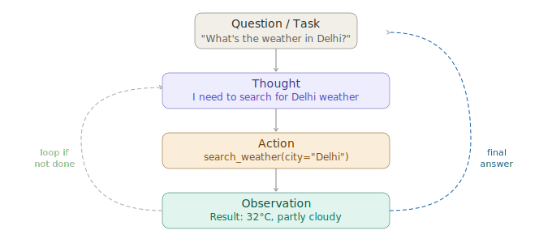

# ReAct Prompting

> **Roadmap:** Prompt Engineering → Topic 9 of 10
> **Status:** ✅ Completed

---

## What is ReAct?

ReAct stands for **Reasoning + Acting**. It's a prompting pattern where the model doesn't just think and answer — it thinks, takes an action, observes the result, then thinks again. This loop continues until it reaches a final answer.

This is the foundation of how **AI agents** work. Every agent framework you'll use later (LangChain agents, LlamaIndex, AutoGen) is built on this exact pattern under the hood.



---

## The 3-Step Loop

Every iteration of ReAct has exactly 3 parts:

**Thought** — the model reasons about what it needs to do next. It doesn't answer yet — it plans.

**Action** — the model calls a tool. This could be a web search, a calculator, a database lookup, an API call — anything you give it access to.

**Observation** — the result of that tool call gets fed back to the model. Now it thinks again. If it has enough info it gives a final answer. If not, it loops.

---

## Manual ReAct — understanding the pattern from scratch

```python
from groq import Groq

client = Groq(api_key="your-groq-api-key")

# --- Fake tools the model can call ---
def search_weather(city: str) -> str:
    # In real life this would call a weather API
    return f"Weather in {city}: 32°C, partly cloudy, humidity 65%"

def search_population(city: str) -> str:
    return f"Population of {city}: approximately 32 million (2024)"

TOOLS = {
    "search_weather":    search_weather,
    "search_population": search_population
}

# --- System prompt that teaches the model the ReAct format ---
SYSTEM = """You are a helpful assistant that answers questions using tools.
Always follow this exact format:

Thought: <your reasoning about what to do next>
Action: <tool_name>
Action Input: <the input to pass to the tool>
Observation: <result will be filled in for you>
... (repeat Thought/Action/Observation as needed)
Thought: I now have enough information to answer.
Final Answer: <your final answer>

Available tools:
- search_weather: Get current weather for a city. Input: city name
- search_population: Get population of a city. Input: city name"""

def react_agent(question: str) -> str:
    messages = [
        {"role": "system", "content": SYSTEM},
        {"role": "user",   "content": question}
    ]

    # Run up to 5 iterations of the loop
    for step in range(5):
        response = client.chat.completions.create(
            model="llama-3.3-70b-versatile",
            max_tokens=300,
            temperature=0.2,
            messages=messages
        )

        reply = response.choices[0].message.content
        print(f"\n--- Step {step + 1} ---\n{reply}")

        # If model reached a final answer, we're done
        if "Final Answer:" in reply:
            return reply.split("Final Answer:")[-1].strip()

        # Otherwise extract and execute the action
        if "Action:" in reply and "Action Input:" in reply:
            action_name  = reply.split("Action:")[1].split("\n")[0].strip()
            action_input = reply.split("Action Input:")[1].split("\n")[0].strip()

            # Call the actual tool
            observation = TOOLS[action_name](action_input) if action_name in TOOLS else f"Tool '{action_name}' not found."

            # Feed the observation back into the conversation
            messages.append({"role": "assistant", "content": reply})
            messages.append({"role": "user",      "content": f"Observation: {observation}"})

    return "Max steps reached without a final answer."


answer = react_agent("What is the weather like in Delhi, and what is its population?")
print(f"\n=== FINAL ANSWER ===\n{answer}")
```

---

## What the output looks like

```
--- Step 1 ---
Thought: I need to find the weather in Delhi first.
Action: search_weather
Action Input: Delhi

--- Step 2 ---
Thought: Now I need the population of Delhi.
Action: search_population
Action Input: Delhi

--- Step 3 ---
Thought: I now have enough information to answer.
Final Answer: Delhi is currently 32°C and partly cloudy.
Its population is approximately 32 million.
```

---

## Why ReAct is better than one-shot answering

| Approach | Problem |
|---|---|
| Single prompt | Model has to guess or hallucinate facts it doesn't know |
| ReAct | Model fetches real information before answering |
| Single prompt | Can't handle multi-step tasks that depend on each other |
| ReAct | Each step builds on the previous observation |

---

## Key Insight

> ReAct is powerful because it separates **thinking** from **doing**. The model is not expected to know everything — it's expected to know *how to find* everything.

This is the mental model shift that takes you from prompting to building real AI agents. Everything in the Agents section of this roadmap builds directly on top of this.

---

➡️ **Next: Prompt Injection & Safety**
