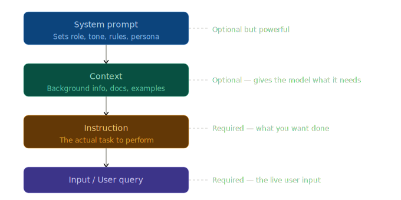

# Prompt Basics & Anatomy

> **Roadmap:** Prompt Engineering → Topic 1 of 10
> **Status:** ✅ Completed

---

## What is a Prompt?

A prompt is the input you send to an LLM. It's not just a question — it has **structure**. Understanding that structure is what separates random results from reliable, production-ready outputs.

---

---

## The 4 Parts of a Prompt

| Part | Required? | Purpose |
|---|---|---|
| **System Prompt** | Optional (but powerful) | Sets role, tone, rules, persona |
| **Context** | Optional | Background info, docs, retrieved data |
| **Instruction** | Required | The actual task to perform |
| **Input / User Query** | Required | The live user message |

---

## Part 1 — System Prompt

Tells the model **who it is** and how it should behave. Sent once, usually hidden from the end user.

```
You are a helpful customer support agent for TechCorp.
Always be polite and concise. Never make up information.
If you don't know something, say "I'll check and get back to you."
```

---

## Part 2 — Context

Background information the model needs to answer well. Could be docs, user history, or retrieved data (RAG).

```
The user has a Pro plan. Purchase date: March 12, 2026.
Refund policy: refunds allowed within 30 days of purchase.
```

---

## Part 3 — Instruction

The specific task you want the model to perform.

```
Answer the user's question using the context above.
Keep your reply under 3 sentences. Be polite and direct.
```

---

## Part 4 — Input / User Query

The actual message from the user.

```
Can I get a refund for my purchase last week?
```

---

## Full Example — Groq API (Python)

```python
from groq import Groq

client = Groq(api_key="your-groq-api-key")  # free at console.groq.com

# Context (dynamic — changes per user)
user_context = """
The user has a Pro plan. Purchase date: March 12, 2026.
Refund policy: refunds allowed within 30 days of purchase.
"""

# Instruction
instruction = """
Answer the user's question using the context above.
Keep your reply under 3 sentences. Be polite and direct.
"""

response = client.chat.completions.create(
    model="llama-3.3-70b-versatile",
    max_tokens=300,
    messages=[
        {
            "role": "system",                          # ← System Prompt
            "content": """You are a helpful customer support agent for TechCorp.
Never make up information. If unsure, say you'll check."""
        },
        {
            "role": "user",                            # ← Context + Instruction + Input
            "content": f"{user_context}\n\n{instruction}\n\nUser question: Can I get a refund for my purchase last week?"
        }
    ]
)

print(response.choices[0].message.content)
```

**Install:**
```bash
pip install groq
```

---

## Groq vs Anthropic — API Differences

| | Groq | Anthropic |
|---|---|---|
| **API style** | OpenAI-compatible | Custom |
| **System prompt** | `{"role": "system", "content": "..."}` | Separate `system=` parameter |
| **Response access** | `response.choices[0].message.content` | `response.content[0].text` |
| **Speed** | Very fast (LPU hardware) | Standard |
| **Free tier** | Yes — console.groq.com | Limited |

---

## Recommended Groq Models

| Model | Best For |
|---|---|
| `llama-3.3-70b-versatile` | Best general purpose |
| `llama-3.1-8b-instant` | Ultra fast, good for testing |
| `mixtral-8x7b-32768` | Large context window (32k tokens) |
| `gemma2-9b-it` | Lightweight, solid performance |

---

## Key Insight

> Most prompt failures happen because one of the 4 parts is **missing or vague**.
> The model isn't "being dumb" — it just didn't have enough structure to work from.

### Mental Checklist Before Sending Any Prompt

- [ ] Did I tell it **who it is**? → System prompt
- [ ] Did I give it **what it needs to know**? → Context
- [ ] Did I tell it **exactly what to do**? → Instruction
- [ ] Is the **user input clearly separated**? → Input

---

## Next Topic

➡️ **Zero-shot & Few-shot Prompting**
